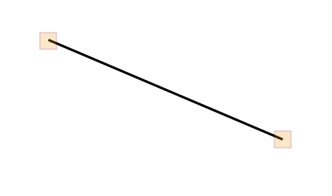
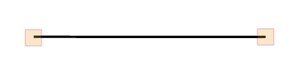
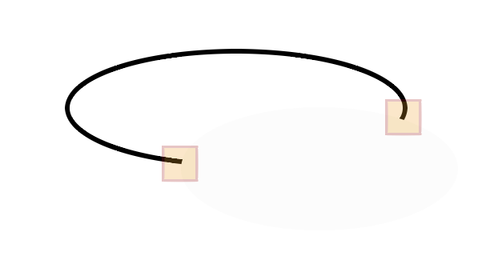
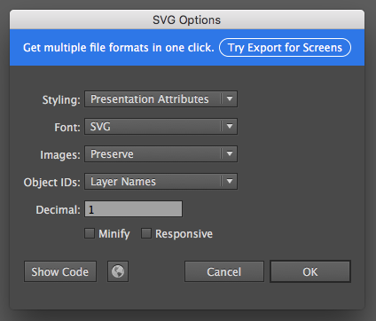
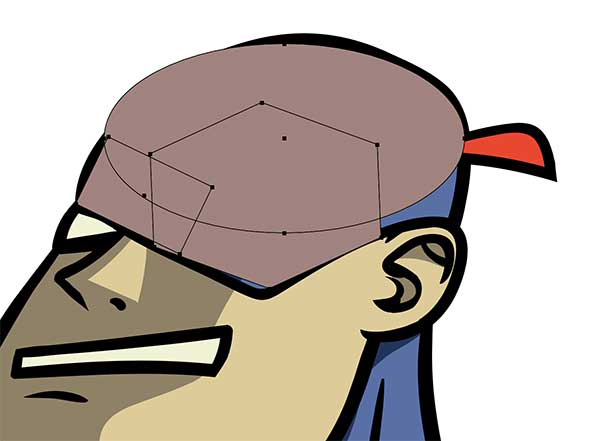

## 第一章: 剖析SVG

可缩放矢量图（SVG）正日益成为互联网中一种较流行图片格式，这种格式的优点可以概况成一下几点：

- SVG图片是可缩放的，这对于市面上越来越多需要适配的屏幕视口（`viewport`）是巨大的好处。 我们借助SVG技术，就可以实现： 只制作一张SVG图片，就可以对所有仪器做到适配兼容，并缓存起来，下次访问就不需要再次请求。 而对比CSS技术来说，我们可能需要用到 `srcset` 或 根据不同的视口所需的图片来配置 `@media` 等方案来解决适配的问题。 SVG避免了所有的额外工作。
- 矢量图（相对位图来说）意味着： 由于使用了数学方法绘制，图片文件有着更好质量 和 更小的体积。

SVG 是一种 XML格式文件，我们可以使用这种格式简洁的描述图形、线和文本，并且可以同时使用DOM去操作这些元素。这就意味着SVG 是高效且易理解的。

在第一章里，我们将夯实SVG的DOM基础知识，因为我们需要借助这些基础来实现复杂的SVG动画。我们将会讨论一些基本的SVG语法,同时你可以依照自己的想法尝试操纵并调试他们。但是我们不会深挖SVG DOM 的每一个细节。因为这并不在这本书的讨论范畴。 如果你想了解更多， 推荐去看同样由 O'Reilly 出版的： 
	
- 《[SVG Essentials](http://shop.oreilly.com/product/9780596002237.do)》（作者 J. David Eisenberg)
- 《[SVG Colors, Patterns, and Gradients](http://shop.oreilly.com/product/0636920043065.do)》 (作者 Amelia Bellamy-Royds and Kurt Cagle)

这些都是SVG相关很不错的学习资源。

## SVG DOM 语法

参考图 1-1， 还有对应的编码：

	<svg x="0px" y="0px" width="450px" height="100px" viewBox="0 0 450 100">
		<rect x="10" y="5" fill="white" stroke="black" width="90" height="90"/>
		<circle fill="white" stroke="black" cx="170" cy="50" r="45"/>
		<polygon fill="white" stroke="black" points="279,5 294,35 328,40 303,62
		309,94 279,79 248,94 254,62 230,39 263,35"/>
		<line fill="none" stroke="black" x1="410" y1="95" x2="440" y2="6"/>
		<line fill="none" stroke="black" x1="360" y1="6" x2="360" y2="95"/>
	</svg>

<div style="border: 1px solid #000;padding: 2px;">
	<svg x="0px" y="0px" width="450px" height="100px" viewBox="0 0 450 100">
		<rect x="10" y="5" fill="white" stroke="black" width="90" height="90"/>
		<circle fill="white" stroke="black" cx="170" cy="50" r="45"/>
		<polygon fill="white" stroke="black" points="279,5 294,35 328,40 303,62
		309,94 279,79 248,94 254,62 230,39 263,35"/>
		<line fill="none" stroke="black" x1="410" y1="95" x2="440" y2="6"/>
		<line fill="none" stroke="black" x1="360" y1="6" x2="360" y2="95"/>
	</svg>
</div>

图1-1，SVG 编码的结果

让我们看看这个SVG的结构，大部分标签看起来对于你来说都很熟悉吧？ 由于和HTML相通，SVG的语法也是简单易读的。在 根节点 `<svg>`元素，我们看到了 关于 `x\y` 两个属性的声明值皆为`0`，对于`(0，0)`点来说，是SVG 坐标模型的起始点。同时 `width` 和 `height` 都有所指定，并且你可以看到他们和 `viewbox` 的最后两个参数相同。

### `viewBox` 和 `preserveAspectRatio`

SVG 的`viewBox` 是一个非常强大的属性，因为是它真正地允许了SVG 画布无限延伸，并同时控制和精确 SVG的可视空间。根据 `x`，`y`，`width`，`height` 的顺序，`viewBox` 有四个参数需要设置。 我们可以发现 `viewBox` 的值并没有带单位，这是因为SVG可视空间并不是基于像素来设定的，而是一个可任意延展的空间，这样就可以适应许多不同的尺寸。 为了便于理解，我们先想象将图1-1 中的图形是画在一张方格纸中的（见图 1-2）：


图1-2 SVG viewBox

我们可以基于这张方格纸定义一个坐标系，这张方格纸本身是自我独立的，我们可以随意改变这张方格纸的`width`和 `height` 或者任意事物。例如： 如果我们将`<svg>` 的`width` 和 `height` 减少一半， 但是保持着同样的`viewBox` ，那么结果就会是图1-3这样所展示的：


图1-3. viewBox 改变后的结果

> 译者注： 我们可以理解为所有图形都基于`viewBox`的坐标系，并绘制在`viewBox`中，而`viewBox`会自动的根据`<svg>`的宽高和下面要介绍的 `preserveAspectRatio` 来做适配。

这就是为什么SVG能成为响应式开发中适配利器的其中一个原因。SVG 同时也会存储了超出`viewBox`以外的信息， 如果我们把一个图形移动到`viewBox` 之外。 情况如图 1-4 展示：


图 1-4 将图形益处 `viewBox` 空间之外的结果。

如上图所示，只有白色的区域是用户所能看到的，但实际上无论可视或是不可视区域内的绘图信息，都会被SVG元素保存起来。这个特性让SVG 可随意的伸缩 和 裁切。对于响应式应用来说这是十分方便的， 特别是用于SVG Sprites技术。

在这个例子还隐藏了一个关于`viewBox`的知识需要你了解。那就是SVG的一个属性 `reserveAspectRatio`。 在平时我们所看到的许多SVG中都没有看到这个属性的声明，所以大多数人都不了解它。它的初始值为 `xMidYMid meet` 从而使得`viewBox`以均匀的比例来适应SVG容器。

关于这个属性还有其他的选项，其中第一个参数 `xMidYMid` 决定了SVG内的画布是否以均匀的比例来缩放以及缩放的位置，写法是以驼峰命名法构成的（注意`Y`是大写）虽然初始的缩放位置是从正中间开始的，但也有一些其他对齐选项，例如`xMinYMax`。 你也可以设置为`none`, 在这种情况下，SVG的横纵比将会被忽略，整个`viewBox`画布就会以压扁或拉伸的方式来填充进SVG的可用空间当中。

第二个参数可选的值只有 `slice` 或 `meet`。 `meet` 会按照SVG的横纵比把整个`viewBox` 的内容全部填充到SVG中，这个功能可以类比 CSS3 的 `background-size:contain;` 图片内容会永远保持在容器边缘内部。

`slice` 会允许`viewBox` 超出用户的可视区，并在指定方向上填充可用区域。你可以将其类比 CSS3 的 `background-size:cover;` 图片内容会超出容器边缘进行填充

> 译者注：
> `Meet`算法：计算`viewBox`的横纵比 `width/height`:
> - 如果大于`1`： 取SVG宽为`viewBox`的宽，然后根据比例计算`viewBox`的高, 然后根据`preserveAspectRatio`中的第一个参数调整`viewBox`位置
> - 如果小于`1`： 取SVG高为`viewBox`的高，然后根据比例计算`viewBox`的宽, 然后根据`preserveAspectRatio`中的第一个参数调整`viewBox`位置
> 
> `Slice`算法：我们首先假设SVG的 宽高固定。 当我们选择 `slice` 后计算`viewBox`的横纵比 `width/height`： 
> - 如果大于`1`: 取`y`方向为基准。 整个`viewBox`的高设为SVG的高，然后再根据比例求出`viewBox`的宽，然后根据`preserveAspectRatio` 中的`x[Min|Mid|Max]` 调整绘制区域位置。 此时 `Y[Min|Mid|Max]` 无效。
> - 如果小于`1`: 取`x`方向为基准。 整个`viewBox`的宽设为SVG的宽，然后再根据比例求出绘制区域的高，然后根据`preserveAspectRatio` 中的`Y[Min|Mid|Max]` 调整绘制区域位置。 此时 `x[Min|Mid|Max]` 无效。
> 
> 只要`preserveAspectRatio`的第一个参数不为`none`，就能保证`viewBox`是等比缩放的。
> 
> 关于 `reserveAspectRatio` 可阅读[张鑫旭的这篇文章](http://www.zhangxinxu.com/wordpress/2014/08/svg-viewport-viewbox-preserveaspectratio/)

#### 更多资源

Sara Soueidan 同学弄了[一个极其直观和交换性的Demo让你边操作边理解`viewBox`系统](https://sarasoueidan.com/demos/interactive-svg-coordinate-system/index.html)

Amelia Bellamy-Royds 在Css-Tricks 网站上也弄了很多[例子帮助你弄懂`viewBox`](https://css-tricks.com/scale-svg/)。

Joni Trythall 同学也有很多[很棒的关于 `viewBox` 和 `viewport` 的资源等你来体验](http://jonibologna.com/svg-viewbox-and-viewport/)

## 绘制图形

在我们上文绘制的SVG中，我们定义了五种不同的形状。`<rect>`是指矩形或正方形。 其中的`x`和`y`属性，相对定位于`<svg>`元素进行定位，在这个例子中是相对起点为`<svg>`的左上角，同时图形的`width`和`height`也使用同样的坐标模型：

	<rect x="10" y="5" fill="white" stroke="black" width="90" height="90"/>

`fill`（填充色） 和 `stroke`（描边色） 属性被设定为 `white` 和 `black`, 而如果没有设定`fill` 和 `stroke` ，那么它们的默认值是 `fill: black;`和 `stroke: none;` (没有描边)。

`<circle>` 定义和你想象的一样，是一个圆:

	<circle fill="white" stroke="black" cx="170" cy="50" r="45"/>

`cx` ， `cy`定义的是圆的圆心坐标。`r` 为圆的半径。你也可以`<ellipse>`绘制一个椭圆形，唯一不同的是椭圆形比圆多出两个参数: `rx`（短轴长） 和 `ry`（横轴长）

`<polygon>`（多边形）是通过以空格分隔的数组列表的`points`属性来定义各个点的坐标的：

	<polygon fill="white" stroke="black" points="279,5 294,35 328,40 303,62 309,94 279,79 248,94 254,62 230,39 263,35"/>

和你想像的一样，例如对于 `279,5` 来说，以逗号分割，前一个为一个点的`x`坐标，后一个为一个点的`y`坐标。 多个点共同组成了这个多边形。

`<line>` 是相当简单的：

	<line fill="none" stroke="black" x1="410" y1="95" x2="440" y2="6"/>
	<line fill="none" stroke="black" x1="360" y1="6" x2="360" y2="95"/>

`x1`和`y1` 为线的起点，`x2`和`y2` 为线的终点，我这里设置了两条语法相近的线，你可以对比着判断那条为直线或对角线。

## 响应式SVG, 组 和 绘制路径

现在让我们看图 1-5 和 相应的代码：

	<svg viewBox="0 0 218.8 87.1">
		<g fill="none" stroke="#000">
			<path d="M7.3 75L25.9 6.8s58.4-6.4 33.5 13-41.1 32.8-11.2 30.8h15.9v5.5s42.6
			18.8 0 20.6" />
			<path d="M133.1 58.2s12.7-69.2 24.4-47.5c0 0 4.1 8.6 9.5.9 0 0 5-10 10.4.9 0
			0 12.2 32.6 13.6 43 0 0 39.8 5.4 15.8 15.4-13.2 5.5-53.8
			13.1-77.4 5.9.1 0-51.9-15.4 3.7-18.6z" />
		</g>
	</svg>

<div style="border: 1px solid #000;padding: 2px;">
	<svg viewBox="0 0 218.8 87.1">
		<g fill="none" stroke="#000">
			<path d="M7.3 75L25.9 6.8s58.4-6.4 33.5 13-41.1 32.8-11.2 30.8h15.9v5.5s42.6
			18.8 0 20.6" />
			<path d="M133.1 58.2s12.7-69.2 24.4-47.5c0 0 4.1 8.6 9.5.9 0 0 5-10 10.4.9 0
			0 12.2 32.6 13.6 43 0 0 39.8 5.4 15.8 15.4-13.2 5.5-53.8
			13.1-77.4 5.9.1 0-51.9-15.4 3.7-18.6z" />
		</g>
	</svg>
</div>

图 1-5: 一个没有定义`width`和`height`的SVG

首先注意的一点是，我们SVG的`width`和`height`都没有定义，而实际上，我们可以将SVG的一些属性定义在其他地方（例如CSS、引入SVG的`img`或`object`标签中）。

> 译者注： 如
> ```html
> 
> 或
> svg {
>   width: 120px;
>   height: 120px;
> }
> 或
> <object type="image/svg+xml" width="400px" height="400px" data="test.svg"></object>
> ```

这种特性使得SVG具有很强的延展性，特别是对于响应式开发来说。

> #### 宽/高 适配
> 
> 使用CSS控制一个元素的尺寸，并都保存在一个CSS文件。这种做法是较不错且简单的。但是，我在有些时候并不会在CSS内定义`svg`的`width`和`height`。因为担心CSS文件不能被正常的加载。如果我们同时也没有在`svg`中设置`width` 和 `height` 的属性，那么`svg`就会继承父级的宽高，这样就完美地达到响应适配的效果。介于这个原因，当你需要设定宽高的时候，可以在`svg`中加上行列属性作为保障，因为CSS属性会覆盖行列属性的值，而如果CSS属性没有正确的加载，则会取用行列属性

SVG可依照百分比 或者 视口单位进行适配，甚至还可以通过媒体查询来影响`svg`的尺寸。而唯一不足的是在这个例子中，你必须声明`viewBox`。一个缺少`width`和`height`属性并且声明了`viewBox`的SVG元素的默认行为是继承包含自身的父级元素，这个父级元素可能是`body` ，`div`或者 其他元素。

其次我想要指出的是 `<g>` 标签， `g` 即是 `group` （组）。这个标签在SVG DOM中用于嵌套集合多个元素。你也许注意到了。我们只设置了`fill` 和 `stroke`在`g`标签之中，而每一个`path`元素虽然没有设置，但是却应用到了`g`所设置的`fill` 和 `stroke`。这说明在`g`标签中设置的样式可以影响它的子级元素。

最后一件非常重要的事儿就是解释`path`元素的语法，一条路径起始于 `d` 属性， `d` 即是 `data` 也就是一条路径的绘图数据。`d` 通常都会以一个`M` 或 `m`（即是`moveTo` 移动到）为第一个值。也就是确定一个新的起始点。语法上和创建一个`polygon`或`polyline`是不同的，同时这个起点也不一定会在最终绘出的路径上。

表 1-1 向我们展现了`path`中的各种命令的含义，命令都有大小写之分，大写命令定义的是相对路径，而小写命令定义的是绝对路径：

| 字母命令 | 意思  | 图片展示 |
| ------ | ----- | ----- |
| `M`,`m` | `moveTo` | 路径的开始点 |
| `L`, `l` | `lineTo` |  |
| `H`,`h` | 从当前位置绘制水平线 |  |
| `V`, `v` | 从当前位置绘制垂直线 |  |
| `Z`, `z` | 加入到最这近的`moveTo`命令的路径的末尾 | 路径终点 |
| `C`,`c` | `Cubic Bézier` |  |
| `S`,`s` | `Reflecting cubic Bézier` |  |
| `Q`,`q` | `Quadratic Bézier`：双方共享相同的控制点 |  |
| `T`,`t` | 控制点已经反应出来了 |  |
| `A`, `a` | 椭圆的弧 |  |

再回去看图1-5的代码，你可以清楚的发现`path` 和 `polygon`/`polyline` 的区别在于使用了`z`命令作为路径的结束符。

进一步学习`path data`已经超出了本书的范畴了，但是这里有Sten Hougaard同学制作的一个[直观的Demo
能帮助读者更直观的了解`path`语法](http://codepen.io/netsi1964/pen/pJzWoz)。

## SVG 的导出，建议及优化

你可以完全手写SVG，也可以使用JS库赖绘制SVG(例如[D3](https://d3js.org/))。但是，当你想设计和创建一个SVG就应该选用例如Adobe Illustrator（下文简称AI,见图 1-6） Sketch 或者 Inkscape 这样的矢量图处理工具。 通过这些工具，每一图层的图片会以`g`标签的形式被导出。并将图层名赋值给 `g` 标签的`ID`, 下面是一个导出SVG的案例，你可能会发现你的SVG多出了很多前面例子都没有的信息：

	<?xml version="1.0" encoding="utf-8"?>
		<!-- Generator: Adobe Illustrator 18.1.1, SVG Export Plug-In . SVG Version:
		6.00 Build 0) -->
		<svg version="1.1" id="Layer_1" xmlns="http://www.w3.org/2000/svg"
		xmlns:xlink="http://www.w3.org/1999/xlink" x="0px" y="0px"
		width="218.8px" height="87.1px" viewBox="0 0 218.8 87.1"
		enable-background=
		"new 0 0 218.8 87.1" xml:space="preserve">
		<g>
		<path fill="#FFFFFF" stroke="#000000" stroke-miterlimit="10"
		d="M133.1,58.2c0,0,12.7-69.2,24.4-47.5c0,0,4.1,8.6,9.5,0.9
		c0,0,5-10,10.4,0.9c0,0,12.2,32.6,13.6,43c0,0,39.8,5.4,15.8,
		15.4c-13.2,5.5-53.8,13.1-77.4,5.9C129.5,76.8,77.5,61.4,133.1
		,58.2z"/>
		<path fill="#FFFFFF" stroke="#000000" stroke-miterlimit="10"
		d="M6.7,61.4c0,0-3.3-55.2,20.8-54.8s-7.2,18.1,4.1,29.9
		s8.6-31.2,32.1-15.8S86.7,41,77.2,61.8C70.4,76.8,76.8,79,37.9,
		79c-0.4,0-0.9,0.1-1.3,0.1C9,81,40.1,58.7,40.1,58.7" />
		</g>
	</svg>

这里贴出之前的例子做比较：

	<svg viewBox="0 0 218.8 87.1">
		<g fill="none" stroke="#000">
			<path d="M7.3 75L25.9 6.8s58.4-6.4 33.5 13-41.1 32.8-11.2 30.8h15.9v5.5s42.6
		18.8 0 20.6" />
			<path d="M133.1 58.2s12.7-69.2 24.4-47.5c0 0 4.1 8.6 9.5.9 0 0 5-10 10.4.9 0
		0 12.2 32.6 13.6 43 0 0 39.8 5.4 15.8 15.4-13.2 5.5-53.8 13.1-77
		.4 5.9.1 0-51.9-15.4 3.7-18.6z" />
		</g>
	</svg>

你可以发现之前的例子更细致，这是由于你没有正确的进行优化操作，所以你的SVG代码很容易发生冗余。

> #### AI 小技巧
> 
> 当我们使用 AI 的时候，应该确保这样步骤来导出SVG，而不是直接选择另存为：文件-> 导出-> SVG
（这功能只支持AI CC 2015.2版本以上）然后就会弹出一个SVG选项对话框如图1-6所示:
> 
> 
> 
> 这种方式导出SVG会比直接通过直接另存为产出的没有进行优化的SVG在体积上显的更小，且绘图信息上更精确。
> 
> 我本人会总是保留数份`.ai` 的源文件，因为当需要大规模修改SVG的时候，在AI上不能很好地对SVG旧版本进行回溯。

AI导出的SVG中有一些信息是十分有用的，但是有一些我们是可以丢掉的，例如AI导出的SVG中夹带的注释部分。我们也不需要版本信息和图层信息。当用于线上环境的时候，这些信息通常并没有什么用，还增加体积不便于传输。应尽量让SVG文件体积更小。

如果 `x` 和 `y` 都设为 `0` （通常情况下）， 我们都是可以把他们去掉的，唯一我们需要保留的情况是： 当子级也有SVG嵌套需要定位的时候。

如果我们使用的是行列的SVG ，我们同样也可以去掉关于 XML 的定义。 我同时也强调在此书内自始至终都会使用行列的SVG，这样能便于更好的控制SVG动画，减少出错的风险。但是有些时候在动画中使用SVG作为背景图片也是非常不错的选择。（我们会在 3，4章有关SVG Sprites更详细的讨论）而如果你用SVG做图片或背景的时候还是需要把XML标签声明加上，以兼容老式浏览器:

	xmlns="http://www.w3.org/2000/svg"

如果你确定你用不到，那么最好还是把它去掉好了。

你也可以优化`path`, AI 导出的SVG 中的`path` 数据会夹带这许多浮点小数，通常情况下这些数是可以被四舍五入的。同时导出的g标签也会扰乱你的代码，让我们来看看下面几个可能需要优化的点:

### 减少路径点

如果你是用过手绘板绘制的SVG, 你可以标记它们，然后选择 “对象-> 路径-> 简化”。 见图1-7 是一个简化对话框的截图。 你需要勾选预览框选项来实时查看改变后的结果，因为在这个阶段，没调好参数可能会改变图片的质量。如图可见，随着曲线精度的增高，图片质量会快速的降低。这个例子中使曲线精度的底线为`91%`。随着精度提高，很多的`path` 点数据会减少，同时SVG 文件的体积会快速的瘦身。


图 1-7 AI 的简化对话框，你可以快速的减少SVG文件的体积

上文提到的方法也许是一种完成简化最快的方式了。 而对于那些较小，不是太重要，不太复杂的SVG图层来说，我会选择用钢笔工具手动重绘他们。 采用这种方式的效果不一定很显著，视图形形状而定。也许你付出了很多却收效甚微。

也许听起来一开始就被吓着了吧？ 不过你确实可以使用钢笔工具快速的绘制出很多复杂的区域。同时使用路径选择工具可以将多个复杂的区域合并（见图1-8）如果这看起来好像有点不对，不要怕，你可以略微减少这个合并后图层的透明度。（这样你就可以看到你试图用简单图形来模仿下面用`path`绘制的复杂图形了）然后选择 直接选择 工具（工具栏上的白色箭头是快捷键）使用直接选择工具拖拽图形点来不断的优化你所绘的图层直到效果和自动产出的结果差不多为止。 这样处理的效果细节上放大看起来也差不太多。（但是文件体积减少了）



图 1-8。 快速的绘制多个图形，并且将他们融合到一起，从而替代一个由SVG自动产出的`path`图

### 优化工具

你其实没必要自己手动的去掉那些不必要的信息，因为咱们的开源社区提供了很多用于优化SVG的工具，它们可以帮助你减少你的代码体积。 其功能包括： 自动四舍五入过长的数字， 合并路径数据， 移除非必要的图层 以及其他更多功能。 

下面这一列表 介绍了一些拥有的开源工具。 使用这些工具，你可以直接看到你优化后的产出的代码和效果，这样有助于你选择最合适你的情况：

- [SVGOMG](https://jakearchibald.github.io/svgomg/):由Jake Archibald 同学所开发的很棒的一款在线的GUI 优化工具，它底层是基于终端SVGO内核。这个工具对于工作来说最稳健和简单的了。这个工具包含了很多优化选项开关。 并且SVGOMG还可以直接展示优化后的效果图，以及优化前后文件大小的对比
- [SVG Editor](http://petercollingridge.appspot.com/svg-editor)：Peter Collingridge的SVG Editor 工具很类似与SVGOMG, 不过功能略微少了点。 有一个不错的功能就是当你想轻调某一处细节时，你可以在左边的输入框中修改，并且同时能在右边看效果。 这个工具也是在线工具，有这不错的可视化界面
- [SVGO](https://github.com/svg/svgo)：SVGO 是一款基于NodeJS 的SVG优化工具。 这并不是一个可视化界面，但是`svg`组织也提供 [SVGO-GUI](https://github.com/svg/svgo-gui)这款可视化工具。 使用 SVGO 之前可能需要一点配置（安装node 下载依赖包等等）不过如果你相对于总是要切换来切换去的浏览器界面来说，觉得终端操作更加方便，那么选用终端化SVGO也是一种工作享受。这个工具和SVGOMG 有着相同的功能

请留心的是试图改变或者调整的优化选项，这依赖于你想实现一个怎样的动画。请合理的选择优化你想要的结果 而不是直接使用默认优化设置，这样能帮你节省大量的时间。 在你开发的过程中，你可能发现有一段比较复杂的动画需要反复进行优化。基于这个原因，我建议您在开发的时候同时打开你的代码编辑器，图片编辑工具以及优化工具。 这样尽可能保持工作流无缝对接。

> 当你在导出SVG图的时候，对于一些默认的导出配置项是需要留神且关心的。
> 
> 这里有一些，我经常勾选或取消的默认配置：
> 
> - 清除ID项 这选项会去掉你仔细为各个图层所设置的名字
> 
> - 去掉无用的g标签 当你需要将多个图层同时一起做动画的时候可以用g标签将他们包起来，否则还是保持代码原样较好
> 
> - 合并路径项 这个选项多数时候都是OK的，不过有些时候，当多个路径合并的时候，你会发展你不能通过DOM独立的移动元素了
> 
> - 保持代码缩进 只有当你需要在编辑器上编辑SVG代码的时候才需要保持代码缩进，其他情况下请压缩你的SVG代码