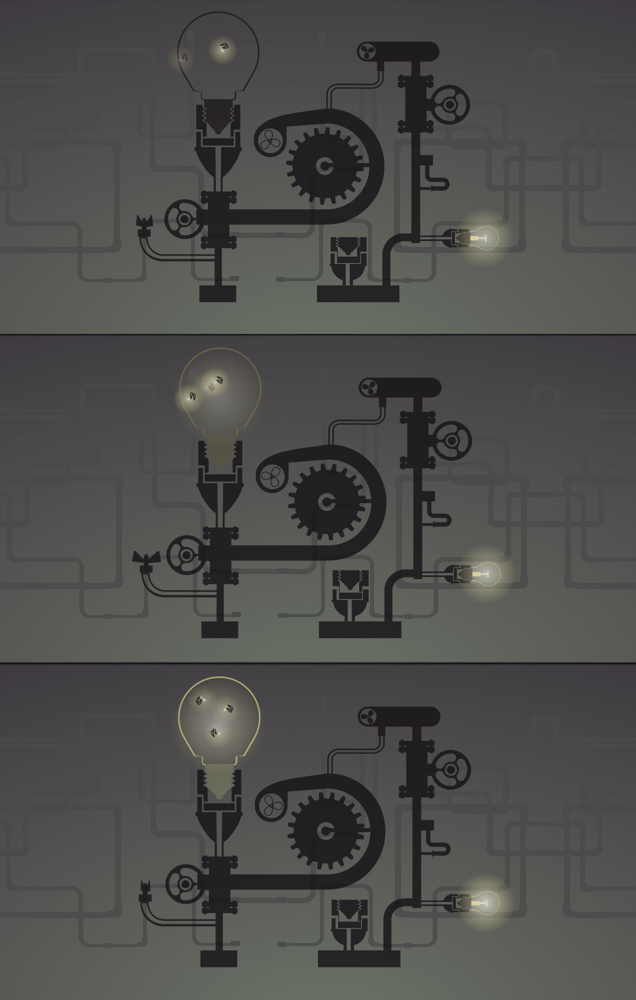
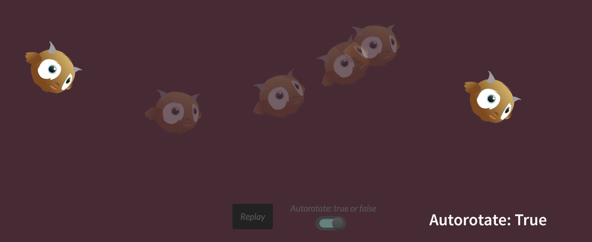

# 第10章： MorphSVG  和路径动画

GreenSock 的插件有许多让人惊奇的特性。首先我们将来聊一下 MorphSVG 和路径动画（BezierPlugin），因为这两个特性对于实际运动模拟度很高。

> #### 加载插件
> 
> MorphSVG 是一个值得投入的插件，但关键是你想在你还没花钱之前试一试。GreenSock 提供了这些插件的 [CodePen-safe 版本](https://codepen.io/GreenSock/pen/OPqpRJ)，这样你可以直接在 Codepen 里面试一试。
> 
> 不要忘记在你开始之前引入插件 JS 脚本和 TweenMax.min.js

## MorphSVG

MorphSVG 是 GreenSock 中最令人激动的一个特性之一。在发布的时候，GreenSock 仅仅只是一个支持通过不同路径点进行渐变运动的库。SnapSVG，SMIL，甚至是 D3 都可以将一个路径图形变为另外一个，但是如果这些路径点是不规则的，这个变形可能会失败或者看起来非常丑和奇怪。而 MorphSVG 可以在不规则路径下让图形更美的变形，并且通过 `findShapeIndex()` 你甚至可以完美的调整创造出来的 Morph 类型。

将一个 SVG 路边变为另外一个，只需要你讲它的 `ID` 改为另外一个。没开玩笑，就是这么简单。然后你就可以创造出让人惊叹的效果了。实际语法如下：

    TweenMax.to("#pathFrom", 1, {morphSVG:"#pathTo"});

MorphSVG 会确保路径在视口的位置，所以需要注意，当你在制作 SVG 时，应该让变形的两个路径在同一个位置，或者在它开始动画之前移动到其他的位置上。

你还可以通过之前的 `ID` 语法，或者直接以字符串的形式提供多边形的点，来渐变多边形线条或者多边形元素：

    TweenLite.to("#polygon", 2, {morphSVG:"10,10 40,70 70,70 70,10"});

MorphSVG 是专门为路径和多边形/线条设计的，但是有时候你可能需要去变换圆，矩形，或者其他 SVG 元素。而这个插件提供了 `convertToPath()` 方法很容易完成。你既可以通过与目标元素关联的 `ID` 或者 类名来调用，也可以直接传入完整的元素一次性从开始变形：

    MorphSVGPlugin.convertToPath("circle, rect, ellipse, line, polygon, polyline");

> #### 插件兼容性
> 
> MorphSVG 和 TweenMax 都很复杂，并且他们经常工作并且接受定期更新。因为关键点是逐步增加版本号，所以使用兼容版本的文件很重要。我曾看到过很多学生使用最新的 TweenMax 版本和较老的 MorphSVG 版本制作的动画失败了，所以如果你在制作一个简单的变形动画时遇到问题（我也会先从简单的开始），你可以先检查一下你是否使用兼容的版本。

###  ndShapeIndex()

另外，MorphSVG 在通过不同路径点计算哪种过渡动画看起来更合适时，表现出很棒的计算性能，所以，使用 `shapeIndex` 的默认属性就足够了。不过，偶尔你想要调整一下两点间的运动也可以。

如果你想特别关注形状变形的方式的话，`findShapeIndex()` 工具函数插件通过不断在循环点之间变换，让你选取针对你动画最合适的变形类型。你加载它，然后将元素的 `ID` 变为另外一个（比如，`findShapeIndex("#hex", "#star");`），然后一个很棒的 GUI 就出来了。不过，不要将上述代码遗留在你的代码库里，你应该使用它，然后在生产版本中删掉，这样可以减少不必要的冗余代码。

在图 10-1 和对应的 [demo](https://codepen.io/sdras/pen/f4e735983d9972abd35d74062ea0e543)里，你可以看见我是如果将一个五角星变为十边形的，但是，`index` 可以完全改变他们插入的方式。你的点越多，你的选择就越复杂。更少的点提供更少的选项。

*图10-1： 我们打算去变形的两个图形（顶部），当 ShapeIndex() 加载完成是，GUI 就会出现并且 shapeIndex 会被设置为 auto（中间），当我们将 index 设置为其他整数时，不同的形状变形就会发生。*

## 路径动画

路径动画对于动画里的实际运动来说是非常重要的。在 `x`,`y`,`z` 方向上插入一些单个值的方式非常受限。我们知道一个瓶子中的萤火虫或者其它生物很少沿着直线的方式飞行。现在，CSS 还未支持沿着路径运动的动画，不过它现在已经[列为提案](http://dev.w3.org/fxtf/motion-1/)，你可以在 [Microsoft Edge 上去投票支持其实现](https://wpdev.uservoice.com/forums/257854-microsoft-edge-developer/suggestions/7804467-support-css-motion-path-module)。SMIL 可以提供路径动画，[但是 IE 或者 Edge 都不支持](https://caniuse.com/#search=smil)。

GreenSock 通过 BezierPlugin 插件，提供了一个很方便的方式去创建上述效果。TweenMax 也支持，而且它的兼容性为 IE8+（对于 HTML 内容，IE9 开始支持 SVG）。所以，路径动画现在差不多被全部支持了，并且还有回退兼容的方案。

为了创建一个路径动画，你你需要传入一个坐标数组给 `bezier` 属性：

    TweenMax.to($firefly1, 6, {
        bezier: {
            type: "soft",
            values:[{x:10, y:30}, {x:-30, y:20}, {x:-40, y:10},
                    {x:30, y:20}, {x:10, y:30}],
            autoRotate: true
        },
        ease: Linear.easeNone,
        repeat: -1
    }, "start+=3");

我通常使用的是 `x`，`y` 坐标的值，因为它是我们之前提到的变换坐标。不过，其它的值也可以正常使用，比如，`left`，`top`，甚至是 `rotation`。这意味着你可以通过添加 `z` 轴的值，沿着 3D Bézier 路径进行变化。看起来确实让人很感兴趣，不过 99% 的时间，我都只是使用 `x`，`y` 轴的值。

当我使用 `x`，`y` 轴的值时，点的坐标是相对于元素的位置而不是 `canvas` 本身。换句话说，如果你定义了 `x:5`，`y:10`，那么这个运动会相对于元素右边 `5` 的距离和下部 `10` 的矩形开始。后续的点同样都是相对于元素的起始位置，并不是前一个变换位置。这可以让区域中的绘制点更容易围绕元素映射。在上述[奇特的萤火虫飞行动画里](https://codepen.io/sdras/full/MYQxXe)，为了让其在灯泡的范围内运动，我扭曲了它的运动路径，这可能看起来有点轻微的跳跃，就像在实际运动中，这 Bug 类似绕着一点运动（图 10-2）

*图 10-2: 萤火虫以奇特的规则运动。为了让其更接近现实的运动，它们不应该以线性的方式而是应该绕着某条路径旋转运动。*

你有可能并不想让萤火虫运动，只是想使用路径作为一个常规的坐标系，而且需要路径之间更加平滑和精确。这里有两种办法可以做到。第一种是将 `type` 参数设置为 `“soft”`。这会使你提供的路径和曲线靠近过这些点，好像它们朝着点的方向被拉升一样，而不是仅仅通过在两者中间插一个值，然后接着到下一个。第二种是将 `type` 参数设置为 `thru`（这是默认值），然后定义 `curviness` 属性值。`0` 表示无曲率，`1` 表示正常曲率，`2` 表示两倍曲率，然后依次。图 10-3 和对应的 [Pen 例子](https://codepen.io/sdras/full/PqEPqz)展示了不同设置的效果。

*图10-3： 例子展示了不同 curviness 属性值的曲线运动。*

注意，当你传入 `3` 的值时，曲线看起来有点不平滑，这是因为每一个点开始绕着她自己的轴循环。你可以认为这个运动形式比作一个正在拉伸的橡皮筋：当 `curviness` 设置 `0` 时，橡皮筋是被拉紧的。当设置为 `2`,橡皮筋的松紧刚好可以让不同点间的运动看起来平滑些。当达到 `8` 以上时，这个路径就没啥效果了。

除了 `“thru”` 和 `“soft”` 的属性值为，我们还有两种 Bézier 类型的定义：“quadratic” 和 “cubic”。“quadratic” 能够允许你在每个锚点出定义一个控制点。“cubic” 类似，不过你可以在每个锚点出定义两个控制点。对于 “quadratic” 和 “cubic” 而言，你必须以锚点作为数组的开始和结尾，尽管你可以在其中放入很多其它的值。

现在，你可以传递一个坐标系数组，虽然我并不惊讶，在未来 GSAP 会提供使用 SVG 路径本身来作为运动的定义。这个库一直在增添新的功能。你可以看看这个[库](https://github.com/greensock/GreenSock-JS/)的更新以及它在过去一年有哪些新加入的东西。

我同样提到了旋转。在前面的 Pen 中，我简单地设置 `autoRotate: true` 使萤火虫绕着对应直线方向的轴进行旋转，在遍历数值数组时。你可以更精确地将 `autoRotate` 设置为一个整数而不是 Boolean，使元素在初始状态就具有一定的旋转角度。或者，你也可以传入一个数组，去调整这些选项：

- 第一个位置（为 “x”）
- 第二个位置（为 “y”）
- 旋转属性（通常为 “rotation”，假如你想使其在一个轴上的话，也可以写为 “ratationX” 或者 “rotationY” ）
- （可选）度数（或者弧度）设置额外的旋转角度
- Booealn 值表示旋转属性是使用弧度单位还是角度单位（默认为 false，表示使用角度单位）

将 `autoRotate` 设置为一个数组：`["x","y","rotation",0,false]`，这和将 `autoRotate:true` 是一样的效果，并且该元素会沿着路径的旋转路径进行运动。这 `5` 个参数中我最常使用的是第 `4` 个：该数值的度数会加到新的旋转角上。这可以让你在动画设置之外，使字符或者元素在一定的方向上倾斜。这用处很大，因为在实际运动一开始，会稍微调整一下倾斜方向，它们并不会仅仅以一个稳定的水平方向进行运动。

我已经提供了一个切换 `autoRotate: true` 和 `false` 的[对应例子](https://codepen.io/sdras/full/aOZOwj)在图 10-4 和 10-5 中。所以，你可以清楚的看到不同参数对于动画的影响。

*图10-4： 当 `autorotate: true` 时，元素/字符会沿着路径进行倾斜。* 

*图10-5: 当 `autorotate: false` 时，元素/字符不会沿着路径进行倾斜，这看起来有点奇怪。*

下面是具体代码：

    function lilGuyGo(autoRotate) {
        tl.progress(0).clear()
        .set(lilG, {
            rotation: 40
        });
        tl.to(lilG, 3, {
            bezier: {
                type: "soft",
                values: [
                    {x: 0, y: 50}, {x: 150, y: 100}, {x: 300, y: 50},
                    {x: 500, y: 200}, {x: 700, y: 100}, {x: 900, y: 80}
                ],
                autoRotate: "true"
            },
            ease: Circ.easeInOut
        }); }
        lilGuyGo(true);

这个小物体比起给他设置一个固定角度的方式运动，以这种方式运动，看起来更生动。你也可以看到在一开始的时候，我将它的脸沿着路径放下朝下，是因为，如果我不这样做，它就会有一点“跳跃”，去沿着正确的原点和轴调整。我本来也可以通过传入一个数组的方式作为 `autoRotate` 的一个选项，像之前说的。这两者均可。

当然，路径运动并不仅仅局限于物体运动。当你结合透明度或者变形动画时，这就有无穷的可能性对动画行进微调。