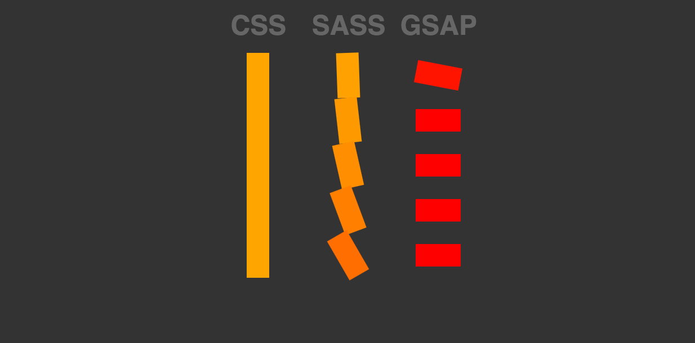
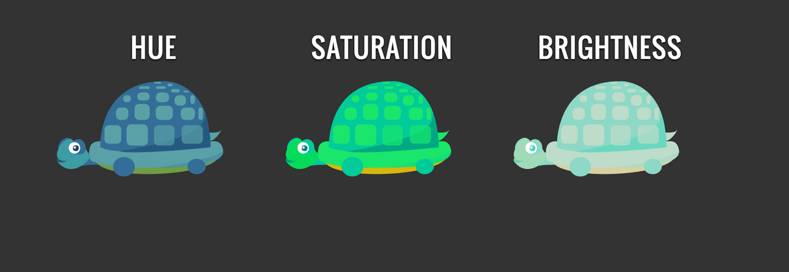

# 第11章：交错效果、Tweening HSL和SplitText的文本动画

## 交错的动画

很多 JavaScript 动画库都提供了交错动画的特性，这个特性非常善于创造酷炫的动画效果，与直接使用 CSS 创建相比优势巨大。 如图11-1所示，让我们看一下编写动画的多种方式。



*图11-1：使用 CSS , Sass 与 GSAP 编写相同的交错效果动画的对比。*

在 CSS 中创建交错动画，需要在元素或元素的伪类上使用相同的关键帧，并对每个关键帧依次增加其延迟:


    @keyframes staggerFoo {
        to {
            background: orange;
            transform: rotate(90deg);
        }
    }
    .css .bar:nth-child(1) { 
        animation: staggerFoo 1s 0.1s ease-out both; 
    }
    .css .bar:nth-child(2) { 
        animation: staggerFoo 1s 0.2s ease-out both; 
    }
    .css .bar:nth-child(3) { 
        animation: staggerFoo 1s 0.3s ease-out both; 
    }
    .css .bar:nth-child(4) { 
        animation: staggerFoo 1s 0.4s ease-out both; 
    }
    .css .bar:nth-child(5) { 
        animation: staggerFoo 1s 0.5s ease-out both; 
    }
    .css .bar:nth-child(6) { 
        animation: staggerFoo 1s 0.5s ease-out both; 
    }

Sass 中，可以把以上代码精简一点：

    @keyframes staggerFoo {
        to {
            background: orange;
            transform: rotate(90deg);
        }
    }
    @for $i from 1 through 6 {
        .sass .bar:nth-child(#{$i} ) {
            animation: staggerFoo 1s ($i * 0.1s) ease-out both;
        }
    }

不过使用 GSAP 的话可以只用一行代码就可以完成这个效果：

    TweenMax.staggerTo(".gsap .bar", 1, {
        backgroundColor: "orange",
        rotation: 90,
        ease: Sine.easeOut
    }, 0.1);

事实上，这种简洁的方式非常适合动画制作流程，特别是需要经常调整动画效果时。

使用 `cycle` 属性可以传递多个需要在其中交错的值，从而代替很多本来需要 Sass 来生成的，复杂的 `nth-child` 选择器.`cycle`方法接受一组数组作为参数,并将这组数之间的值应用到元素上:

    TweenMax.staggerTo(".foo", 1, {
        cycle: {
            y: [75, 0, -75]
        },
        ease: Power4.easeInOut
    }, 0.05);

这些参数也可以随机化从而制造更多有趣的效果。这种方式优于创建一个随机函数并不断调用，因为这样写只会执行随机函数一次(因此之后不会随机)。 这样使用`cycle`属性可以更容易的创建华丽且有趣的效果。下面的代码就使用了`cycle`属性，来给每个动画随机生成值：

    var coord = [40, 800, 70, -200];
    TweenMax.staggerTo(".foo", 1, {
        cycle: {
            x: function(i) {
            return coord[Math.floor(Math.random() * coord.length)];
        } 
    },
        ease: Power4.easeInOut
    }, 0.1);

> #### 了解动画中的```Math.random()```
> 
> `Math.random()`能够创建迷人的随机效果或生成动态代码，因此对于 JavaScript 动画来讲它是非常有用的。`Math.random()`返回一个`0` 和 `1` 之间的值, 因此对于一些场景比如透明度这样的，这个值可以开箱即用。其他情况下,可以倍乘这个值直到其达到需求。前面的代码中你可能已经注意到,`Math.random()` 方法放在了 `Math.floor()` 方法中。这样做的结果是`Math.random()`产生的值会向下取整到最小的整数值(`Math.ceil()` 向上取整，`Math.round()`四舍五入取整。
> 
> 在这个场景下`.floor()`与`.round()`均适合，而我通常选择`.floor()`,因为我了解到`.floor()`的性能会略好。当然,如果不需要整数值,可以不用取整。
> 
> 如果需要使用`Math.random()`来获取一个区间上的随机数，可以倍乘这个区间，并加上最小值，如下所示：`Math.random() * (max - min) + min;`

图11-2 以及[相关例子](https://codepen.io/sdras/pen/XmmjQb)中，我让每个目标元素在三个值之间交错产生动画，只使用了一点点代码(22行 JavaScript)，你也可以完成！


*图11-2：所有的动画都是依靠 GSAP 的补间动画能力，使一个数组中的值作用于很多目标来完成，只用了很少的代码。*
     
下面是代码:

    var bP = $(".boggle path"),
        tl = new TimelineLite();
    tl.add("start");
    tl.staggerFrom(bP, 3, {
        cycle:{
            fill:["white", "yellow", "#e23e0c"],
            opacity:[0.8, 0.2, 0.5, 0.3],
        },
        ease:Elastic.easeOut
    }, 0.001);
    tl.staggerTo(bP, 3, {
        cycle:{
            y:[700, -700, -1000, 1000],
            x:[200, -200, -700, 700],
            rotation: function(i) {
                return i * 20 
            }
        },
        opacity: 0,
        fill: "#f2bf30",
        ease:Circ.easeInOut
    }, 0.001, "start+=1.25");

## HSL 颜色渐变动画

这个动画是“相对”简单的。渐变 `HSL` 颜色的能力(`H` —— 色相、`S` —— 饱和度、`L` —— 明度)是非常奇妙的, 当你想创建一些复杂的，呈现为动画形式的颜色效果，稍微调整这些值就会带来非常强大的视觉效果。例如，一个场景中存在不同颜色的元素，可以在某个过程中缓慢的改变场景中所有元素的颜色，比如从白天到晚上。以前实现这种效果最简单的方法，是逐步改变这些元素自身的颜色值。通常可以使用一个遮罩层来覆盖整个场景,但这样缺乏真实性。或者可以使用一个 SVG 矩阵滤镜, 但这样的效果非常一般，并且很难呈现为动画。也可以使用目前支持度并不高的 CSS 滤镜。然而，使用 GSAP,一小段代码就可以完成这个效果，并且完美兼容。通过 GSAP 可以操作数以百计的元素, 让它们稍稍变暗,并且减少它们颜色的饱和度,缓慢调整它们的色调，就像将他们置为阴暗处中一样。 由于渐变 HSL 颜色不需要依赖一个具体的属性，因此能够用于背景( div )或填充颜色( SVG )。图11-3 和相应的示例展示它如何工作：


 
*图11-3：当鼠标悬停在乌龟上时，乌龟SVG中的每个形状的图形分别会做色相，饱和度或亮度值的插值改变。*
     
这么多选择！有什么好例子吗？可以将交错周期和HSL颜色补间放在一起。相比之前的夜景效果，下一个效果更加极端。

以下两个不同的按钮，相对效果略有不同。因为是对相对值做补间，可以将按钮的效果组合起来并获得多个输出：

    function hued() {
        var ch1 = "hsl(+=110, +=0%, +=0%)",
        tl = new TimelineMax({
            paused: true
        });
        tl.add("hu");
        tl.to(mult, 1.25, {
            fill: ch1
        }, "hu");
        tl.to(body, 1.25, {
            backgroundColor: ch1
        }, "hu");
        tl.from(gauge, 2, {
            rotation: "-=70",
            transformOrigin: "50% 50%",
            ease: Bounce.easeOut
        }, "hu");
        return tl
    }
    var hue = hued();
 
之后使用 `circle` 属性，添加几个节点使场景效果变得更加细腻。目标是所有进场元素的最终效果看起来一样，所以使用`.staggerFrom`比`.staggerTo`更适合：

    tl.staggerFrom(city, 0.75, {
        y: -50,
        scale: 0,
        cycle:{
            x:[300, 100, 200],
            opacity:[0.5, 0.3, 0.2, 0.8],
            rotation:[50, 100, 150],
        },
        transformOrigin: "50% 50%",
        ease: Back.easeOut
    }, 0.02, "in");

这样创建了一系列建造城市的效果（图11-4）。


*图11-4：我们可以使用控件来控制所有的填充和背景色，并进行独特的颜色组合。* 

在这里，我们将HSL补间动画与交互联系起来，通过拖拽来控制时间轴。这样可以创建很多有趣的效果，GreenSock与用户的操作可以很好的结合起来。我们将在第12章讨论这一点。

### 文字切分

虽然[`SplitText`](https://greensock.com/SplitText)并属于SVG动画，不过这个效果很适合同SVG动画一起提出。不过，本书中介绍这个效果并不意味着这个效果是通过SVG的 `<text>`节点实现的。

SplitText兼容IE8，独立于GreenSock。它可以根据选择的内容将文本划分为字符，单词或行，并将其包装到单独的div中，以便可以同时或依次操作它们。

下面是一个简单的例子

    new SplitText("#myTextID")
    
图11-5和相关的[Demo](https://codepen.io/sdras/full/RNWaMX)中把SplitText作为一个对象来使用，并将其用于获取字母和单词，从而在其上制作动画


*图11-5：动画可以为你的故事增光添彩。*

代码如下:

    function sceneOne() {
        var tl = new TimelineLite(),
            mySplitText = new SplitText($text, {
                type: "chars, words"
            });
        tl.staggerFrom(mySplitText.chars, 0.8, {
            opacity: 0,
            scaleX: 0,
            ease: Power4.easeOut
        }, 0.05, "+=4")
        .staggerTo(mySplitText.words, 0.8, {
            rotationY: 60,
            y: 300,
            opacity: 0,
            ease: Power4.easeIn
        }, 0.1, "+=0.1")
        .to(person, 3, {
            rotation: -5,
            transformOrigin: "80% 50%",
            y: -10,
            ease: Circ.easeOut
        })
        .to(head, 3, {
            rotation: -10,
            transformOrigin: "0% 100%",
            y: 10,
            ease: Back.easeOut
        }, "-=3")
        .to(neck, 3, {
            rotation: -10,
            transformOrigin: "0% 100%",
            y: 10,
            ease: Back.easeOut
        }, "-=3");
        return tl; 
    }

SplitText不是唯一可以创建文本效果的库，但是在这个库中包含一个杀手功能，其他库通常没有，它能够很自然的处理文字换行。

拆分元素也可以将其位置设置为“相对”或“绝对”。当您使用`position:relative`分割时，文本将能够随着父元素更改大小而自然地分散和聚集。当使用`position:absolute`时，文本被拆开后后不会聚集起来;这可能会提高动画性能。

如果需要制作文本动画，且将其返回到“非分割”状态，可以使用`revert()`方法。还可以给每个分解的文本添加自动递增的类名，例如`.char1`，`.char2`，`.char3`等。

    new SplitText("#myTextID", {type:"words", wordsClass:"char++"});

这使我们能够创造有趣的效果，甚至针对某个特定单词，字符或行进行动画。