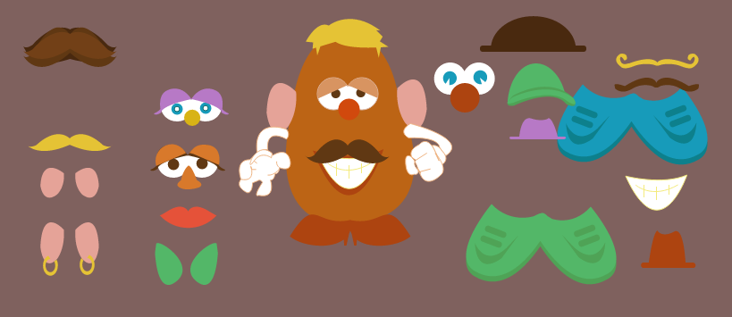
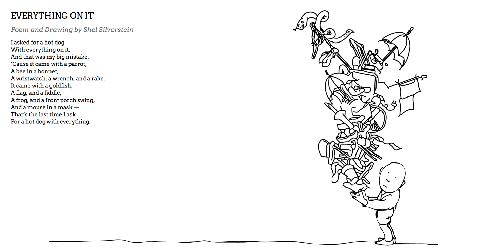

# 第12章：DrawSVG和Draggable

## Draggable

在Web网页中，拖动屏幕上元素是一件看起来非常简单的事情，就像我们用工具乱涂乱画。有很多可以帮助我们的，可以用：触摸输入设备，鼠标事件，可视区域，滚动行为，摩擦和可信的物理现象。当然，有更多你开始没有考虑到的失败情况。值得高兴的是，GreenSock 的 [Draggable](https://greensock.com/draggable) 是一个真正有用的插件，它对HTML元素非常有用，当然同样也包含SVG。

Draggable 支持触屏设备，使用 `requestAnimationFrame()` 方法，也支持GPU加速。Draggable 自己能独立地工作，但是如果和 [ThrowPropsPlugin](https://greensock.com/throwpropsplugin) 一起用会更高效，它可以创造真正漂亮的物理动效。

Draggable最好的一点就是它的简单。让一个盒子元素变得可拖拽所需要做的一共就是如下一行代码：

    Draggable.create(".box", {type:"x,y", edgeResistance:0.65,
        bounds:"#container", throwProps:true});

你可能发现在代码的开始部分，我们用bounds定义了一些boundaries。bounds 相当灵活：你可以定义包含的单位或者像素参数。像 `#container`（在之前的示例中）或者其他块都会有效，但是你会说一个对象：`{top:10, left:10, width:800, height:600}` 限制了运动。

你也可以限制它只能沿着横轴或者纵轴移动，你只要设置 `lockAxis` 为`true`，这样它就会在两个方向。

有很多你可以使用的回调函数和事件监听函数，如下：

- `onPress`
- `onDragStart`
- `onDrag`
- `onDragEnd` 
- `onRelease` 
- `onLockAxis` 
- `onClick`

这样，你可以像下面一样注册一个`dragend`事件的处理函数：

	myBox.addEventListener("dragend", functionName);

它指向了 Draggable 实例本身，这样你可以简单地获取它的 `target` 或者 `bounds`。这非常有用，因为你即将开始使用Draggable提供的功能，不需要猜测或者打印日志来理解你正在指向的。所有的这些也同样在变化的元素上生效，比 `transform-origin` 更优 —— 比起编写原生的方法，插件变得更简单以及更直接。图12-1部分有一些插件[相关的示例](https://codepen.io/sdras/pen/gbERKQ)。

*图12-1：图中是一个真正简单的马铃薯先生，允许你拖动周围的 SVG 元素来填充和匹配它的容貌。*

用你现在为止所学的所有代码，你可能会猜测，我们真正唯一需要的就是下面这段代码，来让它完全生效：

    var features = "#top_hat, #moustache, #redhat, #curly-moustache,
        #eyes1, #lips, #toothy-lips, #toupe, #toothy, #big-ear-r,
        #big-ear-l, #shoes1, #lashed, #lash2, #lazy-eyes, #longbrown-moustache,
        #purplehat, #sm-ear-r, #sm-ear-l, #earring-r, #earring-l, #highheels,
        #greenhat, #shoes2, #blonde, #blond-mustache, #elf-r, #elf-l";

    Draggable.create(features, {
        edgeResistance:0.65,
        type:"x,y",
        throwProps:true,
        autoScroll:true
	});

### Drag类型

到目前为止，我们只是展示了如何用 Draggable 设置`x`和`y`的值，代表闪烁和上下、左右移动屏幕里面的东西。但是，还有其他的Drag类型可以选择：`rotation` 和 `scroll`。

    Draggable.create("#wheel", {type: "rotation"});

上面的代码示例中，Draggable使用了`rotation`类型，它会很有趣，在控制诸如把手、齿轮、杠杆还有滑轮的时候更迷人。你也可以定义 `minRotation` 和 `maxRotation`。

我并不倾向因为滚动而混乱，直到我必须要用的时候，但是还是需要提一下，Draggable 可以对它同样有用。你可以控制一个元素的 `scrollTop` 和 `scrollLeft`属性；给 `lockAxis` 设置一个布尔值；用数值类型来定义`edgeResistance`。

有一个我确实喜欢的和 `scrolling` 相关的，但是是应用到`x`,`y`，有能力像这样设置 `autoScroll:1` （或者 `autoScroll:2` 等等）。它所做的就是允许视图可以滚动，如果元素你拖动到可视区域以外。现在，你有一个可以在屏幕上拖动的盒子元素。如果你传递了 `autoScroll:1`，滚动会跟随这盒子。这正是你想要的，所以它看起来很自然。

### hitTest()

Draggable最酷的一个功能就是它的自定义碰撞检测。它使得拖拽类的UI界面和交互变得可能，甚至是类似游戏的东西。

在下面的代码中，我们会检查元素重叠是否超过`80%`。如果超过，我们会增加一个`class`(它会增加一个红色的边框)，如果没有，我们会删除它。

    var droppables = document.querySelectorAll('.box'),
        overlapThreshold = "80%";
    Draggable.create(droppables, {
        bounds:window,
        onDrag: function(e) {
            var i = droppables.length;
             while (--i > -1) {
                if (this.hitTest(droppables[i], overlapThreshold)) {
                    droppables[i].classList.add("red-border");
                } else {
                    droppables[i].classList.remove("red-border");
                } 
            }
        } 
    });

我们可以使用 `hitTest()` 方法来检测是否发生了一个鼠标移入事件，或者其他类型的事件。

我们可以使用一些原生的方法来达到同样的目的，比如`getBBox()`方法或者`getBoundingClientRect()`方法来计算相邻的值。事实上，我会在第15章给你展示如何用这些来开发炫酷的效果。但是，如果你已经加载和开始使用Draggable插件来处理拖动事件，你完全可以使用这些有用的方法集合。

### 用 Draggable 来控制 Timeline

其中一种我喜欢的方式就是把 Draggable 和其他效果一起用。用 Draggable 绘制一个时间轴可以创造出漂亮的场景，给用户掌控过程的能力。看图12-2和[它相关的示例](http://codepen.io/sdras/full/NqYGZv/)。

*图12-2：用户可以选择不停地转动齿轮或者按play按钮*

简短地说明一下，我这里没有展示页面所有元素动画的代码，更多是专注在我们如何创造这种交互：

    var master = new TimelineMax({paused:true});
    master.add(sceneOne(), "scene1");

    // master.seek("scene1");
    Draggable.create(gear, {
        type: "rotation",
        bounds: {
            minRotation: 0,
            maxRotation: 360
        },
        onDrag: function() {
            master.progress((this.rotation)/360 );
        } 
    });

开始的时候，我们暂停了 `timeline`，然后创建了一个 `gear` 的 `draggable` 实例。我们用`minRotation`和`maxRotation`来定义`bounds`，这样用户不会可以一直拖动齿轮。我们也指定了 `timeline` 会用 `progress()` 方法沿着旋转方向上 `360` 度地绘制。`progress()`方法对于这类的`timeline`操作非常地有用，因为它允许你创建`timeline`的过程或者操作沿着`timeline`某一个点的事件

你也可以在笔直的线上划分交互或者其他任意你想要做的事情 —— 有很多可能性！

## DrawSVG

我们如何能让一个SVG元素看起来在页面上绘制自己呢？当然，事实上，我们已经学习了这些 —— 在第 6 章当我们学习CSS 动画示例的时候。

> #### 加载插件程序
> 
> DrawSVG是一个付费的插件程序，但是在你花钱之前，你会想要试用它。GreenSock让这变的可能，它提供了[CodePen的插件程序版本](https://codepen.io/GreenSock/pen/OPqpRJ)，这样你可以在编写示例的时候使用它。
> 
> 在你开始编写示例之前，不要忘记加载插件程序资源和`TweenMax.min.js`文件。

我们来回顾一下这个技术

首先，我们需要一个SVG元素。这个元素有一个 `stroke`，而且带有虚线。（看图12-3部分）

*图12-3：以带有虚线 `stroke` 的五角星形状。*

我们可以用 JavaScript 原生的方法 `.getTotalLength()`来获取形状的个数。 

    var starID = document.getElementById('star');
    console.log( starID.getTotalLength() );

我们将设置 `path` 上的一个带有虚线的部分，用 `stroke-dasharray` 来设置形状的所有数量（我们从`console.log`打印出来的整数）。 `offset` 或者 `stroke-dashoffset`，是放置的路径开始部分和图案之间的间隔。即使我们只是设置了数组中的一个值，它会自动复制这样 `gaps` 和 `dashes`会相同数量。下面一段动画示例代码，或者不用框架只用 CSS，或者用 JavaScript。

	.path {
	    stroke-dasharray: 1000;
	    stroke-dashoffset: 1000;
	    animation: dash 5s linear forwards;
	}
	@keyframes dash {
	    to {
	        stroke-dashoffset: 0;
	    }
	}

所以，为什么我们用 GreenSock 来做动画，而不是简单地用 CSS 的动画，这样不用框架。这里有一些原因：

- 你已经加载了GreenSock，插件允许你不需要计算个数，而轻松地使用这些属性进行动画操作。
- 没有`getTotalLength()`方法，也可以对`rect`，`circle`，`ellipse`，`polyline`和`polygon` 有用。
- `.getTotalLength()` 方法是静态的，当SVG响应式地调整收缩的时候，它不起作用，但是这个时候 DrawSVG 可以。
- `.getTotalLength()` 在 IE 和 Firefox中有一些奇怪的 bug。如果你只是用它来打印值，然后再删除它，你可以解决问题，但是，当你用这个方法来动态更新的时候它不会生效。
- 有了 GreenSock，你不但可以让动画从开始到一个完整的结束；你可以使用布尔值（`true`代表完全绘制完成，`false`代表一点也没有绘制）或者是百分比（我的最爱），或者你甚至可以以这样的值来处理动画进入和消失，比如 `"50% 50%"`（因为都是以 `50%` 开始，所以不会显示）

DrawSVG让我们做非常复杂而又稳定的动画变的简单，当它和其他特性一起配合使用的时候，如：时间轴，中间的相关的 `HSL`（在前面章节已经覆盖了），你可以简单地创造漂亮的效果，只需要下面一行代码：

    TweenMax.staggerFromTo($draw, 4,{ drawSVG:'0' }, { drawSVG: true }, 0.1);

图12-4部分会展示一个更[复杂的示例](https://codepen.io/sdras/pen/qEdova)，暗示更多的可能性。

*图12-4：示例展示了当文字按照动画效果进入页面的时候， Shel Silverstein  开始在页面被绘制。*

> #### 描边动画
> 
> 无论是用CSS还是用DrawSVG，确保元素一开始有`stroke`。我看过同学们会有一段时间的疑惑，因为开始的时候没有创建一个`stroke`，没有动画，因为没有什么发生，但实际上也没有”失败“。
> 
> 这同样也应用到`groups`。如果你的目标是一个`group`，确保获取`group`内部的元素，而不是仅仅`group`本身。即使 `stroke` 应用到一个 `group`，层叠到其他 `paths`/ `shapes`，这个`group` 本身不含有`stroke`，只有元素有。

DrawSVG使用起来很简单，它提供很多方式来处理复杂的需求，也在更大的场景中变得有用。