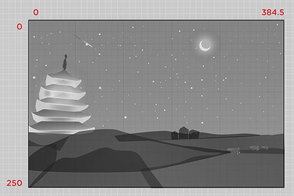
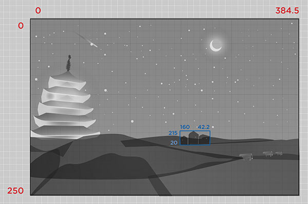
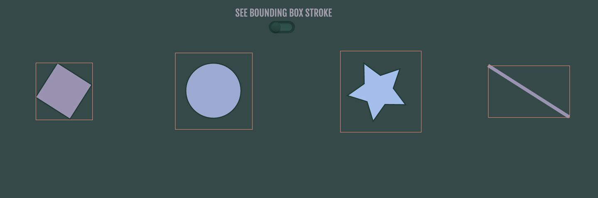
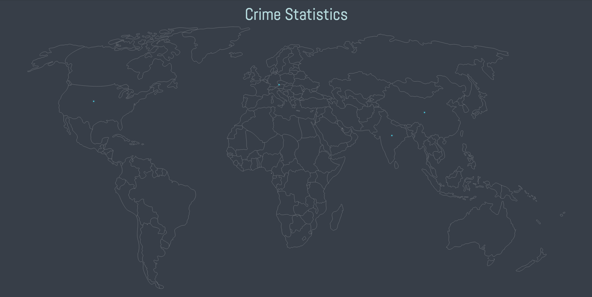
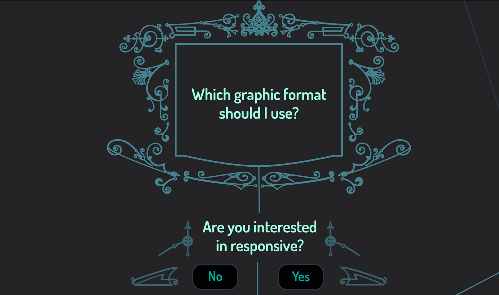

# 第15章：动“不可动者”：通过改变属性并使用原生javascript实现动画

使用 JavaScript 处理动画的强大之处在于，我们不受CSS中动画概念的限制。有很多属性在改变后会产生惊人的效果，甚至很多属性从来没有被尝试过。

## `requestAnimationFrame()`

其实制作SVG动画效果不需要任何库。一个优雅且高性能的方法是使用`requestAnimationFrame()`(简写为`rAF`)。`rAF` 可以替换其他原生JavaScript方法，比如`setInterval()`(尽管这个方法已经通过rAF开创的特性来改进了)。

它的工作方式是在下一次重绘浏览器时，将动画更新相关函数传递给浏览器。`rAF`调用不会创建一个嵌套的调用堆栈，因为这可能导致性能问题。相反，它们将回调函数添加到由浏览器管理的队列中，并且在特定时间只有一个函数实例运行。

`requestAnimationFrame()`的神奇之处在于，它能以每秒`60`帧的速度运行，但在浏览器底层，它会根据你的设备情况计算出运行的速度:桌面端运行的更快，移动设备上运行速度会变慢。当标签切换到后台时，它也会停止工作，因此这样可以节省电池寿命，同时在不需要运行的时候不会占用资源。这样处理，节省了开发者的工作，我们不需要在`setInterval()`中手动处理这些问题，我们不需要为不同的浏览器或不活动的标签设置不同的间隔时间。

> #### rAF的浏览器支持情况
> 
> 之前如果想使用`requestAnimationFrame()`，需要添加浏览器前缀和polyfills，幸运的是，浏览器对此的支持已经提升，现在只有在需要支持IE9或更早版本的情况下才需要这样做。 Opera Mini根本不支持rAF，但不会在客户端运行任何JS。它只是使用网站初始的JS在代理服务器上构建站点，然后将其发送给用户。请记住，使用Opera Mini浏览器来浏览网页，基本上类似看一个网页的截图/ PDF。

`rAF`的语法如下所示：

    function animateSVG() {
        // here is where your animation code would go
        requestAnimationFrame(animateSVG);
    }
    requestAnimationFrame(animateSVG);

也可以在IIFE（立即调用的函数表达式）中使用`rAF`：

    (function animate() {
        requestAnimationFrame(animate);
    }());

当然，不需要将动画的所有代码放在函数中 —— 也可以调用另一个函数，这个函数用于动画更新。`rAF`中的回调函数通常用于判断动画是否已经“完成”（除非你想要一个无限循环的动画）。

在[下面的演示](https://codepen.io/sdras/pen/e805476fd38a7cc3657e2027f3fc0b17)（图15-1）中创建了一个 SVG 圆组成的对象组。前文提到，使用SVG 绘制圆需要三个属性：`r`表示半径; `cx`表示圆心在直角坐标系中x轴的位置;`cy`表示圆心在y轴的位置。在此演示中将使用`cx`和`cy`值来更新圆的位置，而这两个属性在CSS中不是用于动画的。

*图15-1：一个用对象组创建的粒子喷泉效果，它使用`requestAnimationFrame()`来更新SVG属性。*

在这个例子中首先声明变量，并将属性赋给变量。使用`.innerWidth`和`.innerHeight`（获取页面的高度和宽度）将宽度和高度设置为页面的大小，并使用这些值来创建我们的`viewBox`。之后定义了一些变量来代表重力，摩擦力和一个空的物体以供以后使用：

    var svg = document.createElementNS("http://www.w3.org/2000/svg", "svg"),
        svgNS = svg.namespaceURI,
        vbx = document.createElementNS(svgNS, "viewBox"),
        width = window.innerWidth,
        height = window.innerHeight,
        gravity = 0.00009,
        friction = 0.000001,
        lots = [],
        prevTime;
    document.body.appendChild(svg);
    document.body.style.background = '#222';
    svg.setAttribute("viewBox", "0 0 " + width + " " + height);
    svg.setAttribute("width", width);
    svg.setAttribute("height", height);

> #### 正确的命名空间
> 
> 因为SVG需要写在不同的命名空间中，所以创建元素有点复杂，需要使用`document.createElementNS()`来创建一个SVG命名空间的`URL`，之后可以随时通过任何现有SVG元素的`.namespaceURI`属性访问这个`URL`。通常我会如以上代码所示，创建一个变量 `svgNS = svg.namespaceURI`，以便缓存并快速引用它。

现在可以使用一个构造函数来创建一个气泡，`new Bubble()`，它定义了这个对象的初始状态。这个函数通过两个参数：不透明度和半径来随机创建气泡。之后把气泡添加到SVG的`viewBox`中间：

    function Bubble(opacity, radius) {
        this.init(width/2, height/2, 0, 0);
        this.opacity = opacity;
        this.radius = radius;
        var circ = document.createElementNS(svgNS, "circle");
        svg.appendChild(circ);
        circ.setAttribute("r", this.radius);
        circ.setAttribute("fill", "none");
        circ.setAttribute("stroke-width", "1px");
        this.circ = circ;
    }

之后创建对象的原型，为所有`bubble`对象定义两个共享方法 —— 用于设置初始位置和速度的`init()`方法，以及通过摩擦（减慢速度）和重力，计算加速度来更新气泡位置的`update()`方法，（相关的物理公式附在了注释中）

    Bubble.prototype = {
        init: function (x, y, vx, vy) {
            this.x = x;
            this.y = y;
            this.vx = vx;
            this.vy = vy;
        },
        update: function (dt) {
            // friction opposes the direction of velocity
            var acceleration = -Math.sign(this.vx) * friction;
            // distance = velocity * time + 0.5 * acceleration * (time ^ 2)
            this.x += this.vx * dt + 0.5 * acceleration * (dt ^ 2);
            this.y += this.vy * dt + 0.5 * gravity * (dt ^ 2);
            // velocity = velocity + acceleration * time
            this.vy += gravity * dt;
            this.vx += acceleration * dt;
            this.circ.setAttribute("cx", this.x);
            this.circ.setAttribute("cy", this.y);
            this.circ.setAttribute("stroke", "rgba(1,146,190," + this.opacity + ")");
        }
    };

每个泡泡会调用`init()`函数两次。第一次创建气泡并保持居中和静止，之后用独立的方法来使气泡的速度随机化。通过不透明度和半径参数来初始化一个气泡，并将它们`push`到之前创建的数组中（我称之为lots(很多)，有时很难命名） —— 你可以在Twitter上跟我讨论你喜欢的命名，但说句实话：我可能会发送一只猫皱眉头的GIF图作为回应。。）：

    for (var i = 0; i < 150; i++) {
        setTimeout(function () {
            var single = new Bubble(0.5+Math.random()*0.5, 5 + Math.random()*10);
            initBubble(single);
            lots.push(single);
        }, i*18); 
    }
    ...
    function initBubble(single) {
        single.init(width/2, height/2, -0.05 + Math.random()*0.1, -0.1 + Math.random() * 0.1);
    }

之后使用`requestAnimationFrame()`循环遍历`Bubbles`数组(lots)并激活它，使用在`Bubble`对象原型中定义的`update()`方法来重新绘制位置。下面代码做了一些小的调整，当页面的高度很小的时候，可以让气泡在更新之前一直下降，其他情况下才频繁地更新气泡位置：

    (function animate(currentTime) {
        var dt;
        requestAnimationFrame(animate);
        if (!prevTime) {
            // only save previous time
            prevTime = currentTime;
            return;
        } else {
            // calculate the time difference between frames;
            // if it's more than 25 ms, assume it's because the tab
            // wasn't active, and just use 25 ms
            dt = Math.min(currentTime - prevTime, 25);
            prevTime = currentTime;
        }
        for (var i = 0; i < lots.length; i++) {
            lots[i].update(dt);
            // if the height is small, just let it start over when it gets to the bottom;
            // otherwise, at 85% (so that there aren't big gaps)
            if (height < 500) {
                if (lots[i].y > height) {
                initBubble(lots[i]);
            }
            } else {
                if (lots[i].y > height*0.85) {
                    initBubble(lots[i]);
                }
            } 
        }
    }());

通过`requestAnimationFrame()`，不需要添加额外的资源便可以灵活地构建动画，也可以使用那些并不属于标准的动画属性。事实上，大多数JavaScript动画库都使用`rAF`，所以如果在不抽象（使用封装好的库）的情况下更加理解动画，使用`rAF`构建是一个很好的方法。

请记住，一些库提供的抽象对于保持代码干净，清晰是很有用的，因此在生产环境中，使用库可能更有意义，但每个站点都是不同的，可能会具有不同的要求。

## GreenSock的AttrPlugin

GreenSock的AttrPlugin包含在TweenMax中（参见第8章），因此不需要在TweenMax.min.js之外添加任何其他资源。 `attr`的语法与上文的可动画属性略有不同：

    TweenMax.to(".trial", 3, {
        attr: {
            d: "M 100 300 C 125 200 175 200 200 100 Q 250 550 300 300
            Q 350 50 400 450 C 450 550 450 50 500 300
            C 550 50 550 550 600 200 A 50 50 0 1 1 700 300"
        },
        ease: Expo.easeOut
    });

你可以看到我们如何将 `d` 属性放在`attr`对象中，以与其他属性不同。对于其他可动画属性，我们将它们用在`attr`对象之外：

    TweenMax.to(".trial", 3, {
        attr: {
            d: "M 100 300 C 125 200 175 200 200 100 Q 250 550 300 300 Q 350 50 400 450 C
            450 550 450 50 500 300 C 550 50 550 550 600 200 A 50 50 0 1 1 700 300"
        },
        x: 300,
        ease: Expo.easeOut
    });

你可以看到下面实现了一个`path`属性的补间动画。如果存在相同数量的路径点，这很容易做到，不一定需要MorphSVG（第10章）。事实上，如果花时间了解`path`属性，可以通过补间`path`的值来创建一些相当复杂的路径效果。

也可以对其他属性创建补间动画。例如，可以使用下面的JavaScript创建[一个动态的渐变蒙版](https://codepen.io/sdras/pen/a8c85b6e331b2ebf85fb9254af471919)：

    TweenMax.fromTo("#stop1", 1.5, {
        attr:{offset:-1}
    }, {
        attr:{offset:1},
        repeat: -1,
        yoyo: true,
        ease:Linear.easeNone
    });
    
    TweenMax.fromTo("#stop2", 1.5, {
        attr:{offset:0}
    }, {
        attr:{offset:2},
        repeat: -1,
        yoyo: true,
        ease:Linear.easeNone
    });

SVG如下：

    <svg width="500"
         height="200"
         xmlns="http://www.w3.org/2000/svg"
         xmlns:xlink="http://www.w3.org/1999/xlink">
        <defs>
            <linearGradient id="Gradient">
                <stop id="stop1" offset="0" stop-color="white" stop-opacity="0" />
                <stop id="stop2" offset="0.3" stop-color="white" stop-opacity="1" />
            </linearGradient>
            <mask id="Mask">
                <rect x="0" y="0" width="500" height="200" fill="url(#Gradient)"  />
            </mask>
        </defs>
        <rect x="0" y="0" width="500" height="200" fill="#480048" />
        <rect x="0" y="0" width="500" height="200" fill="#C04848" mask="url(#Mask)" />
    </svg>

以上代码本质上创建了一个蒙版，并使用渐变来定义其不透明度，之后对`offset`属性进行补间动画，从而创建了一个高性能的渐变动画效果。如果将此与背景渐变动画进行比较，其效果会更好，因为这个动画造成的重绘较少。

也可以使用滤镜进行动画处理，比如通过`stdDeviation`（高斯模糊） 滤镜。[下面的代码中](https://codepen.io/sdras/pen/gaxGBB)，使用MorphSVG来遍历所有路径点，并通过更新`stdDeviation`滤镜来产生模糊效果，以创建一个起伏的火焰效果，这个移动效果很自然（图15-2）。

*图15-2：如果你这样使用动画，可以得到不稳定的运动效果，这样对于元素来讲非常自然。*

以下是代码的相关部分：

    function flame() {
        var tl = new TimelineMax();
        tl.add("begin");
        tl.fromTo(blurNode, 2.5, {
            attr: {
                stdDeviation: 9
            } 
        }, {
            attr: {
                stdDeviation: 3
            }
        }, "begin");
        var num = 9;
        for (var i = 1; i <= num; i++) {
            tl.to(fStable, 1, {
                morphSVG: {
                    shape: "#f" + i
                },
                opacity: ((Math.random() * 0.7) + 0.7),
                ease: Linear.easeNone
            }, "begin+=" + i);
        } 
        ...
        return tl; 
    }

## 实际应用：viewBox动画

页面中使用数据可视化是传达信息的有力方法。过去，我们已经讨论过如何使用它来隐藏和显示响应式开发的信息。使用SVG时可以通过使用 `viewBox`（视口）像摄像机改变焦距一般隔离页面上的[相关信息](https://codepen.io/sdras/post/rethinking-information-presentation)，突出观看者的信息。这种技术有很多用途。我们将会考虑一种新的动态处理方式来提升 ？ 

在开始对视口进行动画之前会讨论SVG中的`viewBox`概念。在这里会介绍一些基础知识，如果想深入，还有一些很棒的[文章](https://www.sarasoueidan.com/blog/svg-coordinate-systems/)可以[帮助你](https://css-tricks.com/scale-svg/)。

`viewBox`是你在SVG中看到的可见区域大小。它由四个坐标值定义：`min-x`，`min-y`，`width`和`height`，[如图15-3中的所示](https://codepen.io/sdras/pen/a028f6e01ef5a86df5e3ee2d49fabbdf)。

*图15-3：一份完整的SVG实例。*

如图，周围的黑色框定义了`viewBox`。如果熟悉Illustrator会知道这便是“画板”。在Illustrator中可以通过 `文件→文档设置→编辑画板` 来更改Illustrator中的画板区域。之后可以裁剪图像并更改可见区域。如果确定图形大小就是想要的`viewBox`大小，可以用对象→画板→适合图稿边界来快速完成。

[可以改变SVG的宽度和高度](https://codepen.io/sdras/pen/afcb1d2f2079661c669c3622a2528e3b)，同时保持`viewBox`不变。

可以像SVG DOM一样沿着一个网格来绘制它。该网格可以缩小和增长，但是网格的宽高比保持一致。在图15-4中，我们将SVG绘制在网格的`x`轴和`y`轴的`0`点。宽度为`384.5`，高度为`250`。

*图15-4：原始视口的坐标。*

如果选择图片中的那些房屋并合为一组，可以看到它们是如何定位在图上的（图15-5）。

*图15-5：SVG中的坐标，以及图形中，`viewBox`里的一组元素。*

通过将`viewBox`更改为`“215 160 42.2 20”`，我们可以将整个可见区域裁剪为房屋。

可以通过手工测量来找到这个`viewBox`坐标，但这样很麻烦，因为视口本身是可扩展的。幸运的是，我们可以使用一个原生方法：调用[`getBBox()`](https://www.w3.org/TR/SVG/types.html)。调用该方法时会返回元素的边界框，并且不包括填充，蒙版或滤镜效果。调用时返回一个[`SVGRect`对象](https://www.w3.org/TR/SVG11/types.html#InterfaceSVGRect)（即使不可见）。

很赞的事情是`SVGRect`对象会包含四个属性：`x-min`, `y-min`, `width`,  `height`（图 15-6），这样就变的很简单了。

*图15-6：一个 SVGRect 对象。*

这对我们来说非常方便，因为这意味着为了动态更新`viewBox`，需要做的就是将对象中的值用一个字符串存储起来，如下所示：

    var newView = "" + hb.x + " " + hb.y + " " + hb.width + " " + hb.height;

如果使用ES6模板语法，则可以使其更加清晰：

    const newView = `${hb.x} ${hb.y} ${hb.width} ${hb.height}`;

我们可以直接将 SVG的`viewBox`属性设置为这个字符串

    const houses = document.getElementById("houses");
    const hb = houses.getBBox();
    // check the console for the SVGRect object
    console.log(hb);
    // we store the values from the object as our new viewBox string
    const newView = `${hb.x} ${hb.y} ${hb.width} ${hb.height}`;
    // we then set the new viewBox string as the viewBox attribute on the SVG
    const foo = document.getElementById("foo");
    foo.setAttribute("viewBox", newView);

现在我们大功告成了（见图15-7）。

*图15-7：通过SVGRect对象来更新viewBox后的效果。*

动态改变`viewBox`值有几个方法，均使用JavaScript（暂时）：

- 可以使用polyfill，来使用`requestAnimationFrame()`随时间变化来更新`viewBox`的坐标值。
- 可以使用GreenSock的AttrPlugin（与TweenMax捆绑在一起）来动态改变`viewBox`值。我们可以使用React-Motion来更新点击事件的属性。

GreenSock很赞的一点是它可以为任何两个整数设置补间动画，因此GreenSock非常好用。以下示例因为会包含其他动画，为了快速完成效果，会使用GreenSock，其他方法也可以。

> #### SVGRect返回一个矩形
> 
> 要注意，即使不是一个元素或元素被变换后并没有对角线，SVGRect永远返回一个矩形。获取一个圆的边界框时，会首先获取原始坐标进行转换，然后在父坐标系中找到该对角线框的边框。这就是为什么生成的边界框矩形有时比SVG形状大得多。

图15-8及其对应的[演示](http://codepen.io/sdras/pen/MwxRBL)里包含了一些旋转／变换的图形，以及一个带有“填充”的图形，这可以帮助理解边界框的概念。

*图15-8：当一个SVG元素被变换时，边界框不会随之改变 —— 跟对角线无关;即使图形是圆和线，边界框也会展开并创建一个矩形。*

在图15-9和15-10及其对应的演示中，我有一张地图，当用户与之进行交互时，会展示他们选择的具体国家的信息。

*图15-9：一份热点地区的犯罪统计图。*

*图15-10：扩展`viewBox`，调整`viewBox`来放大印度地图。*

热点上添加了重复运行的动画。我还在元素本身上使用一些简单的`data`属性，以便可以存储和使用这些信息来进行动画处理。一致的命名在这里是很重要的。 下面的代码展示了如何控制某国家的扩大和显示：

    <g data-name="usa" class="hotspot">
        <circle id="dot2" cx="221" cy="249" r="2.4" fill="url(#radial-gradient)"/>
        <circle id="dot1" cx="221" cy="249" r="2.4" fill="url(#radial-gradient)"/>
        <circle id="dotmid" cx="221" cy="249" r="2.3" fill="#45c6db"/>
    </g>

热点元素还添加了一些额外的填充区域，以便在移动设备和触控设备中可点击区域足够大：

    .hotspot {
        cursor: pointer;
        /* make the hit targets bigger for mobile */
        padding: 20px;
    }

之后编写一个函数，点击后，传入`data`属性，并根据国家的形状更新`viewBox`。宽度增加了`200`，以便于容纳国家旁边的文本：

    // interaction
    function zoomIn(country) {
    // zooming in part
    var currentCountry = document.getElementById(country),
        s = currentCountry.getBBox(),
        newView = "" + s.x + " " + s.y + " " + (s.width + 200) + " " + s.height,
        group1 = [".text-" + country, ".x-out"],
        tl = new TimelineMax();
        tl.add("zIn");
        tl.fromTo(map, 1.5, {
            attr: { viewBox: "0 0 1795.2 875.1"}
        }, {
            attr: { viewBox: newView }
        }, "zIn");
        tl.to(".text-" + country, 0.1, {
            display: "block"
        }, "zIn");
        tl.fromTo(group2, 0.25, {
            opacity: 1
        }, {
            opacity: 0,
            ease: Circ.easeIn
        }, "zIn");
        tl.fromTo(currentCountry, 0.35, {
            opacity: 0
        }, {
            opacity: 1,
            ease: Circ.easeOut
        }, "zIn+=0.5");
        tl.fromTo(group1, 0.5, {
            opacity: 0
        }, {
            opacity: 0.65,
            ease: Sine.easeOut
        }, "zIn+=1");
    }
    $(".hotspot").on("click", function() {
        var area = this.getAttribute('data-name');
        $(".x-out").attr("data-info", area);
        zoomIn(area);
    });

如果想减少代码量,可以把时间轴`tl`也封装在一个函数中,当有人点击`×`时就可以反向执行动画,但是尝试过之后发现动画比预想中的要偏移,所以仅仅做了一层封装来精简一些代码。也可以用`tl.to`代替`tl.fromto`, 不过重新运行动画时，提供初始值可以增强代码的可维护性(特别是当你不知道谁可能会更新你的代码时)。

本例中使用了jQuery而不是普通的JavaScript。（后面这句不知道怎么翻译了，so if you find my body later, you know the motive.）

> #### CSS中viewBox?
> 
> [已经有一个让`viewBox`成为CSS属性的提议](https://github.com/w3c/fxtf-drafts/issues/7)，我对此非常支持。如果你也想要支持它，可以提出一些技术性反馈，或者在现有的讨论中，对你支持的观点添加一个大拇指(以避免主讨论帖的冗长)。控制`viewBox`的CSS属性是非常有用的，可以很容易地根据此来使用媒体查询和动画，甚至可以减少这些更新来触发的布局重绘和重排。

### 另一个演示:一个有引导作用的信息图

另一个[Demo](https://codepen.io/sdras/full/VjvGJM)中，包含一个一个小流程图来展示如何使用该技术指导用户。这个特殊的图表引导用户选择合适的图像格式(图15-11)。

*图15-11：使用`viewBox`和`getBBox()`来动态更新的动画版流程图。*

注意:动画可能导致眩晕，所以如果你有类似“前庭障碍”这样的情况，不要观看这个动画。如果这个动画嵌入到一个线上站点，可能会提供一个开关选项来关闭该动画。