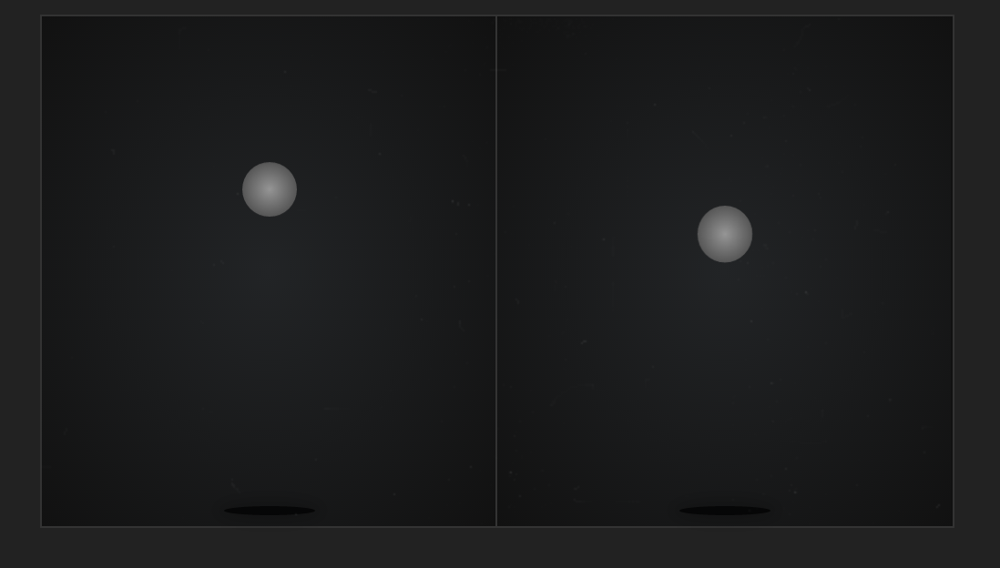
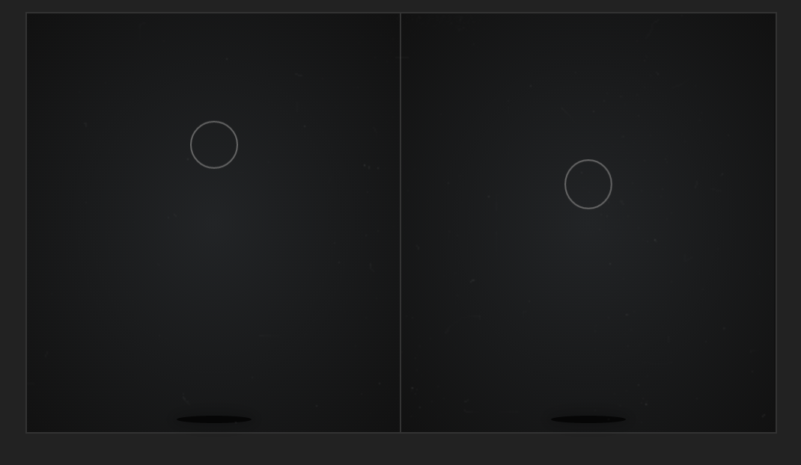
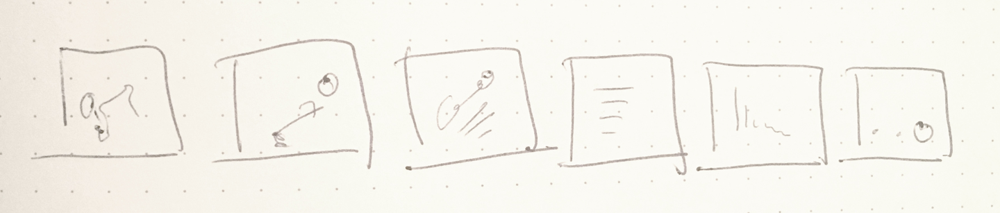
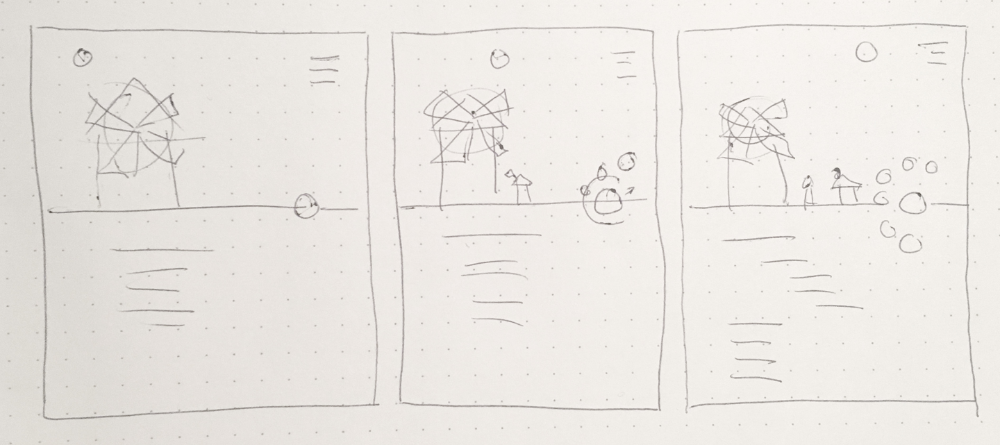
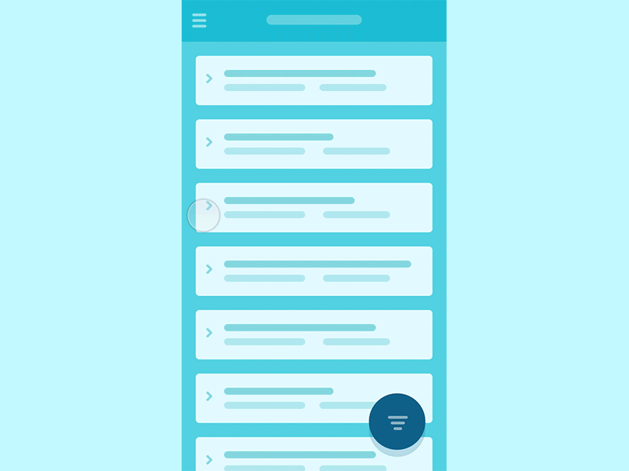

# 第17章：组件库的设计、原型化和动画原理

在现代前端工作流程，那些能够帮助我们保持代码结构组织化，改善工作流程，降低维护成本的设计系统和组件库已经相当的成熟了。 如果想要这些系统运行良好并稳定地扩展，应该保证持续更新正确可用的技术文档和减少交流沟通上的冲突。

但是虽然这些系统大多数在字体、颜色和基础架构上都有不尽人意的地方，Web动画方面的功能仍然是临时且杂乱无章的。但幸运地是，我们可以借助现有的架构和工作环境来减少动画方面的开发阻力，创造出各个环节紧密结合且具有较好用户体验的Web动画出来。

这个章节，我们将会划分为有关动画方面的设计，计划，和实现三部分，来进行讨论分析。

## 动画设计方面

Web动画，和其他的web元素一样都是需要经过精心设计的。 具体原因细节你可以参考 在 [Smashing Magazine] (https://www.smashingmagazine.com/2017/05/enhancing-mobile-design-ux/) 社区中发表的多篇文章:

- Amit Daliot 写的 《[Functional Animation in UX Design](https://www.smashingmagazine.com/2015/05/functional-ux-design-animations/)》
- Rachel Nabors 写的 《[The State of Animation 2014](https://www.smashingmagazine.com/2014/11/the-state-of-animation-2014/)》
- Tom Waterhouse 写的 《[The Guide to CSS Animation: Principles and Examples](https://www.smashingmagazine.com/2011/09/the-guide-to-css-animation-principles-and-examples/)》

作为Web开发者，我们可能主要的精力会放在排版、布局、交互、和视口变换方面。 但是在实际开发过程中，还有一个需要我们关注的要素，那就是时间。

这并不是我们额外需要考虑的部分，事实上，时间越长，我们在有关于排版、布局、交互和视口变化方面需要考虑的复杂程度就会成倍的增加。但是，无需在时间这块有太多的大量的考虑。我们可以根据我们实际的用户体验过程，来慢慢精化我们的Web动画，来创造出许多令人眼花缭乱，应接不暇，令人兴奋且能够引人入胜的Web动画。 从而推进用户体验水平和全面优化Web媒体

### 学会勾勒实际运动中的细节

虽然每一个人都有自己独特的工作方式，且没有任何一种方式是绝对正确的，但是，我想分享一下，我在工作过程中总结的一些关键点和工作方式: 

首先，我认为应该学会观察实际物体运动细节。 这里你可能会笑话我，认为做到这点太简单了。 但是，我想反问一下: 如果你真的做到了这一点，那么请问当一杯水到进杯子中具体需要多长时间？ 动画中怎样做到让一个人物的步态看起来清晰可辨？

想要学会这一点，我建议初学者首先开始从观察球的弹动开始练起。 由于简单，所以这个例子在一定程度上可以很好的让你明白小球的 材质，重量和弹射力度， 如图17-1 是一个关于两个小球弹动的对比[Demo](http://codepen.io/sdras/pen/zxJWBJ)： 你能猜出那个小球比较硬而那个小球比较软吗？

*图17-1： 在两个小球以相同的弹动率的情况下。你可以清楚的知道有关两个小球在材质上的不同 —— 哪一个小球材质比较软。*

怎么知道小球的材质呢？ 其实道理很简单，主要是观察小球的形变，左边的那个小球自始至终都是圆的，而另外一个却会因外力作用而产生形变。 还有什么细节呢： 左边的小球运动的比较死板僵硬，而右边的小球运动起来是较轻巧和灵活的。 尽管给他们设置的运动时间是相同的 但是从他们运动过程中切包含了大量的信息。 同时，一个运动对象所设置的时间函数也能表示。

注意，尽管他们设置了相同的运动时间。 但是， 他们使用了不同的时间函数，所以，对应的动画关键帧也是不同的。 这里我把上面的demo 做了一层改进: 只给小球描边，并且每隔一段时间让闪动一下小球的形状。 这样你能看清，在某一时刻，他们细节上的不同之处。 这个Demo的概念其实和早期的赛璐璐胶片动画电影很像。 让我们来看看图 17-2 和 对应的[Demo](http://codepen.io/sdras/pen/MYdQor)。

*图17-2：通过显示轮廓，我们可以看清楚运动的“间隔” 以及对比左右小球的不同。*

这种关注细节的思考模式也同样适用于其他二次动画， 例如如果有某人摇动了玻璃瓶里水，那么水里应该是怎样的效果？ 如果有某人踢了一个块石头， 那么石头在外力作用下会怎样运动？ Dribbble网站上有一个对细节描述很好的[例子](https://dribbble.com/shots/2000039-Foam-Explosion)。

就像迪斯尼动画制作师 Hans Bacher 的 《Dream Worlds》 书中写到， 当他们再制作 《美女与野兽》 的时候，为了能够很好的把握细节。 公司把他们直接外派到了法国和伦敦， 让他们实地考察哪里的古典建筑。 你们公司可能不像迪斯尼那样财大气粗有公派预算（当然如果你真的有的话，不介意我抱抱大腿去看看外面的世界）。 但幸运地是， 现在的互联网可以为你的工作提供大量关于视觉、 历史 和 空间信息。

根据你的兴趣。 如果在项目中的动画内容留有发挥的余地，你可以尽情的你的优势。 坦率的把对动画兴趣和热情

### 控制合理的动画使用

不像网页字体、颜色等等， 我们通常只是到了设计后期才会考虑为网页添加动画元素，如果把控不好会导致总体缺乏凝聚力，让网页看起来杂乱无章。 如果你是一个公司的新领导。  却不了解项目的最初规划，替换掉了从项目开始就使用的基础设计。 那么，这种做法会引起设计师崩溃，工程停滞不前，并反感你所提出的反感。 举一个简单的例子就是：你要求公司的设计或者技术出一套设计稿或项目原型，却不让他们用之前工作中使用的字体。这个道理在动画设计中也是一样的。请避免在项目快结束的时候，添加一些和整体设计风格不符的看起来很华丽的动画。动画对于网页的意义从来都是在精不在多的。

那么如何控制项目动画的合理使用呢？ 第一步你需要做的就是做好动画审核工作，仔细检查你的网站中所有用了动画的地方，思考这些地方是否真的适合添加动画，或者 有哪些地方是适合用动画，但是你却没用动画。 （提示： 例如表单提交的等待动画，这样可以奇迹般的提升网站的活跃度，且效果直观）。

不确定怎样做好动画审查？ Val Head在 她的 《Designing Interface Animations》（Rosenfeld Media出版）中有一章就有专门的介绍，里面包含了大量的研究实例和很多良好的建议供你参考。

网上的一些优美的动画组件库所配套的文档甚至也会错误的引导你去选择一些并不时候你网站的动画。 记住只有适合自己的才是最好的。 举个例子： 有些大多数动画组件库中都会提供反转180°的动画或者其他一些花哨的动画组件。 但是实际上我们在网站中很多时候都用不到这种动画。 

这将导致...(下面会讨论两种常见地，由于没有很好的动画审核概念所导致的常见错误。)

### 拥有特色的设计主见

很多人都会对 [Material Design (Google 出的一套设计规范其中也包含关于动画设计方面的规范) ](https://material.io/)感到到困惑， 他们把 Material Design 认作为是一种动画设计规范，因为他们从来没有设计动画经验和总结动画设计思想。 所以当这些人每次以用 Material Design 作为网站动画的设计规范的时候， 用户看到了他们的网站，都会感觉自己访问了谷歌的网站。

*选用Google的设计规范而非自己设计规范来设计网站，会让你失去一个让用户对你的网站留下深刻印象的机会。*

在我看来，对于谷歌的 Material Design， 重要的不是这款设计规范的本身。 更多的是 Material Design 作为行业内首个聚合了公司品牌的动画设计准则为我们起了示范作用： 一个公司的统一动画设计规范有助于提高整体的公司品牌形象。在网站项目设计初期，当我们开始为网站思考具体的动画实现的时候，就须考虑将公司的所有细节凝聚到统一的动画设计规范中。

如果你的公司是一家以值得信赖和诚信著称的保险公司，那么你们公司的网站中所有的动画风格都应该是比较正式地，而不能是过分华丽的。 这点可以从时间函数中得到体现： 你需要尽可能的使用线性动画而不是弹性动画或跳跃动画。 但是为了让公司的品牌为用户留下更多舒适且友善的印象，你需要根据公司品牌来定制一些较复杂且生动的动画以提高公司的品牌效应。 你可以参考 [Zendesk （客商社交平台）](https://www.zendesk.com/) 或 [MailChimp （世界最大的营销自动化平台）](https://mailchimp.com/)两家公司所搭建的网站。 它们都是根据自己公司品牌来定制生动的网站动画，你还可以参考 [Chris Gannon 的博客 (Chris Gannon是一位SVG动画交互专家) ](https://gannon.tv/)， Chris Gannon的动画都富含魅力。 特别是他提供的加载动画案例。 形式看似简单但却令人兴奋，简单可依赖。

Aarron Walters 曾经在 他的 《Designing for Emotion》 一书中写道： “当你回想一下你第一次因为某个虚拟的人物的故事情节而感动流泪的情节， 那很可能是动画”， 他认为人类情感和大脑的边缘系统是相关联的： 相较于其他事物，我们会更容易记住情感方面的事。 他的书第七章中就总结了一些关于网站用户影响情感体验的投入产出比的数据, 有兴趣的同学可以去读他写的书。

有一个重要的现象我们需要注意的就是： 多数情况下，用户在浏览网页的时候只是会[粗略的扫读] (http://uxmyths.com/post/647473628/myth-people-read-on-the-web)。如果你使用CSS技术将一副静态的图片单纯的展现在网页中，那么用户可能就一扫而过，不会在脑海里留下什么印象。而动画则不同，它允许我们将元素展现方式化静态为动态。如果我们做成交互式的模式，需要点击，图片才会展现，并且是以动画的形式展现，如果用的得当，用户参与度会惊人般的上升。

而在实际开发过程中对动画应该抱有一些怎样的想法呢？其中有一个建议就是。尽量不要尝试使用翻转动画,并且, 尽量将你的时间函数调整出轻划的感觉。在这种情况下，你需要尽可能的去调整你的时间函数，使你的动画接近自然物体滑动动画的感觉， 并且不要再你的网站项目中写 `transform: scaleX(-1)`。在整个团队中，尽量不要花时间在设计翻转动画上（即使你们都维护这不同的项目） 尽量，以滑动动画的形式替代。你应该学会节省时间，避免在时间花费在关于内部样式统一的沟通上。

### 提升开发水平

动画作为开发过程中重要的组成部分，开发者须了解其对应的开发流程。 我们一般完成动画按照以下几步来做：

- 专业的动画需要单独的进行设计， 包括： 搭建实物模型、 配色、 情节框架设计、 还有一些自己的创意和构思
- 你的设计过程，必须遵循你的代码逻辑架构
- 动画必须是能够为用户提供信息的。 诉诸理性，并引导用户的注意力
- 公司的品牌必须驱动动画，作为主题引导的一部分，吸引用户投入情感
- 我们没有必要重新造轮子，动画已经早于互联网发展很多年了（我们可以使用之前已经造好的轮子）

因为动画是如此吸引人的，所以很容易做过度————不是屏幕内所有的东西都时候进行动画化的。 你没有必要在战争一开始就用出你的秘密武器。动画可以用来作为开场或结束的象征（开场动画和结束动画）以及吸引观众的兴趣 使用动画是需要有目的性，且需要根据用户的参与程度、绩效预算、还有品牌效应来进行计划的。

Val Head在她的 《[Designing “Invisible” UI Animations](http://valhead.com/2015/05/07/getting-to-invisible/)》中就谈到 “一个好的动画（所处的场景）不应该显得不合适，也不应该是事后的想法。” 。

让我们看看一个例子： [Oleg Solomka（mo.js的作者） 写的泡泡布局](http://codepen.io/sol0mka/full/yNOage/), 这个动画十分有趣，互动声音也很好听，很吸引人投入去参与互动。 但是，用户都把注意力放在交互上了，就会忽视实际需要推广的文章内容。 请记住我上问说提到的动画的本质是以一种特殊的方式来展现需要展现的内容，而在实际环境下，一个过于吸引人的动画会淡化用户停留在需要展现的内容的注意力，这样辛苦制作动画就起到了负面效应。

## 设计原型

了解关于动画设计知识，下一步就是付诸实际的计划。

### 逐步分割动画细节

当你开始动画之前，你必须绘制一份分镜（StoryBoarding），分镜是一个很重要的过程，因为你可以将动画分割，从而你可以以模块化的方式组织你的代码，在很多场景下，分镜还能够让你对动画时间进行合理分配，还允许你可以按照步骤工作： 一步步分格镜头，并逐渐的揭示它们。

有一个常见的误区就是，有人将绘制分镜完全等同于设计一篇精美的漫画。我认为这就是为什么很多从业人员并不乐意去绘制一份分镜的原因所在： 他们畏惧去画一份精美的漫画； 畏惧将一份精美的漫画实现优雅的动画；畏惧花费大量的创造精力在计划过程上。 总之，就是他们认为他们只是想赶紧开始项目的工作，以尽快完成项目。我其实完全理解这种心理。 为了避免你们产生这种畏惧心理，我先建议你们忘掉你们心中对分镜不切实际理解。

我是斯坦福大学和菲尔德自然博物馆（[世界级自然博物馆](https://www.fieldmuseum.org/)）所聘用的科学插画家。 我同时在大学也是专攻美术专业的。 你们猜猜我所画的分镜是怎么样的？ 我打赌一定会让你大吃一惊。 图17-3 就是我画的一副分镜。

我会对这如此简陋的初稿感到羞愧吗？ 一点也不会，因为这个初稿是只花了我45秒， 它是对我未来工作的一个整体性的把控和理解。 它能够帮助我勾勒出未来我要花好几天绘制的动画的一些细节，没有了它，我就无法做到事半功倍。分镜因人和使用场景而异。 但是你没有必要像 Rachel Nabors 一样画的那么好，只需要草草地勾勒出草图就好了。
[Rachel Nabors 所绘的分镜](http://rachelnabors.com/css-amv-talk/storyboard/index.html)。

*图17-3： 丑陋但很有实用性的分镜。*

让我们重温我们有关用户共鸣的讨论。 现在你可以通过分镜来完成所有有关用户的交互。 你可以在动画分镜中就声明出从始至终的所有相关的用户交互，你可以考虑一下 James Buckhouse 的这一篇文章 《[Story map](https://medium.com/design-story/story-map-3cc64033128e)》。 （正如 James Buckhouse 在文章中所介绍的 Story map 是指一种新型的设计文档，它可以将所有相关的产品体验都画在一份文档中，能让设计人员一目了然，且脉络清晰。 Storymap 就是用到了分镜的手法。） 它允许你以用户的身份从头到尾体验网站的全部功能。 实际上就是分镜的进化版。 这样的优势是你可基于你的预期目标和产出来做出一些有针对性的建议。

这也许是你不是你第一次听到有关动画中分镜的概念了： 绘制多个粗糙的分格漫画，用来帮助动画师来一个一个场景的分析完成整个动画。 但是你知道分镜的过程中也是需要进行配色的嘛？ 就和你为网站设置配色和全套的商标一样。 迪斯尼和其他的工作室，在制作分镜的时候也会为其中主要的任务和场景进行配色

这意味着你需要学会使用或者手工自己制作配色工具，例如 [Adobe Kuler] (https://color.adobe.com/zh/create/color-wheel/?base=2&rule=Triad&selected=1&name=%E6%88%91%E7%9A%84%20Color%20%E4%B8%BB%E9%A1%8C&mode=rgb&rgbvalues=0.6339878674368107,0.6475815646076216,0.7,1,0.9611857401440562,0.9498420245552297,0.1593034982736775,0.33242582008457044,1,0.4278841513016099,0.8,0.04744279861894203,0.391705030733835,0.7,0.07651244879157422&swatchOrder=0,1,2,3,4) 这也许会花费一些时间，但是在你正在工作的时候却能节省大量的时间？ 我们都知道优化颜色选取工作是有意义的。 用颜色选取工具会比CSS预处理器更加简单方便。 使用它们可以更好的发挥你的优势

### 工具

首先，我们需要引入一个草图（Thumbnails）的概念，缩略图和上文的分镜很像，但是有使用场景不同，为了避免读者混淆，我们换了一个名字。

草图 是你自己所做的简单的注释 （如图 17-4） 草图并不一定需要通俗易懂--有时候时间长了你自己也可能读不懂。但是它的作用只是允许你在极短的时间内，帮助你能够快速的迭代思维和激发灵感。

Figure 17-4. Thumbnails are very sketchy notes to yourself that take seconds and can be
thrown away

*图17-4：草图是一种十分粗略的注释图解。用于帮助你在极短的时间内快速激发灵感。*

分镜是一种草图的升级版，它比草图绘制的更加逼真，也稍微更加容易让人辨识（如图 17-5）。 虽然它们是很粗略的，但是他们可以用来展示很多场景，所以你可以用它和同事交流。
但是在正式的场合下，无论是分镜还是草图就都不适合用于向他人介绍了。 

*图 17-5: 分镜相比于草图更易让人辨识。但是他们并不是完整的画作，你可以和同事们探讨灵感的时候使用分镜。 即使它们确实画的不是怎么好。*

而原型（Prototypes）相对于分镜和草图来说就显得更加高级了，它是你的最终部分成品的一个雏形。 它可以向表达出具体的交互逻辑。 一个较低辨识度的原型 一般是有一些基本图形组成，并且制成初步的动画用来表现出交互逻辑（如图 17-6）。 正如你所见， 原型只是部分功能的展现，所以你不需要把整个网站的全部功能都复现在一个原型内。 

*图17-6： Yaroslav Zubko 以基础图形制作的 GIF 格式的UI原型。*

这里有一篇[Yaroslav Zubko写的文章](https://stories.uplabs.com/a-practical-guide-to-convert-your-sketches-to-working-prototypes-5b1a732d1eb5) 专门介绍了如何使用基础图形制作原型。 [里面还包含了大量的GIF 实例](https://www.uplabs.com/posts/filters-interface-resources)。

还有一种工作方式是将现有网页和扁平化模型截图，然后将截图设置为背景图片，将需要添加的新动画元素以绝对定位地方式设置动画。 这种方法很适用于你和他人做演示的时候。 你可以快速的获取元素并运动元素来展示你的交互方案。 这种方式不会花费你太多的时间。 并且，看起来和最终的效果十分贴切。 很适合给股东们做演示。

如果你还在困惑于设计原型时如何协调设计和编码之间的工作的时候。 这里为大家展示一些很棒的工具用于制作可用的原型：

- [Principle](http://principleformac.com)：一款可以将原型动画化的工具
- [FramerJS](https://framer.com/)：一款用于绘制图形、设计原型、展示给同事的工具，还可以使用编码的方式
- [After Effects](http://www.adobe.com/products/aftereffects.html)：大名鼎鼎的Adobe 出产的Ae 它可以为电影电视视频添加可用的动画
- [Keynote](https://www.apple.com/keynote)：苹果出品的演示工具，能够制作出绚丽夺目的效果
- Straight-up code 直接手写效果代码

个人来说，我更倾向于自己手写效果，一来我觉得以上的这些工具需要我花时间去学习，二来我还可以提升我自身的开发能力。 这样还可以使自己在原型设计方面理解的更加深刻，同时你再实际开发的时候也不需要在交互动画这部分花时间了。 可以直接使用原型中的交互动画代码。

### 杀死汝爱

杀死汝爱（'Murder your darlings'） 是一句英国作家[亚瑟·奎勒·库奇（Arthur Quiller-Couch）](https://en.wikipedia.org/wiki/Arthur_Quiller-Couch)说的一句话。 这句话同样适用于设计界——"不要害怕去推翻或修改某些方面，即使自己看起来觉得做的比较完美" 你永远都不可能一次就把东西做好。 所以，请学会放松和犯错。 无论你是一名设计师，开发者，亦或两者兼顾。 一开始并不会有太好的锻炼机会，就好像你现在这样。 直到你不断的产出许多丑陋的作品尝试写过许多不同时长的动画，并且也搞砸过很多动画作品之后。你才能慢慢上道。学好任何东西都需要积累的过程，试问你学习JavaScript编程难道只学习使用一种框架吗？ 并不是把？ 难道你学习设计是使用一种构图方法吗？ 我想恐怕也不是吧？ 同样的法则也适用于学习动画。

试想一开始你可以同时打开图形编辑工具和文本编辑工具。 在动画时间轴上流利的向前向后进行滑动操作调试，不要害怕去回忆你的每一个步骤，亦或是优化动画和修改代码。你需要准备好学会借助完成任务所需的工具，例如前面提过的[SVG优化工具](https://jakearchibald.github.io/svgomg/) 借助工具的力量你可以快速完成工作。再往后，你就可以逐步地丢开这些工具。懒惰和马虎的你逐渐会学会如何调试，修改代码，或者重构你之前所作的图片和代码。 使它们成为你真正需要的作品

你将会多次重新调整你的动画各部分的时延和时间函数。 依我看，我觉得这一阶段最简单的方法是借助工具例如使用GreenSock所提供的[TimelineLite](https://greensock.com/timelinelite) 调整周围的动画片段。 它可以帮助你做到对动画元素进行 排列、淡出排列，重叠 甚至整个场景运动等等。

CSS 对于小型的UI交互设计来说是非常有用的。 事实上，我真的建议你使用CSS来做交互实例。因为这样你就不需要加载其他的资源了。 但是如果你需要制作有超过两个以上的动画，你就应该考虑选择使用[GSAP](https://greensock.com/gsap)了。GSAP 能够前后调整动画帧，或者设置多个元素同时运动。 这是一个非常强大的工具，尤其是你需要排练和调整你的动画的时候。如果你的动画初始动画帧时延有些变化，那么你就需要重新计算往后全部的动画帧，但是使用GSAP的timeline 就不必这么做

正如上文而言，如果时延没有变化，就不是什么大问题。 不知道你注意到没有一些动画的一些细节并没有运动。 这样会让观众的大脑产生错觉，认为动画已经暂停了。 时延对于动漫，幽默剧来说是非常重要的。 同样对于UI动画来说，如果想让UI动画表现出自然和无缝感，也就必须控制好动画的时延

正如在所有的设计中， 动画的部分看起来比较简单也毫不费力，但是实际上有时候是最难完成的。

### 设计 和 编码 的工作流程

上文已经很清楚的表现出了分镜在动画的设计和计划阶段的重要性。 同样，如果在我们对编码过程进行良好的设计和计划也会对整个工作流程有益。 如果你能够以同设计稿一样的逻辑来组织代码， 你就可以获得一个清晰易懂的代码结构，并且可以很好的反映设计的思路，这样工作者就可以互相参照着实现两者。

编码的函数名应该能直接对应你所设置场景信息，例如‘场景一’ 这样的命名方式虽然看起来不错，整洁，但是一旦项目庞大且复杂起来，需要长期维护的时候，就会限制你和你的团队的工作效率， 因为这样的命名方式并不直观，无法让人一眼就知道这个场景是用来干什么的。 所以你需要更加他们的特征来设计他们的函数名称。 同时以清晰的方式设计可以反映你设计的代码，意味着减少了许多关于作用域、js和Sass变量指派上存在分歧的问题。 同时，当你开发完后需要回去调整代码的时候，一个代码清晰的设计结构也有助于你再次找到你需要进行调整的位置，并且知道接下来的逻辑是什么。

## 制作动画组件库

有时候人们不知道如何将多种动画效果合并到动画库。 所有的动画属性都能够以class的形式分类，这样就允许了程序开发人员和设计人员能够更加自己的需求快速的组合和迭代所需要的效果，只要能够保证语法的正确。 这里有一个以Sass为基础写的一个css动画组件样板（代码有点长，请见谅）：

	// ---- timing ----//

	$class-slug: t !default;
	@for $i from 1 through 7 {
		.#{$class-slug}-#{$i} {
			animation-duration: 0.8 - (0.1s * $i);
		}
	}

	// ---- ease(时间函数) ----//
	$easein-quad: cubic-bezier(0.55, 0.085, 0.68, 0.53);
	$easeout-quad: cubic-bezier(0.25, 0.46, 0.45, 0.94);
	$easein-back: cubic-bezier(.57, .07, .6, 1.71);
	$easeout-back: cubic-bezier(0.175, 0.885, 0.32, 1.275);
	.entrance {
		animation-timing-function: $easeout-quad;
	}
	.entrance-emphasis {
		animation-timing-function: $easeout-back;
	}
	.exit {
		animation-timing-function: $easein-quad;
	}
	.exit-emphasis {
		animation-timing-function: $easein-back;
	}

	// ---- fill mode extend ---//
	// we probably want this so we'll create a class that can be @extended as a
	// 我们可以创造一个类，并使用@extended 来继承类之间共同的属性

	// default into our animations
	// .anim-fill-both拥有 .pop 和 .unpop 共同的属性
	.anim-fill-both {
		animation-fill-mode: both;
	}
	// animations
	@keyframes pop {
	0% {
		transform: scale(0.9) translateZ(0);
	}
	100% {
		transform: scale(1) translateZ(0);
	}
	}
	.pop {
		animation-name: pop;
		// 使用extend继承 共有属性
		@extend .anim-fill-both;
	}
	@keyframes unpop {
		0% {
			transform: scale(1) translateZ(0);
		}
		100% {
			transform: scale(0.9) translateZ(0);
		}
	}
	.unpop {
		animation-name: unpop;
		@extend .anim-fill-both;
	}

You can also take a look at the full pen.

你也可以直接看线上[例子](https://codepen.io/sdras/pen/qqVrxy)。

例子中我创造一些时间单元，和`h1`、`h2`、`h3`。 一样是递增的关系。 我把这些时间单元叫做 `t1`、`t2`、`t3`等等。 `t1` 能够使动画时延最长，而`t5`和`h5`一样是最小的，能够给元素带来最小的动画时延（通常在`.25`秒左右）。 我使用 `.entrance`（进入）、 `.exit`（退出）、 `.entrance-emphasis`（增强式进入）、 `.exit-emphasis`（增强式退出） 这些人类通识的类名来保存动画的时间函数。 在上面例子中只有控制时间函数和`fill-mode`的两种动画类是 可以通用的。 我们对不同的动画使用 `animation-name` 来不同的动画关键帧。 当你需要绘制大量的动画关键帧的时候，我建议你先尝试先制作5到6条来检验你是否真的需要绘制那么多动画帧（上文例子并不需要绘制大量的关键帧，所以只写了两条）。如果动画库中差不多有30多种不同的动画效果，那么这个动画库可以算称得上是较优秀的动画库了。 但是，动画库就好像你的调色盘一样（调色盘颜色多了会给人一种凌乱繁琐的感觉）。  动画库中如果充斥着太多不是很必要的代码，代码库的功能间的耦合程度，请带着批判的方式思考这创造出来的动画是否真的是你库中需要的。

虽然上面的例子只是一个非常简单版本，但是如果是一个成熟稳健的动画系统的话，一定会有很多动画组件是可以复用的（通过`class`）。 它们可以节省很多迭代和原型制作的时间，并且还易于在同一个动画中调整不同种类的动作感觉（通过切换不同的`class`）。

如何写一个成功的动画组件？ 建林说过要先立下一个容易达成的小目标嘛，是的，我们可以先试着做一个简单的而成功的对话框组件（`dialog`）。在一个大型网站你会看到一种对话框会在不同的地方使用很多次，所以写一个类似的组件可以能够让你真正的集中精力在这上面，让你能够快速的提升。 但是你需要避免的一些问题是：

- 不要再一段时间内连续的弹出同样内容的对话框
- 不要使用 GIFS 图，因为GIFS 图体积较大，烧流量，对移动端不友好，且在视网膜高清屏上会显得十分模糊

同时，你也可以将一个组件划分成多个精致的小组件， 这样允许组件的多次复用，提高生产效率。

React 和 Vue 可以完美地实现组件的多次复用， 所以你可以创建一些通用动画组件，这些组件能够允许你在很多不同的组件中使用。 记得利用好React和Vue的框架优势 例如：和上文栗子一样，使用props参数调整不同种类的动画时延和时间函数（上面的例子是使用的class进行分类调整）

### 权衡动画开发优先级

有些时候，一些开发者并不知道如何简单的设计动画库，因为他们不知道如何取舍功能的优先级。 如何合理的设计系统也是我们曾经所探索过的问题。 在 [2016届的CSS开发者大会上](http://2017.cssdevconf.com/) Rachel Nabors ([她的博客是](http://rachelnabors.com/)) 为我们展示了动画方面需求的优先级（如下图） 同学们可以按照她所规划的优先级开发自己动画代码库（转载需要得到 Rachel Nabors 的同意）：

*图17-7： 想完成的需求和用户真正需求相比较.*

*图17-8：承接上图 不同需求的完成难度。*

上图提供了一些建议，在实际开发过程中，指出了那些是相对必要的工作，请带着批判性的思维去理解她所指出的话， 原则上只要你能保证你的工作的产出是用户真正所需的，而且可以复用。 那么你就可以去致力于开发这些动画。

好的公司都流行这么一种准则： “（对于一些不怎么能创造经济利益的工作，例如每个网站中的 "关于我们"）我们不会尽全力对一些没有太大经济价值的页面来开发一些用户所期望的炫酷的页面。 但是我想我们可以让我们的用户知道，他们联系人的邮箱地址的展示效果上，也是会有一点小小的动画过程，并且最终可以产生一个不错的提示效果”

成功的制作一个小项目（例如“关于我们页面”） 有助于提升团队内的相互信任， 并且让你的合作伙伴了解你们是一支怎样的团队。 建立一种良好的关系可以推断往后更复杂的项目合作。 但是，不需要过分投入这种小项目， 良好的沟通才是合作关键。 

### 时间就是金钱

在网站开发过程中，动画往往被认作为是一个事后点缀的功能， 我们一般先设计网站原型，开发实际网站，在一切都完成后才添加动画。 就因为如此，动画组件往往被人们形象的比喻为美味奶油上的点缀物（草莓或巧克力）。 动画开发只有基于整个网站开发完成的基础上，经过分镜和原型设计后才能进行开发。 开发完成后会对网站的用户体验有一个高性能和实质性的提升

[Active Theory](https://activetheory.net/)是一个专注于制作卓越品质动画的工作室，他们只服务于大型客户群。他们在产品设计过程中就会积极的和用户交流设计，让用户了解他们正在设计的，能够给人带来惊奇的Web体验项目。

效仿 Active Theory 我们应该如何改变呢？ 类比店员，他们的法则是增加投资回报率。 而程序员就是提升产品质量， 造出一些有用的。 能够吸引用户、增强用户体验度的轮子，虽然， 这样会增加我们的时间和人力投入，但是，获得的回报也是相对应的。 （相反，如果每次只是投入一点生产力，长期下来，其实最后所得的回报率不会有太多的，即互联网，在精不在多）如果想了解更多如何和客户更有效地沟通的知识，可以去看 由 Mike Monteiro 写的 《You’re My Favorite Client or Design Is a Job》。

在我们为已成型的项目添加点缀的动效之前，我们还需要做一些工作，来保证所做工作的有效性。

首先， 我们需要和用户进行有效的沟通， 这并不是意味要让用户强制的接受我们想法。 我们需要做的是想用户解释项目的预期收入，对产出的界面产品进过[A/B测试](https://www.smashingmagazine.com/2010/06/the-ultimate-guide-to-a-b-testing/)后，以得出的数据来做判断，来证明我们做法的合理性。同时，也为用户节省了大量的时间成本。

为了让我们工作的更简单。 当我们没有多余时间去搭建一个完整的效果的时候我们可以用一下两种方法为用户展现我们的设计的原型。 第一种方式是你可以在 CodePen 上收集他人写好的时髦的组件（按钮、进度条等）拼凑起来给用户预览。第二种方式，就是上文所提到的，将现有网页和扁平化模型截图，然后将截图设置为背景图片，将需要添加的新动画元素以绝对定位地方式设置动画来给用户预览。CodePen 虽然是一个很好的设计平台，拥有很多资源。 但是注意，这些新颖的组件实际上并没有经过实战和市场调研。 所以，你需要将你的工作做得更加完善。 例如使用 A/B 测试（将两组或多组UI/UX样式同时上线，给多组用户群使用，选取反馈情况最好的那一组实验）来证明那一种动画组件的性价比是最号的。 实际的数字通常比PM们的主观意见更具说服力。 因为一些负面的主观意见，可能是由于盲目追求趋势、 无知、 或者由于执行力不足导致过去糟糕的经历所产生的。

一旦你已经在这方面取得了进步，你可以试着按照下面从高到底的优先级来重新计划一下你的开发计划。

- 开发时间
- 用户体验
- 性能
- 配色
- 内容组成
- 用户浏览所需要花费的时间

这些看起来要做好确实过于复杂了。 但是你经过以上的学习，你应该可以在几秒内给自己的项目在这几方面给出一个大致的评分吧，这些也是你能力提升过程中必须经过的坎。如果你依然缺乏经验，那么你还是需要多历练几次。 如果你的网站资源加载时间过长， 那么你就需要非常细心的优化你的资源加载（包括图片，SVG, JavaScript脚本， 动画库）。如果你的网站已经有多种配色方案了？ 那么你需要学会（在组件中）复用那些颜色。

### 其他方面的限制

Frank Thomas 和 Ollie Johnston（迪士尼九位元老中的两位，灰姑娘，小飞侠，爱丽丝梦游仙境等多个著名动画剧的创造者，现皆已仙逝）在他们的书 《Disney Animation: The Illusion of Life》  的开头引用了一句我一直都很喜欢的 Walt Disney (沃尔特·迪士尼, 迪斯尼之父) 说过的一句话： “动画可以将我们心中所幻想的世界描绘出来” 。 这句话确实很准确的定义了动画的力量： 在动画中，你可以创造任何可能发生的事， 你可以创造一个世界，或者毁灭一个世界，激起观众兴趣，讽刺某些事物。

制作动画在很多方面需要考虑。 如果没有考虑除了用户体验之外的其他方面，那么动画依然不会为观众带来任何的效应。 除了正常的设计之外，我们同样需要花大量时间去准备各种需要考虑的因素，这么做的回报就是： 借助这些（知识或调研）准备，能够描述出我们的产品（网站）特性，这些特性能够帮助我们规划好整体风格，我们就可以基于这个整体风格来实现我们的用户界面甚至是公司商标。