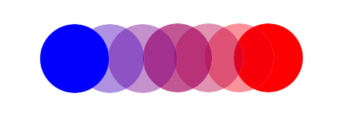

# 第二章：使用CSS制作SVG动画

这大概因为SVG也存在一个DOM的概念，类似标准的`html`语法的原因，你也许会觉得SVG看起来感觉十分熟悉。 实际上SVG也能通过CSS进行SVG动画制作，这无疑是一项格外有价值的特征，因为对于前端开发者来说使用 CSS 操纵标签是格外轻松的。

让我们先对CSS动画做一次简短的复习吧，CSS动画创建的第一步就是先定义两个属性，首先，让我们来看看这个动画的动画`keyframe`：

	@keyframes animation-name-you-pick {
		0% {
			background: blue;
			transform: translateX(0);
		}
		50% {
			background: purple;
			transform: translateX(50px);
		}
		100% {
			background: red;
			transform: translateX(100px);
		}
	}

> #### 关于`keyframe` 语法的小贴士
> 
> 你可以 使用`from` 和 `to` 这两个关键字来代替百分比的定义，如果你没有声明初始动画帧或者结束动画，那么CSS默认会使用元素默认声明的属性。如果你需要兼容很多浏览器，那么需要反复检查你的动画帧是否漏了初始帧和结束帧，否则可能在一些浏览器中会出问题，虽然这可能是由于一些浏览器自己本身的bug或者标准不统一所导致的。

当你定义这些 `keyframe` 的值后，你有两种方式来对你的动画进行配置，这里有一个语法冗余的版本，它将关于动画的每一部分的定义都单独拎出来声明了：

	.ball {
		animation-name: animation-name-you-pick;
		animation-duration: 2s;
		animation-delay: 2s;
		animation-iteration-count: 3;
		animation-direction: alternate;
		animation-timing-function: ease-in-out;
		animation-fill-mode: forwards;
	}

当然这里有一个简短版的（这是我最喜欢用的， 因为代码比较短呀）：

	.ball {
		animation: animation-name-you-pick 2s 2s 3 alternate ease-in-out forwards;
	}

整个`animation` 的属性是以空格分隔开额，除了一些关于数字的值以外，其他有关动画属性的声明的顺序都是可以互换。而只能用数字值来定义的属性 需要遵照这样的顺序 `duration`, `delay`, 和 `iteration count` （分别是 动画的总时间，延长几秒开始和执行次数）。

而应用了上面定义的动画帧的 `div.ball`结构也很简单(见图2-1)：

	.ball {
		border-radius: 50%;
		width: 50px;
		height: 50px;
		margin: 20px; 
		background: black;
	}

图2-1: 我们声明的 `.ball` 小球

我们通过上面的代码得到了图2-2 的结果，填充了黑色的小球：

图2-2：CSS动画用于使用`div`创建的小球的结果

你可以看到有关我创建的这个[例子的全部代码](http://codepen.io/sdras/pen/c00ac22c90b9232a7c5631a8158b48c1)。

如果想知道有关CSS3动画属性更多的内容，例如 啥是 `aniamtion-fill-mode` 或者CSS3中有哪些 `eases` （运动时间函数）可以用，又或是有哪些CSS属性可以适用CSS3 动画的。请参考 同样也是O'Rilly 出版社出版的 由Estelle Weyl写的 《[Transitions and Animations in CSS](http://shop.oreilly.com/product/0636920041658.do)》 这本书。

同时如果你也可以参考 由 Dudley Storey 写的，Apress出版的 《Pro CSS3 Animation》

## 用SVG做动画

让我们来瞧瞧用SVG来代替刚刚使用CSS和HTML声明的小球儿的效果，让我们运用上一章讲过的知识，用SVG来画一个 和 图2-1 一样的小球，我们这样写：

	<svg width="70px" height="70px" viewBox="0 0 70 70">
		<circle fill="black" cx="45" cy="45" r="25"/> 
	</svg>

我们定义了一个半径为`25px`的小球，并且把移动这个小球的中心到SVG画布的`(45，45)`点上。 画布宽高是`70*70px` 所以也想刚刚CSS中声明的那样预留了 `20px` 的左上外边距。当然，我们同样也可以对`<svg>`运用`margin`属性来移动它，但相比较使用SVG本身提供的坐标声明来说， 如果我们移动了一下这个小球，整个`<svg>`移动所占用的空间是宽加上`margin`。

现在，如果我们把这个`<svg>`元素加上同样的`ball` 类，那么就会运行相同的动画函数声明，然后我们就能看到如图2-3的效果：

图2-3：给这个`svg`加上 `.ball` 的效果

到底发生发生什么了？虽然小球像我们预期的那样仍然在移动，但是变色的背景却填充了整个`svg`，即整个`viewbox`，这显然不是我们想要的，那么如果我们把`.ball` 加给`<circle>` 标签呢，会发生怎样的结果？ 让我们看看图2-4：

图2-4： 将`.ball`加给`<circle>`的结果

根据这个结果，我们也大概能猜到是什么原因了：

- `<circle>` 会在`viewBox`内运动，记住，我们前面讨论过，`viewBox` 就像是一个窗口，如果我们移动了`svg`内部元素的属性，就好象在一个窗子里看外面的物体运动，如果超出窗外的元素就会剪裁隐藏掉，所以如果我们把 `<circle>` 元素移出了窗子的范围，效果就如上图那样，被裁切或遮盖。
- SVG DOM 就好想HTML DOM ，但是它们是略有不同额。 我们不允许对SVG元素使用 `background` 属性。 在SVG中我们需要用到的是 `fill` 和 `stroke` 属性。 对于SVG来说 外联样式表会覆盖 `<circle>` 的内联属性样式， 所以我们统一将SVG的样式（`fill`属性），写在外联样式表中。

我们把我们的SVG DOM 稍微改下：

	<svg width="200px" height="70px" viewBox="0 0 200 70">
		<circle class="ball3" cx="45" cy="45" r="25"/>
	</svg>

这是对应的css代码

	.ball3 {
		animation: second-animation 2s 2s 3 alternate ease-in-out forwards;
	}

	@keyframes second-animation {
		0% {
			fill: blue;  // 注意， 我们把 background 换成了 fill
			transform: translateX(0);
		}
		50% {
			fill: purple;
			transform: translateX(50px);
		}
		100% {
			fill: red;
			transform: translateX(100px);
		}
	}

The result is Figure 2-5, but with an SVG instead of an HTML div.

这是图2-5的效果，使用SVG代替HTML绘制小球的效果：

图 2-5: 采用`fill`属性的效果，并且把 `fill` 写进外部样式表中

## 使用 SVG 绘图的优势

那么为什么当我们需要制作由CSS样式控制的HTML动画的时候，我们需要学习和选择使用SVG呢？

首先， 从一个小角度来看，例如绘制一个简单的圆我们需要写4行SVG和CSS代码，明显少于使用CSS和HTML来实现。 SVG 图本的绘制是不同于CSS的，SVG是以一种表象格式绘制建立的，让我们看看这本书第一章所讲的 绘制星星的代码：

	<polygon fill="white" stroke="black" points="279,5 294,35 328,40
	303,62 309,94 279,79 248,94 254,62 230,39 263,35 "/>

使用如此少量的代码绘制一颗星，这对于用纯使用HTML+CSS来实现来说，是非常困难的。如果我们使用预处理器来计算处理CSS,那么编译出来的代码也不会显的那么简洁。

图 2-6 是我用AI 画的一些小玩意儿：

图 2-6: 一个简单的插图例子

对于上图，我们同样也可以用CSS进行绘制。 但是实际上，如果我们和一名设计师共同开发一个项目。我们通常并不会选择使用CSS来画。 因为如果使用CSS绘制完后，再加上动画的话会逻辑会很复杂。 如果我们使用SVG的话，相对与CSS来说，绘制一张插画图会显的更加简单，而且更容易缩放，并且添加的动画也是响应式的，（不用兼容各种不同宽高的屏幕）。

整个插画图的数据信息体积压缩后仅仅是`2kb`, 且单单是这样就能填充到整个屏幕的大小。 相对于使用不同尺寸的位图进行兼容的做法来说这是一个很激动人心的优点。

（如果让我们用现学的图形来做出上图的动画效果）让我们用下刚刚学会的 `<circle>`, 我们可以想想看这些图形能够帮我们做些什么？ 我们可以使用 `<g>` 将奶牛的图层部分包裹起来， 并让其跳跃到月球上，我们也可以让宇航员 突然地消失和出现。 我们甚至可以调整 头盔图层的位置上下移动， 让我们感觉到宇航员在寻找某些东西（这其实也是这个动画的最终效果）。

## 顺畅的动画体验

对于CSS属性布局，我们可以使用`margin`, `top`, `left` 等等CSS属性，表面上它们都能达到相同预期效果，这虽然是很吸引人的地方，但是实际上浏览器对于不同属性的值并不是同等对待的（例如 如果我们使用`margin`就会涉及到浏览器重排和重绘的问题）。 为了让动画简洁流畅， 虽然使用起来可能会存在一些限制（浏览器前缀）。 动画方面我们最好的解决方案基本上是使用 `transforms` 属性来改变图形的形变 同时配合 `opacity` 属性来解决图形的淡入淡出就变的极其强大了。 在标准动画中使用这些属性所达到的效果也是十分令人惊奇的。

在整本书里面， 在我演示各种技术的时候都会尽可能的使用上面所介绍的两种属性。 同时需要卓重注意一点的是，当前SVG DOM 只在某些浏览器中存在硬件加速功能（例如 只有火狐支持SVG硬件加速，而Chrome不支持）但是，即是浏览器对SVG存在硬件加速等优化，你仍然应该用 `transforms` 进行SVG DOM的移动, 千万别用 `margins` 或者其他 CSS 位移属性（涉及浏览器的重构和重排）。

在本书出版的时候， IE浏览器和Edge还不能完全的支持使用`transforms`操控SVG元素， 但是你可以在[Window开发者反馈调查网站上](https://wpdev.uservoice.com/forums/257854-microsoft-edge-developer/suggestions/6820655-add-css-transforms-on-svg-elements)对一些有关的提议进行投票。

那么在这些浏览器支持使用CSS `transform` 操控SVG 之前，你最好还是用SVG原生的唯一属性吧（这比较痛苦，因为你要用JavaScript 做些兼容）或者使用 GreenSock 动画库所提供的API， GreenSock是专门用于制作SVG HTML CSS动画的动画工具库，它内部做了对浏览器的兼容，并兼容到了IE9。

如果想了解关于 如何保持布局绘制成本较低 这方面的相关知识（是一些关于Chrome相关学习资源）， 可以去看 [Jank Free](http://jankfree.org) 上发布的写的 [High Performance Animations](https://www.html5rocks.com/en/tutorials/speed/high-performance-animations/)。

想了解关于一些特别属性在绘制方面的资源消耗的知识，可以去 [CSS Triggers 上查询](https://csstriggers.com/)。