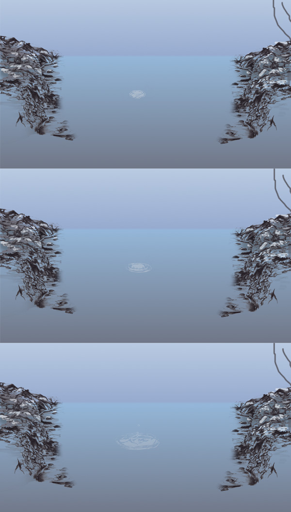
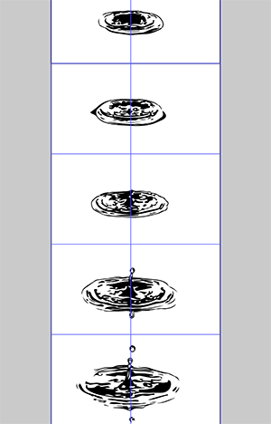

# 第三章： CSS 动画和手绘 SVG Sprites

SVG 作为一个 Icon 格式来说，应该是非常合适的，不过，下面我们将更进一步的了解，通过三种不同的技术使用 SVG Sprites 执行复杂的动画。前两个和 cel 动画非常类似，第三种动画我们将在第四章详细阐述，这种动画，我推荐在更复杂的响应式动画和交互性的 SVGs 中使用。

从设计的角度看，这是一种更先进的动画技术。我们现在在这本书中探讨该技术，因为实际的动画可以使用纯 CSS 实现。该书会以一个渐进式的方式讲解动画技术（首先是 CSS，然后 JavaScript 库，接着就是原生的 JS），不过你可以选取适合你的章节阅读；第七章提供了以上动画技术的比较。

## 使用 `steps()` 和 SVG Sprites 的帧动画两种办法

如果你看过 Looney Tunes 或者老版迪士尼的动画，你可能会对其流畅的动作有很深的印象，因为它每一帧的动画都是手绘的。这样的效果其实可以使用 SVG Sprites 在 Web 上展现。我们可以站在以前动画绘制者的肩膀上，去使用新的开发技术。

在所有基于 Web 的动画技术中，步间（`step`）动画是最容易使用以前手绘的 Cel 动画。Cel 是 “celluloid” 的缩写。它是一种透明材质，动画绘制者会用它在前面样片的做上面绘制。从而定义了一个序列并且创造出运动的错觉。该技术有点类似于以前快速翻阅的小人书。每张图纸通过，一帧一帧的形式，都会捕获到电影中。为了节省时间，这些图示通常会包含多层--你可能也并不想一次又一次的为了展现同样的场景去重复画背景吧。

为了节省画图的步骤，背景会先画出来，然后是人物，有时甚至是人物的脸部，比如嘴巴或者眼睛，这些后面只需要调整一下即可。图 3-1 和 3-2 就是一个分层的例子。

图3-1：手绘的透明cel （由John Gunn提供）

> #### Cel 动画相关
> 
> 你可以认为该技术就像写一个 Web 页面的模板：你从基础的模板开始，然后创建更小的模板。所以，你可以控制一些在独立于其他片段中发生的事物。

我们可以使用单个静止的背景去仿照这个模拟过程，然后快速地在顶层展示一些列图片。这可以在没有真实插值的情况下，呈现出运动的错觉。为了替代这些独立的图片，我们将同时减少 HTTP 请求的量并且使用单个 SVG Sprite 图来简化关键帧（图 3-3）。该技术相比对简单的变形动画而言，更适用于复杂的形状和富有变现力的运动。

因为该技术严重依赖于设计，所以，我们将先熟悉设计这块的工作流程，然后再看看具体实现代码。你可以在我的 [CodePen](http://codepen.io/sdras/pen/LEzdea/) 上，找到最终的动画效果。

通常，在 Web 上展现插值（例如，快速切换）图片，为了让动画非常的流畅，我们需要使用最大的 `fps`。而该技术则是一个例外。因为我们需要绘制每一帧，所以，我们需要尽可能的减少手绘量（参考 图 3-4）。以前，动画绘制者花费大量的时间在实际运动和最少的图纸量之间寻找一个平衡点。老电影是以 `24fps` 进行拍摄，而动画绘制者基本上使用 “双倍拍摄”（意味着 `2` 帧一张图纸，或者说 `12fps`） 作为运动错觉的标准。在低于上述情况下，你的眼睛会察觉到轻微的卡顿（大多数动画制作者认为这是一个很有创意的决定！）。我们将在他们的成果上找到我们的错觉界限，参照 `12fps` 规则。对于 `1.8s` 的动画，我们需要 `21` 张图纸。`21` 代表着我们选的帧的数量，不过，你可以自己决定有多少帧。

图3-3：水飞溅动画

图3-4：画板上绘制每帧

## 在 Illustrator 中使用模板绘制的方法

这有两种方式，可以针对该种动画，创建一组图纸；这两种方式大致相同，不过他们对于图像使用不同自动化流程。在两种工作流程中，我们遇到了一个挑战，即，如何让图纸连续地放在帧的中心，从而形成一个大的 Sprite 图。如果图纸错位了，当我们播放每一帧时，就算是完美的图纸也会看起来有瑕疵。

对于这项技术，我们一般用 Illustrator，不过你可以使用 Sketch 或者其他的图形编辑器。首先，我们需要知道动画的帧数，然后在一个方向上乘以 `21`，这决定了我们画板的长度。我们在一块区域中拖出一个盒子，然后选择 `Object -> Path -> Split Into Grid`。然后我们输入我们想要的行数（或者列数，如果我们希望使用一个水平的 Sprite 图标） 然后点完成。最后，我们选择 `View -> Guides -> Make Guides`，接着我们的模板已经生成好了。

如果你是直接在图形编辑器里面绘制的话，我建议你先将第一张图纸放在第一个盒子里，然后在它的周围再创建一个盒子，并且让帧都处在导轨里。你可以使用对齐线，或者 `Shift` + 拖拽，复制任意的内容到下一个盒子里（包括盒子帧），这样可以让其连续的分布。接着，重复使用盒子帧到下一个导轨处。

你可以使用 Direct Selection 工具（白色的箭头）去拖拽和重塑每一帧图像的片段。注意：不要一开始就在这里复制粘贴你所有的工作，当你参考前一个帧去创建每一帧是，上面的流程才能有很好的效果。

你可以截一些屏，然后可以通过一些定格图，将每张图像放置在 Illustrator 文档中并进行追踪。你既可以通过 Illustrator 自带的追踪工具，也可通过 Pen 来试一试手绘的感觉和更精确的路径。

在这项流程最后，我们将会得到一个很长的 Sprite 图表。我们能够直接将它导出为 SVG 或者 PNG。另外，我们将使用 PNG 和一个全局的类样式，在 Modernizr 下，实现一个渐进回退的方案（对于 Modernizr 可以参考 30 页的“使用 Modernizr”）:

  	.splash {
        background: url('splash-sprite2.svg');
        ...
        animation: splashit 1.8s steps(21) infinite;
  	}
    /* fallback */
    .no-svg .splash {
        background: url('splash-sprite2.png');
    }

这里，尽管回退方案可能没有大多的必要，不过，建议你查阅一下你的评估并参考一下 [caniuse.com](http://caniuse.com/) 对于 SVG 的支持。

## “在 SVG 编辑器或图纸中逐帧绘制并且使用 Gruntiocon 生成 Sprite” 的办法

第一步仍然是 Illustrator 绘图，不过，你可能想要手绘的感觉。如果是这样，那么手绘会很容易，然后把画好的图纸扫描一份。在以前的老画室里，一般使用的是灯箱和赛璐珞片，这样可以方便他们一步一步追踪以前的图纸。不过，你并不需要这些材料去实践该技术。通过将一个台灯放在一个玻璃桌面下，你可以轻易的制作出一个简易的灯箱。这装置可以发射足够的光线，让你能够查看这些相等规则的不透明的副本图纸。如果你想创建一个新帧，可以将一张白纸或者皮纸放在上一个图纸上，然后仔细绘制，直到有一系列的帧。你可以接着扫描这一套图纸并将其矢量化，注意要正确的放置，减少不透明度和导轨量。

如果你更喜欢在编辑器中绘制每一帧，但是又不知道总共要画多少，那么你可以单独绘制每一帧，然后每次稍微移动图纸，再将每个新的版本保存到文件夹中。Illustrator 新的导出设置已经很完善了，你可以选择去掉旧草稿和评论。注意，是通过 `Export → SVG` 进行导出，而不是 `Save As → SVG`。你需要弄清楚你一开始保存的是 SVG 而不是 AI 类型或者其他类型。接着，你可以使用 [Grunticon](http://www.grunticon.com/) 去自动压缩和生成 Sprite 图表。在 CSS-Tricks 上，有篇很好阐述了如何使用 Grunticon 的[文章](http://css-tricks.com/inline-svg-grunticon-fallback/)。

就我个人而言，如果你使用手绘，那么最重要的是确保每一张画板对齐，然后使用 Grunticon。但是，Illustrator 的模板技术可以让你一眼看到所有的图纸，这可以让你对正在做的有一个全局的了解。

## 简易代码模拟复杂运动

这种 Sprite 图可以使用最少量的代码来生成大部分预期动画。我们尽可能的让代码 DRY（ Don't Repeat Yourself 的首字母缩写），简单，干净。这种运动最关键的点在于我们主要依赖于 Sprite 图，而不是使用很多的代码去实现运动的错觉。

我们绝对定位了一块更小的运动区域，因为我们想要在桌面端和手机端得到一致的效果。我们预期是循环整个图像，但是能够间隔的停在图片里的每一张独立的图片上。幸运的是，在 CSS 中我们可以使用 `steps()` 去完成。我们已经在设计阶段做了大量的工作，所以，去模拟效果的代码不会很复杂。

这里不需要复杂的百分比和关键帧。我们所要做的就是使用图像的高度，然后在 `100%` 关键帧里，将其负值赋给 `background-position` 属性：

	@keyframes splashit {
		100% { background-position: 0 -3046px; }
	}

这里，我们并不需要使用 `.container-fluid`，因为它非常容易使 SVG 在移动端上占据整个屏幕。在过渡 `div` 中，我们使用 `steps()` 来算出 SVG 中帧的数量，然后模拟动画：

	.splash {
		background: url('splash-sprite2.svg');
		...
		animation: splashit 1.8s steps(21) infinite;
	}

使用 SVG 而不是 PNG 能够让我们在屏幕上展示更清晰的图片，不过，它也需要简单的提供一个渐进增强。我们使用 Modernizr 在 `body` 上创建一个钩子，然后可以使用 PNG 来模拟动画：

	/* fallback */
    .no-svg .splash {
    	background: url(‘splash-sprite2.png’);
    }

我们一般不会轻易的使用 PNG，因为在不同分辨率下，它有可能会模糊，而 SVG 会保持原有的清晰度。

> #### 使用 Modernizr
> 
> Modernizr 是一个特性检测库。它可以让你使用 Web 上的高级特性，并且通过检查它是否支持，提供退化手段，或者渐进增强的处理。它是一个高度自定义的库，其会在 `body` 元素上写入你可以用来 `hook` 的相关的类，比如前面例子中的 `.no-svg` 标签。我强烈建议针对你特有需求，使用自定义编译版本，因为整个库有点过大，而你仅仅也只是使用了其中的一小部分。

## 简单重复行走

如果你把 `steps()` 从上一个动画中移除，你会发现一些有趣的事情。现在，不再是创建一个流畅的移动绘图，而是背景开始滚动。我们可以利用这点，去做一个完善的分层背景和空间布局和运动。

我们现在着手开始做一个简单的[重复行走](http://codepen.io/sdras/pen/azEBEZ)。大致布景为一个幽灵形状的人形走过一个循环的，多维的，粗略的背景。

我们可以使用以前的 `cels/steps` 技术，结合用来显示重复行走的图纸，来创建上述的动画。我们将使用一个手动动画技术，通过移动颜色不一样帧，来改变颜色。另外，我们可以使用带有色调旋转的滤镜去改变颜色，但只要我们是通过手工来创建这些帧的话，改变颜色所需要的工作量就很小了。并且，滤镜在性能上的损耗，虽然不是很大，不过我们没必要去使用它。

> #### CSS Filter案例
> 
> 如果你打算使用滤镜，这里有很多网站介绍了 CSS 滤镜效果。例如：
> 
>  - [HTML5 Demos](http://html5-demos.appspot.com/static/css/filters/index.html)，上述图像的来源
> 
> - [Bennett Feely 写的 CSS 滤镜效果集](http://bennettfeely.com/filters/)
> 
> - [CSSReflex](http://www.cssreflex.com/css-generators/filter/)
> 
> - Una Kravets 写的 [CSSGram](https://una.im/CSSgram/)，其混合了几个滤镜，有点像 Instagram 的效果。这也是我最喜欢的一个网站。
> 
> 注意，动态滤镜效果非常吃性能。我尽可能不去做滤镜动画，或者使用 `setTimtout` 在我需要它的时候，添加指定的属性或者 CSS，然后移除它。

`steps()` 和 `animation-duration` 的比应该这 `12fps` 的范围，这点依然很重要。我们可以通过改变 SVG Sprite 图表的 `background-position` 属性，来使图像滚动起来。为了确保一致性，我们让所有的背景图的尺寸都是一样的（参考图 3-5）。如果你熟悉 Sass 的话，可以使用 `@extend` 来进行设置：

 	/*--extend--*/
    .area {
    	width: 600px;
      	height: 348px;
    }
    .fore, .mid, .bk, .container { @extend .area; }

图3-5: 图像的流动性和一致性

为了创建一个让人印象深刻的循环流畅动画，我们需要在 `x` 轴上将这三个背景图无缝的衔接，以至于当他们滚动的时候，不应该出现缝隙。这可以通过让每张图底部紧贴，或者，在这种情况下，使用一个足够稀疏的图像，使其能够完整的通过。如果你打算使用后面一种，那么当你在构建图形时，就需要在一些图形编辑器中，比如 Illustrator 或者 Sketch，确保开始状态和结束状态看起来正常。

图3-6：我们将使用SVGs创建一个深度错觉

每个元素都是用相同的关键帧动画值，但是我们会以他们 `z-index` 的减小，来使每个元素动画时间一并减小。如果你环顾一下，你会发现，离你越近的物体会有更鲜明的对比并且对比于更远的物体，移动更快。所以，我们通过增加背景中 SVG 动画的第二个整数（从而拥有更长的动画），来使动画类似这种效果。这产生了一个很棒的视差效果。在这个例子中，有三个视差效果的背景图，但不包括人形：

    .fore {
      	background: url('fore.svg');
      	animation: bk 7s -5s linear infinite;
	}
    .mid {
      	background: url('mid.svg');
      	animation: bk 15s -5s linear infinite;
	}
    .bk {
      	background: url('bkwalk2.svg');
      	animation: bk 20s -5s linear infinite;
	}
    @keyframes bk {
      	100% { background-position: 200% 0; }
	}

我们并不需要这种动画的多个间隔时间，因为关键帧已经给我们做了好插值。如果以后滚动 Srpite 图标的像素发生变化，我们并不需要更新数据，因为已经将其值设置为百分比了。负值的延迟确保了动画能在开始的时候立即执行。所有的 SVG 都已经优化并且都有一个 PNG 的降级方案。