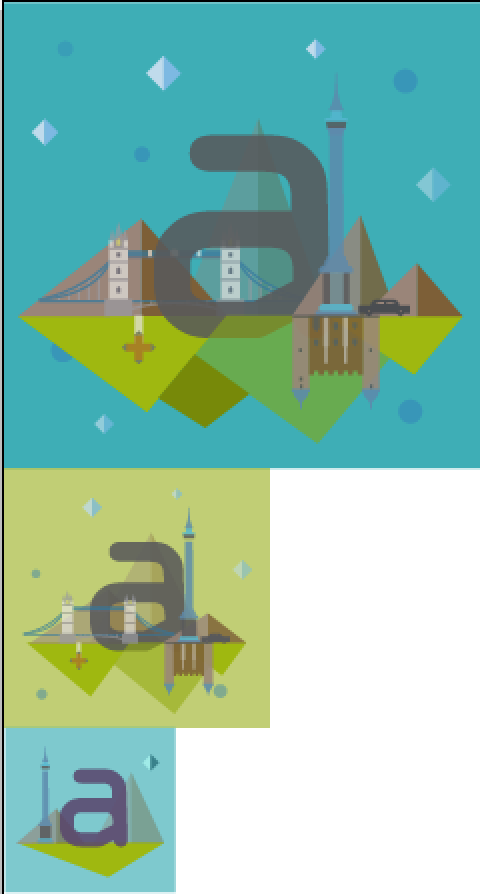
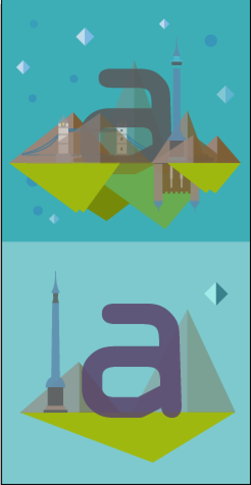

# 第四章 创建响应式 SVG Sprite

SVG 的可伸缩部分可能是这种图片格式最强大的特性。使用 `viewBox` 属性和我们对图形和路径的知识，可以动态的将 SVG 裁剪为任意大小。我们在坐标空间所做的都会被保留。

如果将一个普通 SVG 上的 `width` 和 `height` 属性移除，将会看见一些有趣的事情。SVG 会填满视窗的 `width`，并且保持里面 DOM 的高宽比不变。

如果我们在 SVG 放大或缩小之前去使用 CSS 关键帧或者 JavaScript 去移动 SVG 元素，比如`circle`或者`path`，那么，这些变化同样会在图形中被缩放。这意味着如果你通过百分数，CSS Flexbox 属性或者其它技术，去缩放一个复杂的 SVG，那么你的动画也会相应的被缩放。你不需要为了手机或者其它尺寸的设备调整任何东西。只需要关注与如何一次写出正确的代码。

完整的动画应该能完美的缩放。在下面的 [CodePen 例子](http://codepen.io/sdras/full/jPLgQM/)中，你可以在动画运行时，任意的去缩放，然后观察它的表现。这很利于响应式的发展。图 4-1 的动画，使用了一个完整的流式办法。

图4-1：不同状态的同一动画，其大小不同
 
我们首先将整体设计出来，然后慢慢的展示。图 4-2 是我们初始的 SVG（在我们添加任意动画之前）的效果。

图4-2：Illustrator原始设计稿 —— 首先设计所有的东西，然后慢慢的展示需要的部分

我们也可以用两种方法去设计响应式 SVG。在本章中，将着重了解通过 SVG Sprite 图的方法，这和在第三章介绍的类似。它可以很容易配合 CSS 的使用。在 15 章，将讲解一些，当隐藏、显示、重叠、重排内容时，所使用的更高级的 JavaScript 方法，

## 用于响应式的 SVG Sprite 图和 CSS

Joe Harrison 在图 4-3 中，已经阐述了一个非常好的办法。[通过使用折叠的 SVG Sprites 图来针对移动端更少视觉信息](http://responsiveicons.co.uk/)。当视窗从手机端变为桌面端时，我们将借鉴这项技术，并且创建一个相似，增量更复杂的 Sprite。

图4-3：Joe Harrision的经典SVG 版 Logo Sprite

随着屏幕尺寸的缩放，图形可以灵活调整并缩小或者展示视觉上的复杂性。这对于用户来说很友好，因为他们不必在小小的屏幕上看到复杂的视觉图形，而这些信息往往都是让人烦躁的噪音。动画可以根据排版和布局做出相应的更改，比如，适应视窗和简化设计。

我们将使用一个[响应式的发光的下沉字母](http://codepen.io/sdras/full/xbyopy/)来演示，一个单独的插图应该如何调整（图 4-4）。该设计的灵感主要是从《凯尔斯之书》中获得的，这是一本让人难以置信的中世纪装饰手稿。该设计主要展现了一个独立的图纸是如何适应不同的视窗尺寸的。我们将以该设计开始，作为我们的 “图像”。其它人可能有不同的想法，比如直接在浏览器开始或者绘制草图。这都没关系，只要你选的方法能让你收获很大即可。

图4-4：设计我们的地图

## 分组和导出

现在，既然我们知道最后的结果是怎么呈现出来的，那么就可以和视窗的宽度关联起来，以分组的方式来重构设计。我们也可以通过第一和第二版本中重复的图形来做简化，将共享的部分做成一份副本即可。

所有元素都是赋以语义化的 `ID` 名字，比如 `mountain` 或者 `bridge`。最详细的图形同样获得一个共享的 `ID`，我们通常用来显示更大的视窗。如果第一个插图是 `kills1`，第二个插图的分组就为 `kells2`，最后一个就是 `kells3`。

为了让 SVG 在共享容器值之间可伸缩，上一次插图的尺寸应该和第一个的大小一样。而剩下的则交给 SVG 内置的响应式处理来解决。

最后创建一个拥有两块相同宽度区域的 Sprite 图表，这样可以一次缩放整个图像（图 4-5）。第一张图片是最复杂的，它主要针对的是平板和桌面的使用。

图4-5：一旦减少重复，就可以准备导出

当我们得到了上述 Sprite 图后，可以使用 SVGOMG 的 Web 模式的 GUI 去优化该图，检查是否有失真，清除不必要的 `IDs` 的选项，合并无用的分组。然后，就可以在需要的时候，将 `ID` 改为 `class` 名，清除一些导出文件中没有用的设计。我一般手动或者通过查找替换的方式，不过完成这件事的方法太多太多了。

优化后的 SVG 是直接内嵌在 HTML 里面的，而不是像之前技术一样，使用背景图的 `URL` 属性。现在，我们将 SVG 隐藏，然后以移动端先行的方式展示：

  	@media screen and ( min-width: 701px ) {
        .kells3, .kells2 {
          display: none;
        }
  	}

为了重新定义每个版本的动画，我们可以参照 `viewport`，来稍微调整一下动画的参数：

	[class^="mountain"], [class^="grass"] {
		...
		transform: skew(1.5deg);
	}
	@media screen and ( min-width: 500px ) {
		[class^="mountain"], [class^="grass"] {
			transform: skew(2deg);
		}
	}

此时，为了让 SVG 更灵活，我们将 SVG 的 `width` 和 `height` 移除，并且设置 `preserveAspectRatio="xMidYMid meet"`（不过这是默认值，所以，它严格来讲并不需要）。通过这些更改，SVG 可以适应容器的大小。而容器的大小我们设置为百分数的（Flexbox 或者其他响应的容器都可以在这里使用）：

	.initial {
		width: 50%;
		float: left;
		margin: 0 7% 0 0;
	}

## `viewBox`的技巧

这里有一个问题 —— 即使我们在底层设置了一个 `class` 名，并且隐藏它，但是 `viewBox` 依然会计算那块区域，会存在一个空白的间隔。为了去计算那块区域，我们可以改变 SVG 中的 `viewBox`，只展示顶层部分：

	viewBox="0 0 490 474"

不过，上面那种仅仅是为两个大的版本提供的，而 `viewBox` 给 SVG Sprite 图表的部分提供了一个窗口，而最小的版本现在是模糊的。所以，我们需要调整一下。这和在 CSS 中更改背景位置去展示不同 Sprite 图的部分是类似的。不过，因为需要改变 SVG 的属性，所以要用到 JavaScript，仅使用纯 CSS是做不到的：

	var shape = document.getElementById("svg");
		
	// 媒体查询事件
	if (matchMedia) {
		var mq = window.matchMedia("(min-width: 500px)");
		mq.addListener(WidthChange);
		WidthChange(mq);
	}
	
	// 媒体查询变化
	function WidthChange(mq) {
		if (mq.matches) {
			shape.setAttribute("viewBox", "0 0 490 474");
		} else {
			shape.setAttribute("viewBox", "0 490 500 500");
		}	 
	};

> 现在，在 [W3C 的 Github 页面](https://github.com/w3c/fxtf-drafts/issues/7)上有一个讨论是否将上述调整的方式写入 CSS 规范中; [Jake Archibald 已经提了issue](https://lists.w3.org/Archives/Public/www-style/2016Feb/0328.html)。如果提议被采纳，那么就可以使用媒体查询去更新所有的 `viewBox` 并且只需要使用一种语言即可。

当水平移动浏览器窗口的大小时，SVG 视窗会相应变化去展示想要展示的那一部分。现在，我们代码已经写好了并且准备开始实施动画。

## 响应式动画

当 Sprite 图从图形编辑器中导出时，其中每一个元素都有独一无二的 `ID`。对于重复的元素，我更倾向于使用 `class` 名，所以通过查找和替换的方式将 `ID` 改为 `class` 名(Illustrator 依然会给每个 `class` 名添加一个唯一的数字，但是我们可以通过 CSS 中的属性选择器来选中它们)：

	[class^="mountain"], [class^="grass"] {
		animation: slant 9s ease-in-out infinite both;
		transform: skew(2deg);
	}

下面代码中，给指定元素添加了变形动画，这可以让 `keyframe`  动画更完美和更精确。该动画会假定`keyframe`中 `0%`对应于元素的初始状态。为了创建一个高效的循环，只需要定义动画序列中的中间部分，设置动画的变化：

	@keyframes slant {
		50% { transform: skew(-2deg); }
	}

一些元素可以共享一个常见动画，比如点和星星。我们可以复用这些声明，只需要根据需要调整延迟时间。我们可以将延迟时间设置为负值，这样就可以在开始的时候就立即出现。即使，这些元素动画是交叉的。当在 `0%` 和 `100%`时，动画关键帧将会使用元素的默认样式（如果他们没有被定义）。我们将使用该特点尽可能的减少代码量：

	@keyframes blink {
		50% { opacity: 0; }
	}
	[class^="star"] {
		animation: blink 2s ease-in-out infinite both;
	}
	[class^="dot"] {
		animation: blink 5s -3s ease-in-out infinite both;
	}

我们还需要添加一个视窗的 `<meta>` 标签，这能让我们控制不同设备上的页面宽度和缩放。最常用的如下：

	<meta name="viewport" content="width=device-width, initial-scale=1">