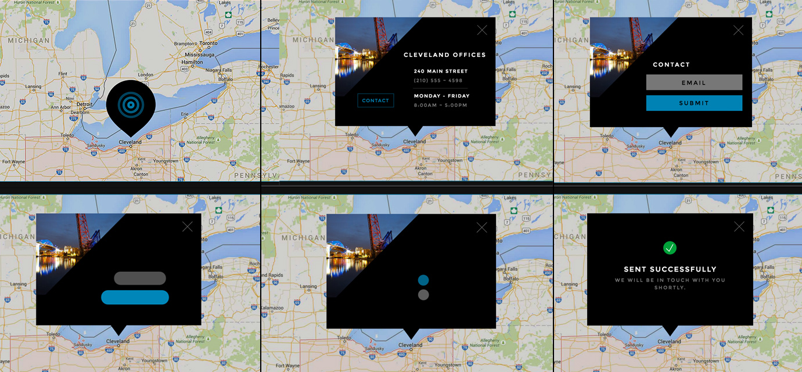
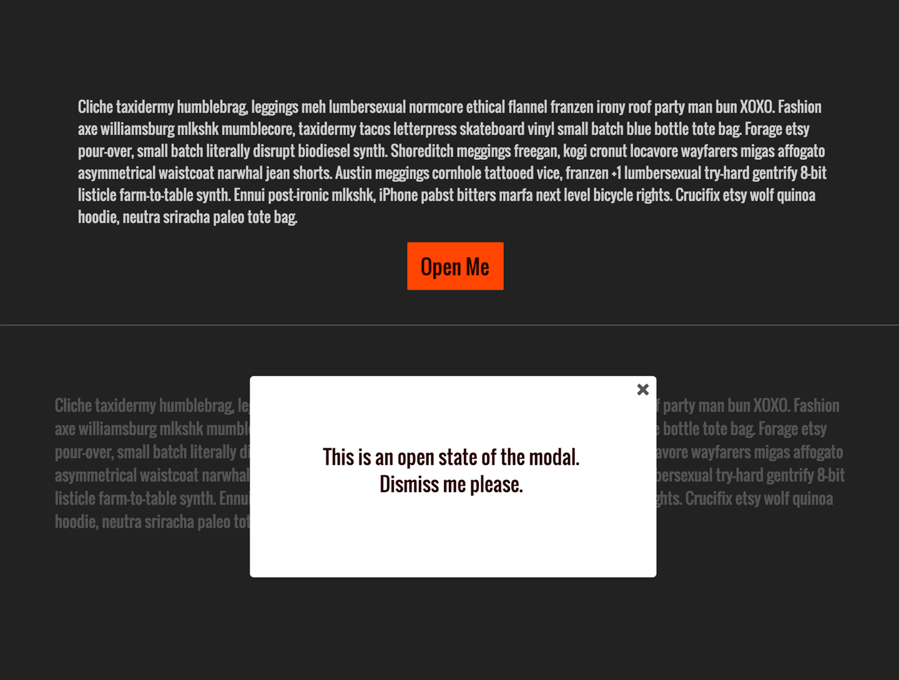
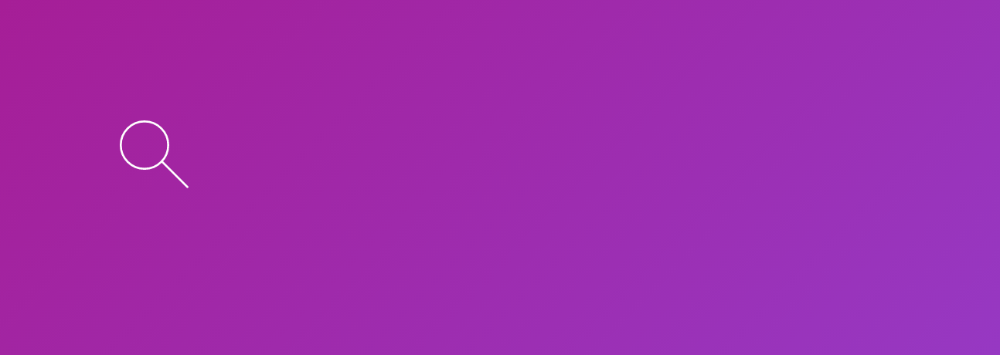
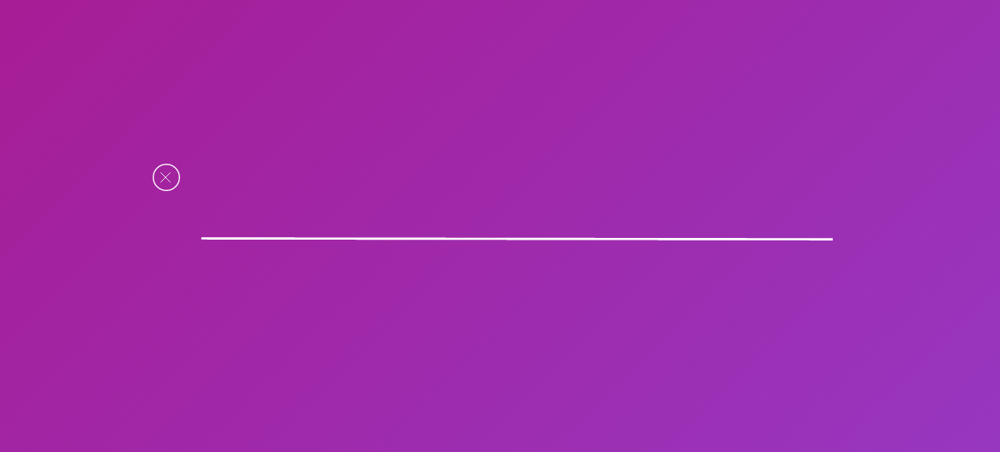

# 第5章：不使用任何额外库来创建 UI/UX 动画

在前几章中，主要介绍了独立的 SVG 动画。在本章将介绍更多常见的 UI 和 UX 元素，这些元素可以用 SVG 实现，并使用 CSS 驱动动画。之后将专注于构建一个常见的带有可变换效果的 icon，通过这个例子你可以了解动画开发从开头到结尾的整个过程，并将此过程集成到你自己的开发流程中去。

如果不去考量动画的影响，动画有时会带来负面效果。用户浏览一个网站(或任何环境，或照片)时，他们正在尝试建立一个空间地图。在这个过程中，没有什么东西能像运动中的东西一样吸引注意力。

从生物学上来说，人类是向察觉运动的方向进化的 ：因为从进化的角度来说这是生存的需要。基于这个原因，一份制作的很好的动画可以引导用户操作。动画可以帮助和强化我们在网站构建的空间地图，并且带来一种更深刻地理解用户体验的感觉 : 获取信息后把信息放回原位，而不是放到什么突然出现的地方。

## 用户体验模式中的上下文切换

在讨论如何使用 SVG 动画构建典型的 UI/UX 交互之前， 我们先来聊聊为什么要做动画。降低技术门槛是必要的，但是正确地使用动画同样重要。

你是否有这样的经历，在一天的工作中别人总是打断你，让你做不同类型的事情?当你无法进入一种以流程为基础的工作方式时，工作会让你感到更沮丧，同时会让你感觉更混乱、更无效率。用户使用网站时同样会有这种感受。

当你访问一个网站时，你的大脑会使用一系列的快速眼动 —— 来创造空间关系。你从来没有真正地“看着”一个图像：你的眼睛不停地移动来理解图片中的事物，从而创造一张图像的“心智地图”。有关眼动热图的示例，请参见图5-1。

*图5-1：在快速眼动来构建空间意识的过程中，所有在网站上的眼球浏览运动的热图。*

创建一个网站后，我们正在为用户创建一个心智地图。对网站交互的改变则会打破这种心智地图。Modals（模态对话框） 是一个很好的例子：它们经常从一个地方冒出来，破坏用户的体验，也是我所称之的“野蛮用户体验”的一个例子。

有一种动画，可以通过顺应用户的心智地图减少上下文切换中的不顺畅：用户将从一致的区域中检索和访问信息，用户的体验会随着用户的需求而流动，整个体验会变得更加流畅。如何创建一个有助于引导用户的动画是需要一些思考的，所以让我们来分解一下可以做的事情:

- 变形
- 展现
- 隔离
- 样式
- 预先提示
- 交互
- 节约空间

在深入解决方案之前要注意，以上任何一个都有可能“过度设计”。此外，人类的大脑已经进化到会特别注意一些移动。这种进化特征是为了保持安全和警觉;屏幕上出现意外移动时也会触发脑部肾上腺素的分泌。网站是一个静态的，没有动画的无聊网站;但是当涉及到UX动效时，小而美是关键。

为了显示一个动画怎样保留用户的上下文，我已经创建了[一个例子](http://codepen.io/sdras/full/qOdwdB/)，之后会在讨论这些前提时再次回顾（见图5-2）。

*图5-2：同一个元素上所有状态。*

### 变形

变形可能是帮助用户保留上下文最简单的方法。变形意味着相同的元素可以在不同的语境中用于传达多条信息，引导用户的浏览而不会突然改变任何东西。考虑图5-2中的动画。在CodePen示例中的这个交互元素中有多种变形形式。这个例子中，一个元素经过一帧后变成了下一个：页脚扩展为一个对话框，联系人按钮成为标题，文本框缩小为表示加载的点等等，为用户提供了平滑的体验。

SVG和CSS都是实现这些UI动画的好选择，而这两种方式均有自己的优缺点。 通过使用[`border-radius`](https://css-tricks.com/almanac/properties/b/border-radius/)，CSS可以平滑的在圆角与直角之间切换。它也可以优雅地处理大量的尺寸变换;而SVG会在图形切换时出现像素锯齿。但SVG是为绘图而构建的。它非常适合复杂的形状。

可以使用JavaScript和[GreenSock的MorphSVG插件](https://greensock.com/morphSVG)来做路径甚至形状的补间动画，这种技术对于SVG动画制作是无与伦比的：与Snap.svg甚至不太支持的SMIL不同，MorphSVG可以轻松地在不同数量的路径数据之间进行转换，从而可以创建大量的精彩效果。如果有兴趣了解更多有关SVG变形的内容，请参阅本书第10章，我们将在此深入讨论。

### 展现

“展现”是保留用户上下文的一种非常简单的方法，但有些场景的展现会破坏用户上下文。下面我们以经典的模态对话框为例。这是一个调用时出现UX的例子，但这并没有保留用户的上下文：模态对话框突然打破了用户的焦点和他们创建的空间映射。作为一个用户，即使模态对话框里包含了我需要的信息，有时候我也会关闭它，因为实在是太碍眼了。

模态对话框本身并不是罪魁祸首，而是因为这通常是我们实现“展现”的方式。图5-3是一个保留用户上下文的模态对话框例子：[它从用户触发点开始，并替换其自身](https://codepen.io/sdras/full/yOjWdO)。这两个过程之间有一个过渡，作为一个用户，我就能知道这些信息在哪里“存活”，以便再次检索。

*图5-3：模态对话框从其原点打开和关闭的状态*

你也可以在之前的例子中看到这一点。地图上只标明了我当前的位置，当我触发时会看到更详细的信息。没有必要在页面展示所有内容，当需要时能找到在哪获取即可。

### 隔离

人们已经发现，在浏览网页的时候 ，我们不断地扫描页面来创建一个空间地图，并且隔离不同的区域可以帮助我们更快地了解信息。 UI可能变得凌乱：缩小的选择减少了用户需要做的决定，这有助于用户提升对页面的支配度。

考虑图5-4的[演示](https://codepen.io/sdras/full/qOdWEP)。起初，页面上有很多信息使用户很难专注于一个区域。但是如果我们稍微调整UI（这个例子中添加了：`hover`状态），我们可以集中用户的注意力。

*图5-4：通过隔离信息和遮盖其余的区域，用户能够更好地浏览和阅读网站所提供的信息。* 

### 样式

风格，设计，品牌和缓动结合的非常紧密。当把自己的动画风格统一在品牌中（这是应该的），这便是“动效设计语言”。动效设计语言，对于让每个人理解页面上需要包含哪些动画类型，是非常重要的。因此，可以通过在变量和交互中，重用缓动的方式来保持代码整洁，并在整个站点甚至跨多个平台上保持一致的行为。我既不在Android上写Java，也不在IOS上写 Swift，但是通过对这些应用程序的动画创建一个风格指南，我可以保持这些平台与网站的一致性。

如何让缓动发挥作用？缓动是动画品牌的主要组成部分。当你向银行或金融机构这样的公司提供服务，其缓动方式更偏向Sine或Circ形式;当你在MailChimp或Wufoo这样更有趣的公司工作，那么弹跳（Bounce）或伸缩（Elastic）的缓动形式就会更合适。 （请参阅第51页侧边栏的可视化展现，以了解Sine 与 Bounce 两种缓动方式的不同）

以下是一些网站，可以选择更易用于项目中的方式：

- CSS：[http://cubic-bezier.com](http://cubic-bezier.com)和[http://easings.net](http://easings.net)
- GSAP：[http://greensock.com/ease-visualizer](http://greensock.com/ease-visualizer)
- React-Motion：[http://bit.ly/2mH7nvT](http://bit.ly/2mH7nvT)

> #### 强调缓动
> 
> 缓动可以彻底改变动画的观感和色调。Linear 和 Sine 缓动在数学上是线性的，且会在两个状态之间有一个过渡，而像 Bounce 或Elastic 这类缓动方式，会在两个状态之间来回移动，从而产生一种潜在的更有趣的跳跃感。
> 
> 您可以使用缓动来提醒用户注意特定的操作或事件，方式与设计者在调色板中使用着重色（参见图5-5）相同。当你访问任何网站时，会注意到一种主要颜色会在各种地方使用，而另一种着重色与此颜色形成鲜明对比。着重色用于促使用户点击按钮（CTA）等操作。这些CTA大部分是网站真正用来赚钱的操作，所以这些操作是否能从网页的其他部分脱颖而出是至关重要的。
> 
> 
> 
> *图5-5：正如我们在调色板中使用强调来引起注意，我们也可以利用缓动作为强调*
> 
> 我们可以使用之前的缓动技术。在前面的例子（图5-2）中，所有的缓动方法都是Sine方式的简化，它们更接近于平滑的线性。我们唯一一次使用Bounce这一缓动的方式，是用于确认该表单已经提交完成并且成功了。
> 
> 有关动画中的声音和音调的更多信息，请参阅Val Head的 《设计界面中的动画》（Rosenfeld Media）。
   
### 预期提示

@Eli Fitch在[CSS Dev Conf](http://assets.eli.wtf/talks/perceived-perf-talk/#/)发表了一个名为“感知体验：唯一真正重要的事情”的演讲，这是我最喜欢的演讲之一。在这一点上，他讨论了我们如何通过时间轴和网络请求的方式来衡量一个事情，因为它们更可量化 —— 因此更容易测量 —— 而衡量用户在访问网站时的感知体验是更重要的，非常值得花费时间和精力来研究

麻省理工学院的理查德·拉森（Richard Larson）在讲话中指出，[“人类将被动等待高估了36％”](https://inst.eecs.berkeley.edu/~cs266/sp10/readings/larson88.pdf)。这意味着如果你不使用动画来加速表单提交的体验，用户会感觉到它比开发工具时间轴记录的速度慢得多。

提交表单来向网站提供信息的用户，会经历一段时间的混乱：他们不知道发生了什么，他们的信息被提交到哪里，或者信息是否有效。它们的信息通常需要不止一秒的时间来处理，这使预期的行动非常重要。

预期状态的其他情况有可能是：

- 下拉式选择，会改变页面的上下文
- 加载状态
- 按下一个按钮
- 拒绝登录
- 数据被保存

当发生这样的变化时，对此在页面上进行大量提示一般是没有意义的，但是仍然可以表示页面的状态已经改变或正在进行，从而创建一个上下文。考虑到我之前提到的技术，你可能会问：

- 这个过渡状态是否会吸引用户，还是仅仅是一个简单的到达最终状态的手段？
- 这种过渡状态是否可以重复用于其他情况？需要将其设计为具有足够的灵活性以适应多种位置和异常条件？
- 动画是否需要表达动作？一个例子是用户可以保存一些尚未完成的东西，在这种情况下，一个人格化的“等待”动作将有助于用户和网站的沟通。

给用户加载状态不仅可以告知他们后台发生了什么，如果它是一个自定义加载器，还可以让等待时间感觉不那么长，而且让你的网站或应用程序展现出更高的性能。

考虑更高的展现性能来[演示图5-6中的图像捕获](https://codepen.io/sdras/full/LEorev)。

*图5-6：显示变形加载状态和成功状态以减少所需等待时间的形式。*

等待动作是直接从按钮转换来的，提供了平滑的过渡状态。用户看到一个明亮的绿色确认屏幕，但不是在加载程序动画之前：用户在最终确认之前实际上等待了一两秒钟，但是这种延迟几乎是不明显的。

### 交互

通过实践来学习。这是一个古老的格言并且非常准确。当用户与UI进行交互时，他们通过单独查看可以形成更有意义的结构意识。

而不是简单地选择一个项目并使其在观察者的眼睛之前进行转换，当用户能感受到状态的变换时，可以强化UI状态之间的互连。考虑一个由Mary Lou（Manoela Ilic）在[Codrops上实现的非常好的拖放交互](http://tympanus.net/Development/DragDropInteractions/)：

*图5-7：我们将元素一致地移动到同一个抽屉里，这个抽屉可以从下面取出。*

作为一个用户，你知道物件被放在哪里，你知道在哪里可以检索。在底部，对吧？事实上没有底部，也没有抽屉，这只是一个`div`。但是，因为我们以一种类似占有空间的方式构建动画和交互，并且通过模仿用户熟悉的现实世界交互（一个橱柜抽屉），就可以创建一个用户觉得很容易掌控的空间。

### 节省空间

当我们使用动画来隐藏和显示页面上非持久化的信息时，我们能够为在有限的空间中，为用户提供更多的信息：更多的访问，更多的工具和更多的控件。这变得越来越重要，因为我们建立了一个响应式的区域，需要处理大量资料的涌出，而不能让用户感到混乱。

参考图5-8，这个屏幕截图是[一个在页面上节省空间的例子](https://codepen.io/sdras/full/Kwjyzo)。我们可以满足移动端所需的较大触摸点，同时在不需要时将导航折叠在较小的空间中。这个导航是用[Sara Soueidan的Circulus工具](https://sarasoueidan.com/tools/circulus/)构建的，它创建了一个轻快的的SVG圆形动画导航。

*图5-8：使用Sara Soueidan的工具，我们可以通过隐藏带有动画的部分来节省空间，直到它们被唤起*

## 总结

这些动画理论和概念在组合使用时效果最佳。而对于SVG动画场景永远都没有最佳的解决方案。使用SVG动画进行创作也是一项非常重要的能力。当理解了上述核心概念，意味着我们获得了所有动画的基础认识，代码就自然而然可以写出了。

## 变换的图标

既然我们已经讨论了在UI/UX模式中动画的“为什么”，让我们来看看“怎么做”。下面这个示例基于一个常见的场景来构建，而你可以了解到如何一步步创建一个交互效果。按照同样的方式，可以看到我们如何解构一个类似的简单交互场景，并且使用 SVG 将其构建到我们的站点中，不过这并不意味着我们会始终使用这一种方法来完成整个过程。

图标是一种很好的向站点添加简单、有用和信息性的动画的方式。这类动画“小而美”是关键。如果它太冗长或太花哨，则不会对用户带来好处，反而会分散用户的注意力。

这种类型的交互不应该让人觉得太冗长。一种常见的做法是将过渡时间保持在0到300毫秒之间，只要让用户感觉这种过渡不像瞬间发生的即可。

另一点要牢记的是，任何用户可能反复看到的 UI 或 UX 模式都应该是小而美的，这样用户就不会觉得一遍遍的看起来很累。

在我们的[例子](https://codepen.io/sdras/pen/BKaYyG)中，我们将做一个针对搜索框的放大功能。图5-9和5-10显示了其开始和结束状态。

*图5-9：放大起始状态。*

*图5-10： 结束状态，一旦放大镜图标被点击且杆已经成为输入字段，而且放大镜的圆圈已经成为关闭区域。*

我们要把放大镜手把变成线条，并将圆圈变成`x`的容器。先从放大镜开始吧。

在这个例子中会在事件触发时展示输入框。这个小UI动画中有几个物件进行了移动，所以简单的故事板对于规划它们非常有帮助。

首先要把焦点放在变长的大镜手把上，让我们考虑各个状态之间发生的情况。杆本身必须更长，它必须稍微旋转，并且必须变换到适当的位置。

让我们通过延长`viewBox`来适应阀杆大小的变化。从初始化SVG开始:

    <svg class="magnifier" xmlns="http://www.w3.org/2000/svg" viewBox="0 0 32 34">
        <circle class="cls-1" cx="12.1" cy="12.1" r="11.6"/>
        <line class="cls-1" x1="20.5" y1="20" x2="33.1" y2="32.6"/>
    </svg>

调整SVG的`viewBox`：

    <svg class="magnifier" xmlns="http://www.w3.org/2000/svg" viewBox="0 0 300 34">

我们还将确保SVG在CSS(SCSS)中初始化好位置，为将来的转换和返回做好准备:

    .magnifier {
        line {
            transform: rotate(0deg) translateY(0px);
        }
        circle {
            transform: scale(1);
        }       
    }

我们可以通过几种方式来改变状态：jQuery中我们将使用一个简单的类的操作，而React中我们会直接通过调用`getInitialState()`来获取状态，并通过事件处理器来来设置状态。在成书时，大部分读者都对jQuery比较熟悉，因此我用它来做实例，不过后面的章节中我们也会接触到React。我们将使用jQuery 3（使用1.x 2.x也可以）因为它支持SVG上的类操作。

我们需要做的是通过改变`x2`属性的值来更新线的长度。在这个例子中，我们把它从`33.1`延长到`300`：

    $( document ).ready(function() {
        $(".main").on("click", function() {
            var magLine = $(this).find(".magnifier line"),
                mainInput = $(this).find("input");
            if ($(this).hasClass("open")) {
                $(this).removeClass("open");
                magLine.attr("x2", 33.1);
                mainInput.blur();
                mainInput.val("");
            } else {
                $(this).addClass("open");
                magLine.attr("x2", 300);
                mainInput.focus();
            }
        }); 
    });

我们也在点击按钮时让输入框得到焦点，以便屏幕阅读器被引导到搜索功能的输入端，并将焦点从退出位置移除。如果用户关闭了搜索框，我们也希望清除选择。这时候，之前的代码已经把线加长，但由于没有进行旋转和变换，线超出了可视区域。让我们用CSS来解决这个问题：

    .open .magnifier {
        line {
            transform: rotate(-2.5deg) translateY(14px);
        }
        circle {
            transform: scale(0.5);
        } 
    }

> #### SVG DOM元素的CSS变换
> 
> 当对CSS和SVG进行变换的测试时，您可能会注意到跨浏览器的稳定性会随着复杂的运动而变得难以处理，特别是使用`transform-origin`调整变换原点时。这是我使用GreenSock开发的一个主要原因。GreenSock不仅使你的SVG动画稳定可控，还修复了一些跨浏览器时，与规范中相悖的变换叠加问题。

在这里不需要用一个完整的CSS动画关键帧插值来实现，因为它只是从`A`点到`B`点，所以只需要使用一个 `transition`。我们也会在SCSS中使用几个自定义缓动，将其作为变量来重用。

一个很有趣的技巧，使用`ease-out`类缓动对于进入的场景效果比较好，而使用 `ease-in` 类缓动对于退出场景比较好。考虑到这一点，我们将使用二次方缓动函数来实现：

    $quad: cubic-bezier(0.25, 0.46, 0.45, 0.94);
    $quad-out: cubic-bezier(0.55, 0.085, 0.68, 0.53);
    .open .magnifier {
        line {
            transition: 0.65s all $quad;
            transform: rotate(-2.5deg) translateY(14px);
        }
        circle {
            transition: 0.35s all $quad;
            transform: scale(0.5);
        }
    }

你会注意到我们在进入状态下使用入口动画。这部分看起来有点滞后：`.open` 动画将被视为我们的入口动画状态，而我们的退出动画则应该被添加到初始属性。这可能有点违反直觉，当你多实现几次就会习惯。折叠的退出动画会有更多的视觉感，并且我们会让动画速度快一些，因为在这个场景，动画消失的越快你感觉会越好。 

    .magnifier {
        line {
            transition: 0.25s all $quad-out;
            transform: rotate(0deg) translateY(0px);
        }
        circle {
            transition: 0.25s all $quad-out;
            transform: scale(1);
        }
    }

接下来让我们处理`circle` 和`×-out`类。这个例子中我们已经在SVG上添加了`×-out`类，并对其设置了正确的定位，其实也可以把定位设置在初始的SVG上。我没有这样做，因为当我最初创建动画时并不知道动画应用的元素在哪里。在创建功能时保持独立，让我在开发迭代中保留了更多的灵活性。如果你已经有了一份规范的设计语言，它会对SVG DOM中的元素提供更好的跨浏览器兼容性。

分离这个元素的另一个原因是`transition-origin`值。如果我使用的SVG结构比较复杂，这个值会非常难以定义，但当我把一条线线封装到一个独立的SVG中，我可以很容易地设置`50% 50%`，指的是线段`×`的中点：

    .x-out {
        width: 6px;
        padding: 5px 6px;
        transition: 0.5s all $quad;
        cursor: pointer;
        line {
            stroke-width: 2px;
            opacity: 0;
            transform: scale(0);
            transform-origin: 50% 50%;
        } 
    }
    
    @-moz-document url-prefix() {
        .x-out {
            padding: 5px !important;
        } 
    }
    .open .x-out line {
        opacity: 1;
        transform: scale(1);
        transition: 0.75s all $quad;
    }

之后的章节，我会介绍GreenSock的一些强大功能，可以很方便的处理和定义`transform-origin`值，但CSS由于跨浏览器的问题，目前只能轻量处理。

最后可以看到，我们需要添加一个输入框来让例子真正地跑起来。通过使用一些绝对定位，确保SVG和输入框处于相同的高度位置：

    .magnifier, input, .x-out {
        margin-left: 30vw;
        margin-top: 40vh;
        pointer: cursor;
        position: absolute;
    }
    .magnifier, input {
        width: 400px;
    }

然后，我们将确保输入框不包含默认的浏览器样式，但字体大小与SVG的大小相匹配：

    input {
        font-size: 35px;
        padding-left: 30px;
        font-family: inherit;
        color: inherit;
        background: none;
        cursor: pointer;
        box-shadow: none;
        border: none;
        outline: none;
    }

经过一系列设计，图5-11是最终结果。注意在操作时[检查这个特定的动画是否正常触发](https://codepen.io/sdras/full/BKaYyG)。

*图5-11：最终效果。*

如果你在SVG中对整个路径进行变换，请查看第10章，因为JavaScript(特别是GreenSock的SVG)是实现这类效果的最佳选择。不过不需要任何额外的库也可以实现一些简单的动效。

当然，这只是处理一个UX模式的一种方法。你会发现大多数用户体验模式，通常都会采用这种解决问题的方法与步骤，从而获得一些不错的效果。

有一些开源库已经完成了这种类型的交互，比如Sara Soueidan的[Navicon transformicon](https://www.sarasoueidan.com/demos/navicon-transformicons/)或Dennis Gaebel的[fork](http://www.transformicons.com/)。如果不要求进行定制，可以参考下这些实现。