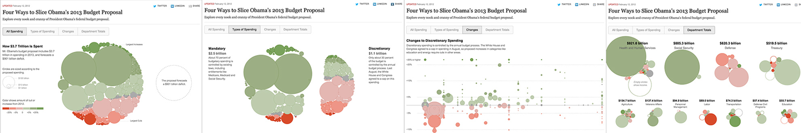
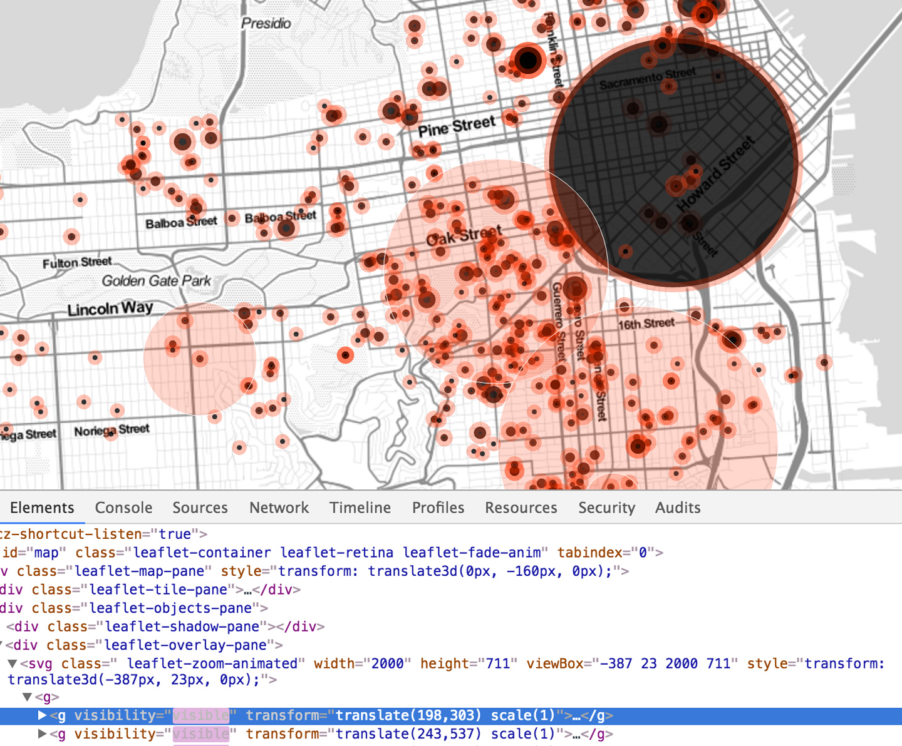
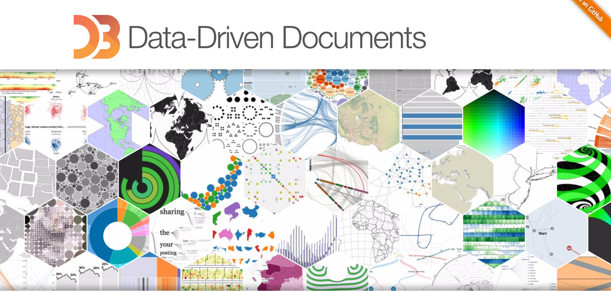
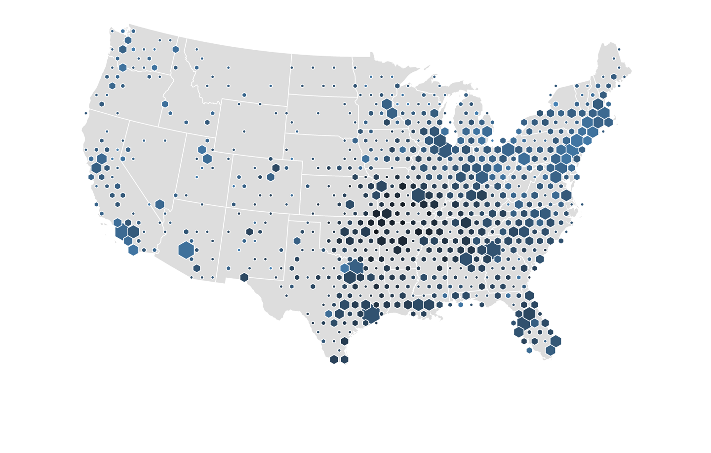
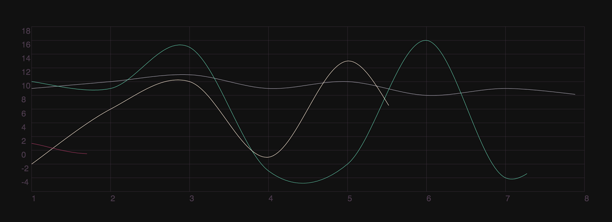
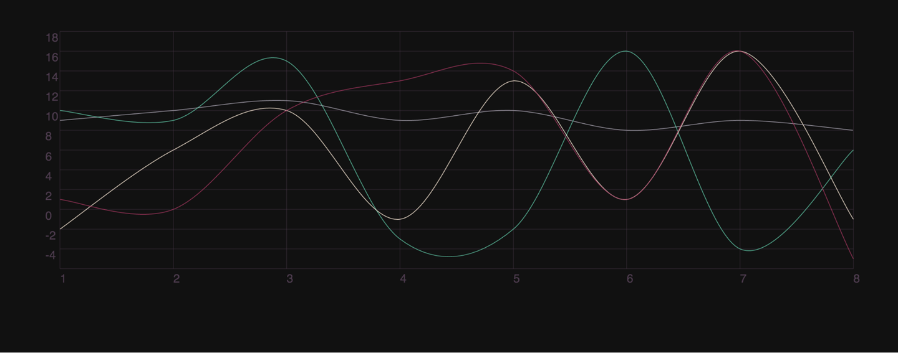

# 第6章：动态数据可视化

数据可视化是用来呈现不同信息的一个非常有用的方法。幸运的是，一些相关的库的流行，比如 [D3](https://d3js.org/)，[Chartist](https://gionkunz.github.io/chartist-js/)，这让我们能够很容易地创建一些动画。这并不是有这些就可以实现数据可视化，我只是从我工作中接触到的里面选出了我最喜爱的。

在本章中，我们将利用 D3 和 Chartist 来实现数据可视化。 Chartist在刚发布的时候，利用的是已经废弃的 SMIL 来做动画，所以，我不建议你使用它原生动画函数。D3也提供了一些原生动画函数，但是你可能发现，既然你已经了解到一些 CSS 的实现，那么在屏幕上实现数据可视化并且动态化，对你而言应该更容易。

> #### Chartist 与 D3 优缺点
> 
> 在 Chartist 中，你可以很容易的创建响应式的表和图像。它非常的易上手。Chartist 封装了 SVG，所以一些 JavaScript 功能看起来有点困惑和不直接。考虑到这点，我强烈建议使用 Chartist 去用 CSS 动画画一些简单的图形。
> 
> 而 D3 并不是特别容易上手，但是，它非常易于扩展。你可以利用 D3 创建你想创建的，并且实现很多漂亮的 Web 数据可视化。

简而言之，这并不是固定的答案。你应该选择适合你工作流和网站实现的库，或者你喜欢的库。

教授怎样具体使用 Chartist 或者 D3 去创建图表和图像，已经超出了本书的范围，但是 Chartist 有很棒的实例，文档，并且O’Reilly也有很棒的书对如何学习 D3 做了介绍：由 Scott Murry 编著[Web 可交互式数据可视化](http://shop.oreilly.com/product/0636920026938.do)。我使用这本书去学习 D3 的技术并且强烈推荐它。

## 为什么在数据可视化中使用动画？

动画在数据可视化中非常有帮助，因为其常常作为数据结果的一个表现形式。这里动画有很多方式来帮助数据可视化：

- 过滤
- 排序
- 演示
- 时间渐变
- 透明度的变化

在上一章中，我们讨论了对用户而言保持上下文的重要性。数据过滤可以让我们保留一致的元素，当通过尾部调整来改变其内容。

参考图 6-1 的数据可视化。[纽约时报在不同的上下文中呈现一致的数据](http://www.nytimes.com/interactive/2012/02/13/us/politics/2013-budget-proposal-graphic.html)，这让读者能够通过非常有效和多维的方式来处理信息。用户能够通过在不同上下文中，获得更大的信息量，且呈现的区域保持不变时。

*图 6-1：纽约时报通过 4 种不同的方式，重组一样的信息，给予了这些信息新的含义。并且通过动画连接不同的视图来保持不同状态上下文的一致*

即使最有效的信息，如果没有展示也是没有意义的。这也是为什么动态展示在数据可视化中是非常重要的。

我住在旧金山，那正发生着住房危机。许多家庭被 Ellis 法案的法律漏洞被赶出家门。Ellis 法案驱逐的影响力在图 6-2 的数据可视化中被强烈展示出来，它随着时间展示了驱逐令影响的范围。我们将在第 9 章学到如何写出以时间线为基础的交互动画。

*图6-2：随时时间增加，红点会增加的越来越快，最终填满整座城市；数据可视化并不只是在展示数据，而是在讲故事，展现整个影响*

如果我们仔细看代码的话，就会发现，那全部都是 SVG。可视化是隐藏的，并且根据驱逐发生的时间来展示（详见图 6-3）。这种线性展示效果非常好，因为，越来越多的地点会以 `爆炸` 的动画形式展示在地图上。

*图6-3：在代码中，可视化使用一个 SVG 动画，通过修改和改变这些组，来完成屏幕上爆炸的效果*

让我们一起来创建一个类似的微型版本，这样你就可以看到这是怎样完成的。

## 使用CSS动画的D3示例

在开始时，D3 有许多漂亮的块，你直接使用并做相关修改（图 6-4）。这些块是一些展示例子，里面包含了代码和 D3 的实现细节。注意：这些块并不是库的一部分，它们只是贡献者提供的独立的例子，并且版权和版本可能会不同。

*图 6-4：D3首页*

要想像已经做好的示例一样漂亮，你可能需要给你的网页添加一些样式，或者使他们更生动。

对于这个资历，我选了一个在美国的3000 沃尔玛地图。（如图 6-5）

*图 6-5：我们将使用 D3 mbostock/4330486 的区块可视化效果来实现渐进动画的案例*

用过一些样式和简单的 SCSS 函数，我们可以将静态的文档转换为，像图 6-6 到 6-8 一样的呈现效果。完成的动画详见 [http://codepen.io/sdras/full/qZBgaj/](http://codepen.io/sdras/full/qZBgaj)。

*图 6-6：渐进渲染六边形数据的初始状态*

*图 6-7：渐进渲染六边形数据的中间状态*

*图 6-8：渐进渲染六边形数据的结束状态*

为了改变基本样式，我们需要不同的类去区分不同的 SVG paths 类型。在本例中，D3 通过 `.attr()` 函数去指定必要的类名。

下面是 JS 代码：

    svg.append("path")
        .datum(topojson.feature(us, us.objects.land))
        .attr("class", "land")
        .attr("d", path);

    svg.append("path")
        .datum(topojson.mesh(us, us.objects.states, function(a, b) {
            return a !== b;
        }))
        .attr("class", "states")
        .attr("d", path);

    svg.append("g")
        .attr("class", "hexagons")
        .selectAll("path")

下面是 SCSS 代码：

    svg {
        position: absolute;
        left: 50%;
        margin-left: -500px;
    }
    path {
        fill: none;
        stroke-linejoin: round;
    }
    .land {
        fill: #444;
    }
    .states {
        stroke: #555;
    }

在每个六边形路径上添加一个额外的类名，让其有动画效果，其实是并没有意义的，因为我们可以使用 `nth-child` 选择器来完成。Sass 也可以通过创建一个函数，来构造一个栅格动画。我们初始的时候，将六边形的`opacity`设置为`0`，目的是能够渐变的展现他们：

    .hexagons path {
        opacity: 0;
    }
    
    $elements: 2000;
    @for $i from 0 to $elements {
        .hexagons path:nth-child(#{$i}) {
            $per: $i/50;
            animation: 2s #{$per}s ease hexagons both;
        }
    }

    @keyframes hexagons {
        100% {
            opacity: 1; 
        }
    }

这里只需要不多的代码，就可以实现非常漂亮和令人激动的渐进动画。如果想了解更多时间线性的动画效果，可以参考 12 章。在 12 章，我们将会结合拖动实例，通过创建具有交互性和渐进性的动画来讲解 GSAP 时间线性动画。

## 使用CSS动画的Chartist示例

让我们也来做一个简单的图表例子。首先，我们基于一个完整的折线图表，其样式已经满足我们的需要，最有趣的就是其中的线条动画。这能够清晰的显示数据本身，并且能更简单的处理数据。

通过Illusion来绘制SVG的效果，我们`.getTotalLength()` API 来获取需要知道的 SVG 路径的长度。

    setTimeout (
        function() {
            var path = document.querySelector('.ct-series-d path');
            var length = path.getTotalLength();
            console.log(length);
    }, 3000);

    // 输出
    a: 1060.49267578125
    b: 1665.3359375
    c: 1644.7210693359375
    d: 1540.881103515625

我们将使用这些数据去让路径有一定的动效，比如，通过 CSS 让这些路径一点一点的绘制。

首先，我们可以给其中一条路径设置`stroke-dasharray` 属性：

    .ct-series-a {
        fill: none;
        stroke-dasharray: 20;
        stroke: $color1;
    }

效果如图6-9：

*图6-9：带有 `stroke-dasharray` 属性的路径*

我们可以给 `stroke-dasharray` 属性设置无限制的长度，同时也可以设置一个 `stroke-dashoffset` 属性，它的值也可以随意设置。`stroke-dashoffset` 属性的含义和它的名字一样，就是设定虚线段的间隔值。这个属性其实也就是动画属性之一。

现在可以使用控制板输出值和我们的表格来创建一个动画，该动画会使用整个的路径长度并使其偏移。这可以让我们的[数据](https://codepen.io/sdras/full/oxNmRM)看起来是在 `viewBox` 绘制的（如图6-10 和 图6-11）。我们打算多次使用相同的信息，所以可以使用 `mixin` 来进行复用。同时也可以设置不同的值给 `dashoffset` 和 `dasharray`。为了统一，将其最终值设为 `0`：

    @mixin pathseries($length, $delay, $strokecolor) {
        stroke-dasharray: $length;
        stroke-dashoffset: $length;
        animation: draw 1s $delay ease both;
        fill: none;
        stroke: $strokecolor;
        opacity: 0.8;
    }
    .ct-series-a {
        @include pathseries(1093, 0s, $color1);
    }
    @keyframes draw {
        to {
            stroke-dashoffset: 0;
        }
    }

*图6-10：我们可以看到渐进式线条的绘制*

*图6-11：这是它的结果*

上面仅仅是创建Chartist可视化数据动画的一种方式。你可以在[其官网](https://gionkunz.github.io/chartist-js/examples.html)上找到很多其他的例子。在使用Chartist和 CSS 中，编写初始，结束和持续状态的方式，完全由你自己决定。

接下来，我们将在后面几章中更深入的学习数据可视化，但是在学习之前还要学一下 JavaScript。接下来是一个动画技术的简要对比，后面我们将换一种语言。

## 用 D3 来做动画

在该部分，在不使用 CSS 的前提下，通过 D3 来做一个最简单的动画例子。后面的例子，我们将使用版本四（需要注意，版本 3 和版本 4 是不兼容的，如果你使用版本 3 那么下面的例子，可能无法使用）。

如果你记得第一章的话，会发现，一条线其实就是由 `x,y` 坐标平面上的点绘制而成，你也可以发现这个方法对于一些简单的数据可视化来说非常有用。如果观察下面的代码，可以用之前SVG的知识来理解它：

    var line = d3.line();
    var data1 = [[0, 0], [200, 300], [400, 50], [500, 300],
        [550, 300], [600, 50], [700, 120], [775, 250]];
    var data2 = [[0, 100], [220, 120], [300, 250], [500, 10],
        [520, 120], [575, 250], [600, 300], [775, 50]];
    
    d3.select('#path1')
        .attr('d', line(data1))
        .transition()
        .attr('d', line(data2))
        .delay(1000)
        .duration(3000)
        .ease(d3.easeBounce);

我们通过 `d3.line()` 方法来设置相关的线条。该方法通过数据中的 `x,y` 两个平面坐标的字段来完成绘制。接着，我们可以添加一个渐变效果给线条的两个状态变化。另外，你还可以选择是否添加延时，持续时间和变换特效。

之前的代码能够添加线条两个状态的渐变效果：

你可以对其他属性复用该方法，比如 `colors`, `coordinates`。D3 对于该方式是非常灵活的。

> #### 不同数量路径点的动画
> 
> 即使 D3 很灵活（它可以支持 SVG 的大部分内容），SVG 对于不同动画的路径值非常严格，同时 D3 也是一样。如果第二个 `dataset` 相比于第一个有不同的长度，会发现渐变的效果看起来会非常的奇怪和丑陋，或者就直接失败。这也是为什么 GreenSock's MorphSVG 非常好用的原因。因为它对于这种情况也能处理的很好。（参考第十章）[d3-interpolate-path](https://github.com/pbeshai/d3-interpolate-path) 是一个独立于 D3 开发出来的，用来创建一些漂亮的路径动画。这里有一篇很好的[博客](https://bocoup.com/blog/improving-d3-path-animation)介绍它。

D3 非常容易创建摇摆动画，而且可以同 CSS 使用。你给每个元素计算出各自的延时时间。如果对 JavaScript 的`for`循环很熟悉，那么该种方法的应用对你来说应该不是太大的问题：

    transition.delay(function(d, i) { return i * 10; });

如果我们在颜色中也是用这种插值方式，那么代码看起来如下（我们将更新上面的代码示例更新为一个散点图，让颜色更容易被看到）：

    var dataset = [ 5, 17, 15, 13, 25, 30, 15, 17, 35, 10, 25, 15],
        w = 300,
        h = 300;
        // 创建 SVG
        var svg = d3.select("body")
                    .append("svg")
                    .attr("width", w)
                    .attr("height", h);
        // 通过数据，在 SVG 中创建相应的图形
        svg.selectAll("circle")
        .data(dataset)
        .enter()
        .append("circle")
        .attr("class", "circles")
        .attr("cx", function(d, i) {
            return 10 + (i * 22)
            })
        .attr("cy", function(d) {
            return 200 - (d * 5)
        })
        .attr("r", function(d) {
            return (d / 2)
        })
        .transition()
            .style("fill", "teal")
            .duration(1500)
            .delay(function(d, i) { return i * 100; });

完整示例可以参考 [CodePen](https://codepen.io/sdras/pen/7391be8243018607e62069bc00b630b9) 例子。

### 链式和重复

对于更复杂的效果，我们添加多个渐变效果，甚至创建循环。为了使用链式动画，我们像之前一点在两个状态之间添加 `.transition()` 方法，不过，为了让整个动画循环，我们还需要更改一点语法，使用递归的方法。下面是具体例子：

    .transition()
        .on("start", function repeat() {
            d3.active(this)
                .style("fill", "purple")
              .transition()
                .style("fill", "blue")
              .duration(2000)
              .transition()
              .duration(2000)
                .on("start", repeat);
          });

详细例子可以参考 [CodePen](https://codepen.io/sdras/pen/28e70cdcb1312beb33be4a25ac2c3997)。

不过，如果你打算写一个非常复杂的链式或者重复动画，推荐你使用 GreenSock 来做。我们在后面几章中会介绍一下 GreenSock。你会发现，上面的代码能够结合 D3，并且提供精确的时间轴和顺序控制。