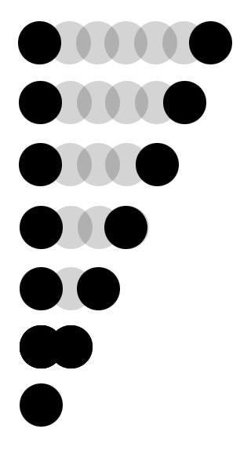

# 第8章：用GreenSock做动画

在前面的章节中，我们介绍了一些你会选择Green‐Sock作为一个动画库的原因。在本章中，我们会介绍一些如何使用动画的基本知识。

即使你更喜欢CSS，你同样可以掌握GreenSock。当你使用JavaScript来做动画的时候，你没必要知道它所有的东西。当然，这些更喜欢用JavaScript的人接触起来会稍微快一些，而且可以更简单地来调试，但是，我确实认为它的语法比较简单，完全可以让一个CSS开发者有能力掌握它。在某些方面，它比CSS更简单：CSS中的帧动画把帧的定义放到一个地方，和应用它们到CSS属性中区分开，然而GreenSock可以让你在一个地方处理所有的东西。

GreenSock已经开发了10年：它之前是一个Flash的工具。这给了它在竞争中一个巨大的支柱，因为设计者们更熟悉开发者遇到的问题。他们都是非常亲切的，有一些固定的人在论坛上帮助大家，所以当你遇到问题卡住的时候，有一个非常好的社区来帮助你。

让我们开始把！

> #### 开始使用GreenSock
> 
> 要使用GreenSock，你需要在你的页面开始部分中引入TweenMax，具体代码片段如下：``。
> 你也可以替换`/1.19.0/`为任何一个最近的版本，这些版本号你可以在https://cdnjs.com/网站上看到。
> 
> 或者你可以在命令行使用`yarn`或者`npm`来安装，命令如下：`npm install gsap` 或 `yarn install gsap`

## 基本的GreenSock语法

我们将开始一个真正的简单示例，结果如图8-1所示，代码如下：

	TweenMax.to(".element", 2, { x: 100 });

*图8-1：我们看到一个球，它有一个 `.element` 的`class`，效果如上。*

在这个示例中，球向右移动了`100px`。下面我们一点一点分析这里面的语法，然后也考虑一些其他的选项。

### TweenMax/TweenLite

	TweenMax.to(".element", 2, { x: 100 });

代码片段一开始的TweenMax告诉浏览器：我们将要使用GreenSock里的动画函数代码（它在我们之前引入的库文件中被加载）。如果你选择使用更小版本的库文件，你可以用TweenLite来替代。TweenLite的优势是它非常小，同样的TweenMax的优势是它装备了类似： 循环，CSS属性（你会发现你可能会需要），和TimelineMax库它扩展了较小的TimelineLite（后面的章节我们会介绍时间轴）。这两个是可以互相替换的，不改变动画工作的方式，除了一个提供更多的给你之外。

### .to/.from/.fromTo

	TweenMax.to(".element", 2, { x: 100 });

另一个就是这个 `.to` 方法，就像你想象的，它告诉元素去改变状态。

你也可以用 `.from` 方法，它代表元素源自的你任意在大括号里面指定的（`animation`对象）可以更改它的默认值，或者 `.fromTo`，它可以让你更细颗粒度的控制从哪里开始从哪里结束。

`.fromTo`对动画很有用，它会被重新触发，因为你可以对开始和结束的点更确定。举例，你触发一个动画，它会缩放`50%`。然后你又让它缩放`50%` - 但是它已经在那了。这个动画在第二次触发之后将会看起来什么都没有做。

当我们使用 `.fromTo`，这个语法看起来有一点不一样：

  	TweenMax.fromTo(".element", 2, {
    	x: 0
	}, { 
		x: 100
	});

你可以看到，我同样改变了一些行，这样看起来更清晰。这样我们可以看得更清晰，元素会在`x`轴从`0`到`100`。

### Staggering

我们同样可以使用`.staggerTo`、`.staggerFrom`或者`.staggerFromTo`。这会有同样的动画效果，以多种层叠的方式重复，应用到一组你设计的对象中。使用SVG，我发现放置元素到一个组里面很方便，为了完成它，我们给这个组加了一个`class`。举个例子，在下面的代码中，这个动画效果会应用到这个带有`class`为`.element`组内部的所有`circles`：

  	TweenMax.staggerTo(".element circle", 2, {
    	x: 100
	}, 0.1);

这个代码片段展示了我们改变了的内容：我们用 `.staggerTo` 替代了 `.to`，在代码块的最后，增加了一个额外的参数 `0.1`。它控制每一个`staggers`之间的时间。我们同样指向了所有在含有 `.element` 类名的组里面的`circles`。具体效果如8-2图所示：

*图8-2:所有的球都以相同的值运动，但是一个接着一个，有时间间隔。*

> #### 反方向的 Staggers
> 
> 如果你想要从最后一个元素开始到第一个元素应用 `stagger`，非常简单。给间隔设置一个负值（这里设置了 	`-0.1` 的值）
> 
>	TweenMax.staggerTo(".element
>   	circle", 2, {
>       	x: 100
>	}, -0.1);

还有更多`staggers`高级的类型可用，包含使用 `cycle` 属性，随机的 `staggering` 值。你可以在第11章获取更多相关的信息。

### Elements
	
	TweenMax.to(".element", 2, { x: 100 });

GreenSock 关联目标元素的方式和原生 JavaScript中的 `querySelector` 或者 `querySelectorAll` 很像，甚至和 jQuery 选择器的行为更接近，这里你可以传递一个或者多个元素，他们可以是类名，`IDs` 或者是属性（像 `path`，`circle`或者`rect`）。你不需要担心节点列表，它们都会抽取了，这样让 DOM 和跨浏览器支持更简单。

你可以使用单引号的选择器字符串，像上面的示例一样，直接指向元素，但是 GreenSock 也接受变量，如果你的Jam（比如，`var el = document.querySelector(".el")`）。当针对一个元素多次使用时，更倾向使用这样的变量，以避免重复和多次查找。

### Duration

	TweenMax.to(.element", 2, { x: 100, delay: 2 });

这应该是我们见过最简单的值了。我们传递了一个整数，它代表着动画运行多久。2代表`2`秒，`0.3`代表`0.3`秒或者`300`毫秒。就像 `.element` 的值，我们也可以传递一个变量。我倾向于只是在多个元素和动画效果的时候使用变量的方式，比如我们想要使用同样额外的持续时间，但是这种情况比较少。

### Delay

	TweenMax.to(.element", 2, { x: 100, delay: 2 });

如果你想要让你的动画在触发之前停留一段时间，你可以使用`delay`。`delay`在锁住或者设置一个接着另一个的时候很有用，但是在下一个章节，我们可以用时间轴来会覆盖更多的效果和组织链式的效果。

## 动画的属性

我们简略地解释了示例代码中如何把球往右移动100px，但是我们再解释一些更多相关的内容。`x`代表什么？事实上代表 `transform：translateX(100px)`。就像 SVG 中的`rects`，不应该对元素中的 `x` 属性困惑。记住，当我提到 `transforms` 和 `opacity` 的时候，它们是执行动画最高效的。GreenSock的开发者知道这些，所以他们很友好地创建了一些短命名，我们可以使用`x`,`y`,`z`，`scale`和`rotation`（而不是CSS里面的`rotate`）。我们可以单独地使用而且可以在不同的时间。它节省了我们的很多代码，而且让我们的代码可读性更高。

记住，如果你要让SVG DOM进行转换，它会使用`viewBox`的坐标系统，所以你不要使用像素。你可能会想起之前的章节，有一个很有用的功能，因为它代表我们可以简单地使用scale和创造复杂响应式的动画（更多这里相关的介绍会在16章）

> #### CSS动画转换
> 
> 因为`transform`是CSS的一个属性，在不同的时间对同样一个元素应用不一样的`transforms`会比较麻烦。他们最后采用一个层叠顺序 -- 一个接着一个应用，除非每次变化的时候，你都设置每一个百分比的值。
> 
> 我在CSS-Tricks发表了一篇文章，里面写了[更多的内容](https://css-tricks.com/debugging-css-keyframe-animations/#article-header-id-1)。
> 
> GreenSock 花了很多个更新版本来打破这些属性的分离，这样我们能更好地控制运动。
> 
> CSS工作组也在计划把 `transforms` 拆解成他们自己的属性，但是在实现的发布时间上和浏览器的扩展上都不是很清晰。Chrome有一些实验性的实现。

我们同样有 `opacity`，像它在CSS里面的作用一样：我们支持`0`到`1`的值，`0`代表透明，`1`代表不透明。更多的是，GreenSock提供了一个自定义的值 —— 叫`autoAlpha`，同样也提供`0`到`1`的值。这个值连接着 `opacity` 和 `visibility:hidden`，这样它移除了元素/添加它到DOM中。

这个很重要，因为设置`opacity`为`0`的元素还是会和鼠标/触摸/键盘事件有联系，屏幕阅读器的可读性树上会包含它们。但是设置`visibility`为`hidden`的元素不会这样。`autoAlpha` 确保当元素完全退出，就像在视图上一样，正常地隐藏起来，不受任何交互影响。

你也可以使用其他CSS的值来做动画：颜色、宽度、高度还有透视，它们都可以。但是还是有一些事情需要记住。首先，任何一个属性的名字都需要变成 `camelCased` 写法。举例：`background-color` 将会是 `backgroundColor`，`border-radius` 也会变成 `borderRadius`。

同样地，任何不是数字的值需要以字符串形式传递，用引号包裹。所以，一个颜色的值应该是：`"#333333"`。

当使用两个属性来做动画的时候，我们用逗号隔开（类似对象的属性）

  	TweenMax.to(.element", 2, {
		x: 100,
		y: 50
	});

### Easing

Easing是可选的，所以我没有在第一个示例中包含它。但是，`easing`可能是GreenSock中最有用的工具：它给静态的代码带来了一些活力。我们可以像下面一样添加`easing`：

  	TweenMax.to(.element", 2, {
		x: 100,
	   	y: 50,
	   	ease: Sine.easeOut
	});

当我们这样写的时候，`ease` 始终保持一致。这里，`Sine` 是 `ease` 的类型。大部分的`easing`曲线包含3种可选项：`.easeIn`, `.easeOut` 和 `.easeInOut`。 他们倾向贝塞尔曲线的方式。还有很多其他的 GreenSock eases 的类型。当我之前开始学习的时候，我发现[GreenSock Ease Visualizer](https://greensock.com/ease-visualizer)是一个非常有用的工具（见图8-3），尤其是它在观察和探索这些不同的可选项的时候。

*图8-3：GreenSock Ease Visualizer 是一个无价的交互式工具。*

最近， GreenSock介绍了一个新的ease类型，名字叫Custom。为了使用它，你需要加载CustomEase插件，但是它让你可以传递SVG的路径，而且你可以用Ease Visualizer来操作这些paths（它可以让你观看示例的变化）。这是一个非常有用的功能，因为，有时候你采用的easing的类型可以让所有东西变得逼真而且给人留下深刻的印象。

> #### 小技巧
> 
> 尽管他们的名字可能给人提示，`.easeOut` 确实对进场很有用。`.easeIn` 对退场很有用，对于一些中间状态，我倾向于使用`.easeInOut`。
> `In`和`out`代表着动画的开始和结束，你想要动画“简单”（慢）的部分成为对象的静止状态（入口结束的部分，出口开始的部分）用更快的运动让它移动到可视区域外面。

这看起来有很多可以挖掘和领会的，但是一旦你多次使用了这些语法之后，很容易记忆，因为你会用同样的形式一遍一遍的。我强烈建议敲打本章中的部分代码，这样你会印象更深刻。

在后面的章节中，我们会挖掘更多高级和有趣的事情，现在，我们已经把基础内容介绍过了。