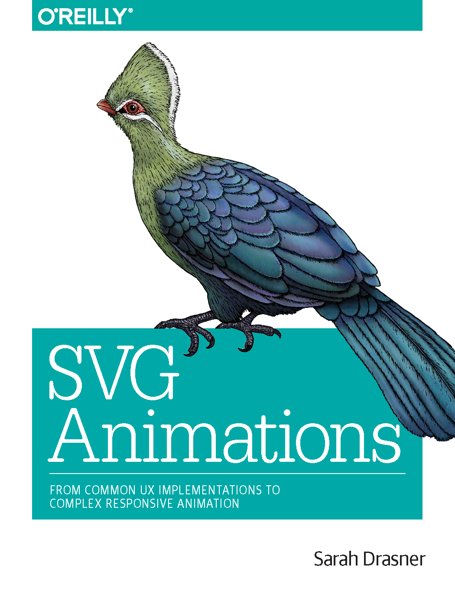

# SVG 动画

SVG动画的英文原著是@Sarah Drasner的大作，原著书名《SVG Animations》。中文由电子工业出版社委托社区同学：@大漠、@姜天意、@张耀春、@欧阳湘粤和@田淮仁 翻译。

目前完成初稿，正在较稿和审稿当中。

> **特别声明，由于我们水平有限，如果翻译不对之处还请各路大婶拍正。如果您英文阅读无障碍，更建议您直接购买英文版本阅读！**

## 大纲

- [前言](docs/preface.md)
- [第1章：剖析SVG](docs/Ch1.md)
- [第2章：使用CSS制作SVG动画](docs/Ch2.md)
- [第3章：CSS动画和手绘制SVG Sprites](docs/Ch3.md)
- [第4章：创建响应式SVG Sprites](docs/Ch4.md)
- [第5章：不使用任何额外库来创建UI/UX动画](docs/Ch5.md)
- [第6章：动态数据可视化](docs/Ch6.md)
- [第7章：Web动画技术比拼](docs/Ch7.md)
- [第8章：用GreenSock做动画](docs/Ch8.md)
- [第9章：GreenSock的Timeline库](docs/Ch9.md)
- [第10章：MorphSVG和路径动画](docs/Ch10.md)
- [第11章：交错效果、Tweening HSL和SplitText的文本动画](docs/Ch11.md)
- [第12章：DrawSVG和Draggable](docs/Ch12.md)
- [第13章：Mo.js](docs/Ch13.md)
- [第14章：React-Motion](docs/Ch14.md)
- [第15章：动“不可动者”：通过改变属性并使用原生JavaScript实现动画](docs/Ch15.md)
- [第16章：待...](docs/Ch16.md)
- [第17章：组件库的设计、原型化和动画原理](docs/Ch17.md)

> **特别声明：如果未得到授权，严禁转载本仓库下的任何内容，包括代码和图片！如有造成侵权，出版方有权追究相关的法律责任！**