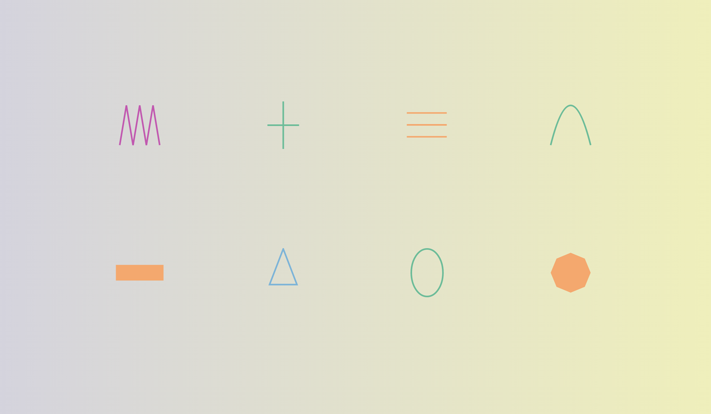
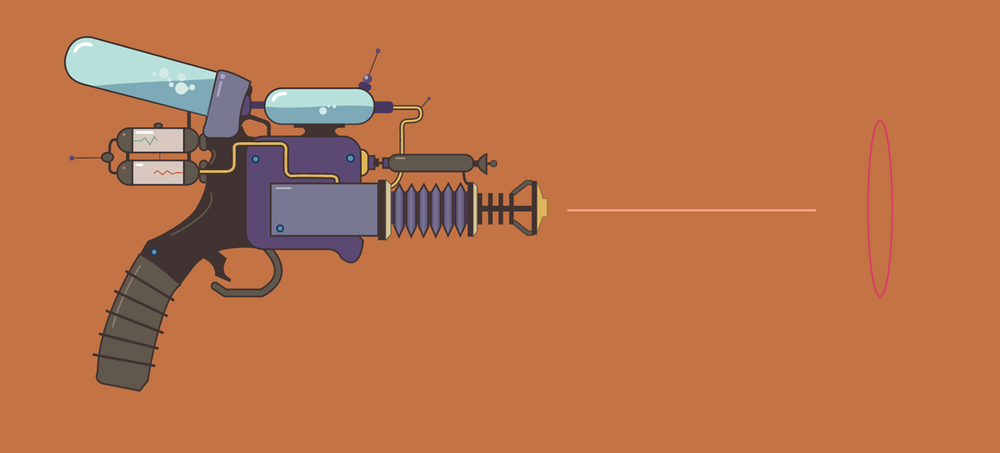
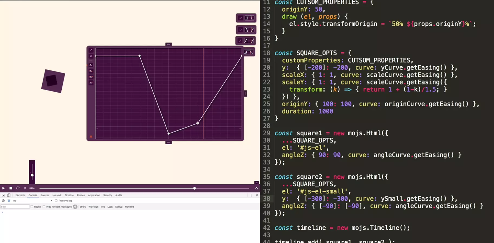
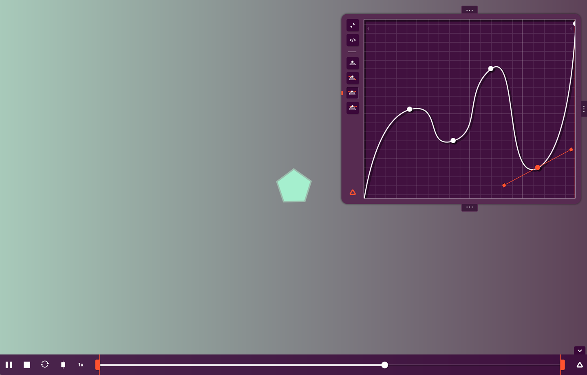

## 第13章：Mo.js

[mo.js](http://mojs.io/) 是一个专注动效的 JavaScript 库（截至目前github中已经累计有 11529 个star了），它提供以声明式语法来完成元素的动画和动效。虽然 mo.js 仍然还处于测试版本，但是已经展现了很多惊人的功能了，这个库的作者是来自微软的 Oleg Solomka （网名是 LegoMushroom...乐高蘑菇），你可以找到很多由他所创造的令人影响深刻的案例以及有关mo.js的的教程。在本章我们将对mo.js功能做一个快速的预览，教导你快速上手mo.js。

## mo.js基础介绍

mo.js 主要提供了两种方式来让某些DOM结点运动。你可以用mo做一些其他库同样能做的事，例如获取DOM或SVG结点元素并移动他们。 或者你也可以创造一个特殊的mo.js所构造的对象。这种对象可以提供一些mo.js独家所提供的功能。 例如 自定义时间函数和时间线控制。 自定义path 时间函数和时间线控制对象是令人印象深刻的动画工具，可以让你在工作中的更简单的适应mo.js。

## 图形

你所制造动画所基础就是图形，mo.js通过这些图形和其他对象来简化使用者的工作。 mo.js 提供的声明式语法能够让使用者随心，简单地创造一些图形出来。

图 13-1 以及所对应的基础语法讲解[实例](https://codepen.io/sdras/pen/ae5359df933edcc8009bd407990a25fd)。

*图 13-1 一个简单但是富含很多细节的图形，作者还对其细心地进行了绝对居中。*

如下是这个例子所对应的代码：

	var shape = new mojs.Shape({
		shape: 'circle', // 默认的图形就是圆形
		radius: 50,
		fill: '#A8CABA', // 默认颜色是粉色
		stroke: '#5D4157',
		strokeWidth: 3,
		isShowStart: true, // 任何动画运行前都这个图形都是展现的
	});

这里有一些你需要了解的基本知识：

- 你可以创造的图形包括圆(`circle`)、矩形(`rect`)、加号(`cross`)、等号(`equal`)、折线(`zigzag`)以及多边形(`polygon`) （默认是圆形）
- 你可以定义图形填充色、描边色、和描边边宽。（默认的结果是只填充粉色不而描边。 等于号和加号是没有空间填充颜色，所以你必须为他们设置描边和描边边宽，否则即使声明了它们我们也是看不到的）
- 你可以通过设置`radius`来图形的宽高（宽高相同），如果你需要的图形宽高不同，那么可以使用 `radiusX` 来调整宽，`radiusY` 来调整高
- 你需要明白，如果你只是需要展现一个图形，而不准备对该图形做动画，那么如果需要让这个图形能够看得见的话，就必须设置 `isShowStart: true`（默认值为`false`）。 
- 对于`polygon`, `zigzag` 和 `equal` 我们可以设置 `Points` 属性， 即图形点的个数， 根据设置不同的Points 我们可以创造出多种不同的图形。
- 除非你对图形设置特殊的`top`, `left`等值，否则所有的图形在都默认为绝对定位并且相对于屏幕居中

图 13-2 为上文所述的效果 和 [对应的例子](http://codepen.io/sdras/pen/dd1337e17a9706c1e50d1940a1643d54?editors=0010)

*图 13-2： 一些你可以用mo.js 创造的图形。*

下文是左上角折线图形所对应的代码

	const zigzag = new mojs.Shape({
		shape: 'zigzag',
		points: 7,
		radius: 25,
		radiusY: 50,
		top: pos.row1,
		left: pos.col1,
		fill: 'none',
		stroke: color1,
		isShowStart: true,
	});

你也可以传递一个已存在的父元素 例如 `parent: '#id-to-be-placedunder'`, 当然你也直接传递一个任意的 DOM 元素。有些时候你也可以选择使用`div`或者 SVG, 如果你能把图形放置在`viewBox`内 那么在创建移动端响应式的场景中创作伸缩动画将会变得更容易。

你也可以按照下文提供的方式，自己自定义一个图形添加到`shape`对象中，来做动画：

	// custom shape
	class OneNote extends mojs.CustomShape {
		getShape () { return '<path d="M18.709
		...
		"/>';
		}
	}
	mojs.addShape( 'oneNote', OneNote );
	const note1 = new mojs.ShapeSwirl({
		shape: 'oneNote',
		...
	});

## 图形运动

你可以使用mo.js创造图形，并且赋予图形动画。 怎么赋予动画呢？通过传递一个对象，类比tween 的`from` 和 `to`：`{fromvalue: tovalue}`。值得注意的是，在ES5中是无法对一个对象的`key`设置变量的。这看起来像`options={scale:{}}；options.scale[frome]=to`。在ES6中，这更容易，因为当你声明对象时，你可以使用变量来实现关键值。

我们还可以声明一下形变属性，例如`scale`（形变）, `angle`(旋转，类比 CSS的`rotate`属性) ，以及`opacity`(透明度)，和 `fill`。 对于`fill`属性，我们也可以插入一个`color`， 例如图13-3这样：

	scale: { 0 : 1.5 },
	angle: { 0 : 180 },
	fill: { '#721e5f' : '#a5efce' },

*图13-3：上文对应的图形过度动画，不同属性，从一种状态一起运动另一种状态.*

除此之外，对于`option`对象我们还可以定义几个参数：

- 动画时长 (`duration`)
- 动画时延 (`delay`)
- 是否重复播放 (`repeat`)
- 动画播放速度 (`speed`)：默认是`1`，类比`TimeScale` 设置`0.5` 动画速度减半，`1.5` 则 动画速度加倍
- 是否来回播放 (`isYoyo`)：  布尔值 是否让动画像`yoyo`球一样，状态来回运动 默认为`false`
- 缓动函数：在某个属性对象中设置，设置单个属性运动的节奏
- 返回播放时候的时间函数（`backwardEasing`）：当我们设置了 `isyoyo： true;` 的前提下，我们就可以设置个属性，这个属性作用于返回播放时候的时间函数（从`1` 回到 `0`），因为有些时候，返回播放的节奏和正常播放的节奏不同，所以我们就可以通过这个值单独设置（如果没有设置，则默认值同`easeing`）
- 是否淡出 (`isSoftHide`)： 布尔值 默认为`true`， 即每次隐藏图形的时候都通过改变`scale: 0` 进行淡出，如果为`false`则直接`display: none;`

> #### 使用mo提供的随机数生成器
> 
> 我们用其他的js库的时候可能有时候需要写一个用来生成随机数值的辅助函数，或者用一点点代码来实现随机数的向上或向下取整（具体详情可见123页的注释部分）。
> 
> 而mo.js 则帮我们将随机数的生成完美地抽象出来了，我们可以通过传递一个字符串来产生一个随机数： `'rand(min, max);'` 举个例子： `angle: 'rand(0, 360)'` （产生一个`0`，`360`范围内的随机角度）

### 链式调用

如果你喜欢写动画的时候采用链式调用的方式，我们可以在初始的定义动画中使用 Promise/A 规范的 .then() 语法来链式的声明动画， 例如[这样](https://codepen.io/sdras/pen/6774e07346aed8977e87f09aa282c982)：

	const polygon = new mojs.Shape({
		shape: 'polygon',
		points: 5,
		stroke: '#A8CABA',
		scale: { 0 : 1.5 },
		angle: { 0 : 180 },
		fill: { '#721e5f' : '#a5efce' },
		radius: 25,
		duration: 1200,
		easing: 'sin.out'
	}).then ({
		stroke: '#000',
		angle: [-360],
		scale: 0,
		easing: 'sin.in'
	});

### 旋转动画（Swirls）

mo.js 提供了例如 `ShapeSwirl` 和 `Burst` 这样有趣的功能。 它们都能够在SVG上绘出优雅的动画。 一个`ShapeSwirl` 等同于一个常规的图形对象，但是，`ShapeSwirl`的所产生的图形的运动节奏就和所叫的名字一样--图形是以旋转的轨迹运行的。 对于旋转动画，mo提供了多个参数供我们配置， 他们都是用于配置 `Swirls` 所依赖的正弦函数的：

- 旋转的振幅（`swirlSize`）：水平方向上，图形旋转运动的轨迹振幅（即设置正弦函数的偏移量或振幅）
- 旋转的频率（`swirlFrequency`）：旋转运动的快慢程度（即正弦函数的频率）
- 路径缩放（`pathScale`）：(即正弦函数Y轴方向上缩放)
- 角度偏移量（`degreeShift`）：即设置旋转动画的轨迹方向，默认竖直向上为`0`，顺时针方向旋转，设置区间为 `[0, 360]`（和`Burst`动画一起用效果更佳）
- 正弦函数方向： 调整旋转动画运动轨迹方向，由右到左还是由左到右（即正弦曲线波峰，先上后下还是先下后上）参数只能设置 `-1` 或 `1` （默认为`1`）
- 是否使用旋转动画（`isSwirl`）： 布尔值，默认为`true`，设置为`false`后，则取消旋转动画

上面的内容确实有点难以读懂和理解，所以我弄了个[Demo](http://codepen.io/sdras/full/mrZWqg/)来帮助同学们手动调整这些参数，来更好的明白这些参数的含义，（注: Demo中需要进行鼠标点击才会出效果）。 图13-4 是Demo动画的截图

*图 13-4：一个可以控制参数Demo，通过这个Demo便于我们理解 mo.js 的`ShapeSwirl` 的工作原理。*

同时，对于一些常规的配置或自定义的图形对象，我们可以统一抽象出来，和`ShapeSwirls` 所需要特殊声明的参数对象进行分离。 然后通过ES6为我们所提供的对象解构运算符来进行合并，这样统一抽象出来的常规配置项就可以进行复用。像图13-5的[示例一样](https://codepen.io/sdras/pen/OReWOw)：

	const note_opts_two = {
		shape: 'twoNote',
		scale: { 5 : 20 },
		y: { 20: -10 },
		duration: 3000,
		easing: 'sin.out'
	};
	const note1 = new mojs.ShapeSwirl({
		...note_opts_two,  // 如果不懂Es6对象解构语法的同学可以参考 [http://es6.ruanyifeng.com/#docs/object] 中对象的扩展运算符一章
		fill: { 'cyan' : color2 },
		swirlSize: 15,
		swirlFrequency: 20
		}).then({
		opacity: 0,
		duration: 200,
		easing: 'sin.in'
	});

*图13-5：上文所提到的一个使用了`ShapeSwirl`特性的 Demo 效果。*

### 爆炸式的效果

一个爆炸式的效果，真的会让人觉得眼前一亮，很可爱。 下面是一个声明一个默认配置爆炸式对象的例子：

	const burst = new mojs.Burst().play();

关于一个爆炸式的效果，你有下文这些选项可以进行配置，我这里稍微做了些配置，写了一个[例子]([)http://codepen.io/sdras/pen/kkqNYK)（例子需要点击触发） 如图 13-6：

- 数量（`count`）：即爆炸出来的子元素的数量
- 角度 (`degree`)：即子元素散开的角度，默认是向`360`度散开的，例如如果设置`45`，那么所有的子元素就以圆心角45度区域散开。
- 子元素运动的区间（`radius`）：语法是 `radius: {起始距离: 终点距离}`，如果起始距离为零则从圆心点出发
- 是否渐进隐藏：布尔值，决定是否使用`scale: {1: 0}`来隐藏子元素们，默认为`true`， 如果设置为`false`，则以`display：none;` 直接隐藏。 这个属性适用于所有种类的图形，但是我再次提及它是因为，这个属性，对于爆炸式动画中的某些子元素非常有用

*图13-6：你可以在`Burst`中定制大小，颜色，事件，甚至是自定义形状。*

所有对于 Shape 图形的参数设置，都可以适用于 Burst 动画对象， 我们也可以对爆发出来的子元素单独设置形状，例如下文例子：

	const burst = new mojs.Burst({
		radius: { 0: 100 },
		count: 12,
		children: {
		shape: 'polygon',
		...
		}
	});

### 时间线控制工具

通过时间线工具，你可以以声明式的方式通过 `.add` 方法来绑定配置对象或者`tweens`对象，这样就允许动画按照`.add`的顺序依次执行， 你还可以使用 `.append` 方法吧 `tweens` 对象运行顺序的最末尾（类比栈 `.push`方法）。下面是一个有关 `Timeline` 的例子：

	const timeline = new mojs.Timeline({
		.add( tween )
		.append( tween )
	});

`.add` 允许你添加一个任何动画对象或者Shapes图形对象进入时间控制线中。 这些动画对象虽然会立即按顺序执行，但是你也可以对它们设置 `delays` 或者 `stagger` 来调整它们的运行时间。 `.append` 方法和`.add`方法一样，但是顺序上会错开`.add`方法添加的顺序（排在末尾）。

你能够对`Timeline`配置的参数很少，而且往往这些参数配置后都没有什么价值，和上文配置方法类似，以对象的形式传递这些参数： `repeat`, `delay` 和 `speed`， 下面是一个配置的例子：

	new mojs.Timeline({
		repeat: 3,
		isYoyo: true
	});

`Timeline` 除了可以传递`Tween`对象外，还能够无限制的嵌套多层子`Timeline`：

	const subTimeline = new mojs.Timeline();
	const master = new mojs.Timeline()
	.add( subTimeline );

### 间补动画

虽然我们在上文已经介绍了很多mo所提供的动画构造函数了，但是对于在上文已经出现的我们却没有详细的讨论过关于间补动画的相关知识。  Tween 即是间补动画，它的主要作用是允许我们能够在一个设定的时间段内，不断更新图形运动细节，从而产生从一个状态到另外一个状态以动画形式进行过渡。 相对于对于 Shape 对象中很多参数（`duration`， `repeat`, `easing` 等）都能直接在Tweens中使用。 这里有一个关于间补动画的一个简单例子:

	var thingtoselect = document.querySelector('#thingtoselect');
	new mojs.Tween({
		duration: 2000,
		onUpdate: function (progress) { // progress 返回的是 [0,1] 的小数值
			square.style.transform = 'translateY(' + 200*progress + 'px)';
		}
	}).play();

上面的代码能使一个元素，从左边到右边运动`200px`。 

在复杂的[Demo](http://codepen.io/sdras/pen/JRQXGz)（镭射枪动画） 就是依靠这个原理实现的左边两段镭射光线加载的动画。 如图13-7，这里我使用了`<path>`产生的[时间函数来改变动画的运动节奏](https://css-tricks.com/svg-line-animation-works/)。 关于如何使用`<path>`产生时间函数，我们会在下一章讨论。同时，关于镭射枪的液体动画，我也同样是使用上文所述的原理，来不断刷新水波`<path>`的`d`属性，来产生水波运动的效果的。

*图 13-7：使用 mo.js 的 旋转动画对象（Swirls） 和 路径时间函数(Path easing) 实现的镭射枪动画。*

让我们来看看上文所提到的两段镭射光线加载的代码：

	// 截取镭射枪动画的部分代码
	const sideL1 = document.querySelector('#sideL1'),
		sideL2 = document.querySelector('#sideL2'),
		allSideL = [sideL1, sideL2];
	const laser1E = mojs.easing.path('M0,400S58,111.1,80.5,175.1s43,286.4,63,110.4,46.3-214.8,70.8-71.8S264.5,369,285,225.5s16.6-209.7,35.1-118.2S349.5,258.5,357,210,400,0,400,0');

	new mojs.Tween({
		repeat: 999,
		duration: 2000,
		isYoyo: true,
		isShowEnd: false,
		onUpdate: function (progress) {
			var laser1EProgress = laser1E(progress);
			for (var i = 0; i < allSideL.length; i++) {
				allSideL[i].style.strokeDashoffset = 20*laser1EProgress + '%';
				allSideL[i].style.opacity = Math.abs(0.8*laser1EProgress);
			}
		}
	}).play();

补间动画提供了很多的回调函数，列如 监听动画开始和反复开始的回调函数(`onStart` 和 `onRepeatStart`) 、 完成和反复完成的回调函数（`onComplete` 和 `onRepeatComplete`）、回放开始和回放暂停（`onPlaybackStart` 和 `onPlaybackPause`）等等， 我们可以针对动画的不同角度来对动画细节上进行微调。 如果你想知道更多的回调函数，可以参考关于[mo.js Tween对象文档](https://github.com/legomushroom/mojs/blob/master/api/tweens/tween.md)。

### 路径时间函数

这是mo.js 所提供的一个非常酷的[功能](https://github.com/legomushroom/mojs/blob/master/api/easing/base-functions.md)，它可以允许你通过输入一段SVG `path`绘制的数学曲线图，将曲线图转换为对应的时间函数（类比[Css3 cubic-bezier](http://cubic-bezier.com/)）。 这章里很多例子中我都用到了这个功能，但是实话讲， 我永远的没法像 [LegoMushroom (mo.js的作者) 那样写出那样华丽优雅的教程](http://mojs.io/tutorials/easing/path-easing/) （注: 教程中用得到了可视化图表的形式，很直观的讲述细节）我在这里就简单的解释一些基础并演示一下这个功能是怎么用的，方便你入门。 但是我强烈建议你去看看他所写的[教程博文](http://mojs.io/tutorials/easing/path-easing/)。

在我们学习所有的路径时间函数之前，我们很有必要先夯实一下时间函数最基础的使用方式，我们可以在构造函数的参数中这样声明一个时间函数：

	easing: 'cubic.in'

为什么我们要学习时间函数？其中最主要关键原因就是时间函数是能够为你的动画增添活力， 它允许通过自定义路径的形式，灵活调整你的运动动画节奏。 如果你用CSS动画用的很舒服，那么你应该也会喜欢上mo.js的贝塞尔时间函数，贝塞尔时间函数和[Css3 cubic-bezier](http://cubic-bezier.com/)所接受的贝塞尔函数是一样（但mo.js却没有CSS3 cubic-bezier那样存在某些限制）。这里有一个关于贝塞尔时间函数的使用例子：

	easing: 'bezier( 0.910, 0.000, 0.110, 1.005 )'

如果你想对时间函数进行更精确的控制， 使用SVG path 时间函数是一个非常不错的选择，你可以传递一个 SVG path对象， 然后，mo就会根据你传的`path`转换为时间函数，你所运动的图形的节奏就会跟着这个时间函数的输出的百分比走。让我们回顾一下上文我截取的镭射枪那个Demo中的代码。 我就是使用了`path` 时间函数对 `onUpdate`输出的百分比值进行了处理:

	const sideL1 = document.querySelector('#sideL1'),
		sideL2 = document.querySelector('#sideL2'),
		allSideL = [sideL1, sideL2];
	const laser1E = mojs.easing.path('M0,400S58,111.1,80.5,175.1s43,286.4,63,110.4,46.3-214.8,70.8-71.8S264.5,369,285,225.5s16.6-209.7,35.1-118.2S349.5,258.5,357,210,400,0,400,0');
	// 定义输出的path图形

	new mojs.Tween({
		repeat:   999,
		duration: 2000,
		isYoyo: true, // yoyo反复动画
		isShowEnd: false,
		onUpdate: function (progress) {
			var laser1EProgress = laser1E(progress); // 将正常的[0,1]输入时间函数，从而改变动画运动节奏
			for (var i = 0; i < allSideL.length; i++) {
				// 使用产出的百分比值，不断使用刷新状态，从而改变 strokeDashoffset
				// 产生线条从有到无再到有的效果
				allSideL[i].style.strokeDashoffset = 20*laser1EProgress + '%';
				
				// 同时改变线条的透明度，增强效果
				allSideL[i].style.opacity = Math.abs(0.8*laser1EProgress);
			}
		}
	}).play();

我们可以通过下一章我们要介绍的 mo.js 所提供的曲线编辑工具来切身感受 `path` 时间函数所关于运动行为上产生的效果。你可以查看下一章中我提供一些例子。 曲线编辑工具能够可视化且直观展现我们所创造的时间函数，这样能够让我们更加精确的调整所创造的时间函数。

## mo.js 所提供的辅助工具

mo.js 所提供的功能中，最令人印象深刻的就是它所提供的辅助工具了。 为了引起你的兴趣，这里有一个挂在Vimeo 网站上使用[示范](https://vimeo.com/_waiting_room)， 见 图 13-8

*图13-8：Vimeo 上所演示的：使用mo.js的工作流程。*

我弄了一个可以快速上手的Demo来展示 mo.js所提供的 动画播放器 和 曲线编辑器, 如图13-9，左边那个是曲线编辑工具而藏在下面，有个播放小按钮的则是动画播放器。 同学们可以选择把[Demo fork下来玩弄或者在线尝试](http://codepen.io/sdras/pen/b8435b5d31bc780920153a7a1356bec9/)学习动画最重要的就是要乐于尝试。 

*图13-9：这是一个入门的Demo，可以很容易地用它使用mo.js工具。*

而现在有一个最酷的事儿： LegoMushroom 需要帮手啦。 他正在对现有的 timeline 工具做扩展组件，LegoMushroom已经在[GitHub上提供了UE图](https://github.com/legomushroom/mojs-timeline-editor/issues/3) 如果你有兴趣贡献开源项目的话 现在就有一个能让你深挖mo.js 技术并帮助 LegoMushroom 实现一个有用的辅助工具 -- 只要点击左边的 我想帮助 （"help wanted"）！

下面是已经完成，可用的赋值工具的项目地址：

- [动画播放器](https://github.com/legomushroom/mojs-player)
- [曲线编辑器](https://github.com/legomushroom/mojs-curve-editor)

如果你对mo.js抱有强烈的兴趣想去贡献代码和深挖学习，你也可以加入这个[社区](https://hamsterpad.com/chat/mojs)。

如果你是个不太喜欢阅读而是喜欢上手操控Demo的人，这里提供了这章提到的所有的[Demo 列表](http://codepen.io/collection/XOEKow/)。

关于mo.js 的知识，本章自然不可能涵盖全部，我只是介绍了一些我认为mo.js所提供的最有用的功能，但是如果想更深，更进一步的学习mo.js，可以参考[mo.js的官网](http://mojs.io/)和[mo.js的文档](https://github.com/legomushroom/mojs/blob/master/api/readme.md)。