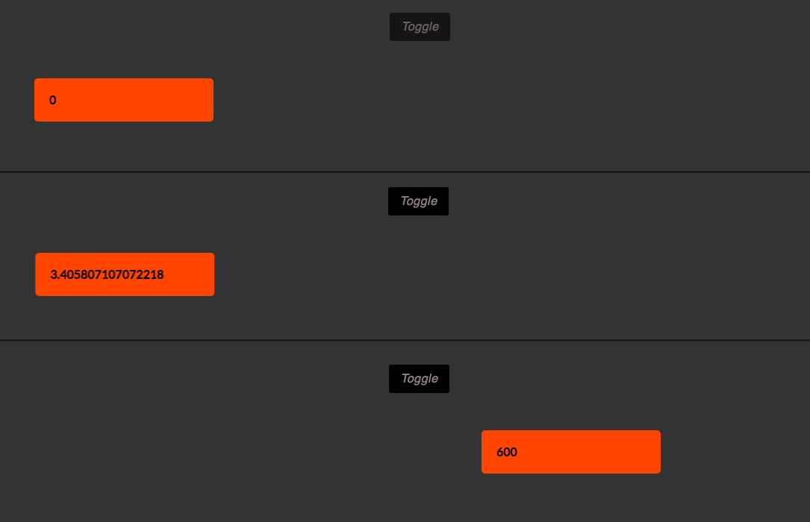
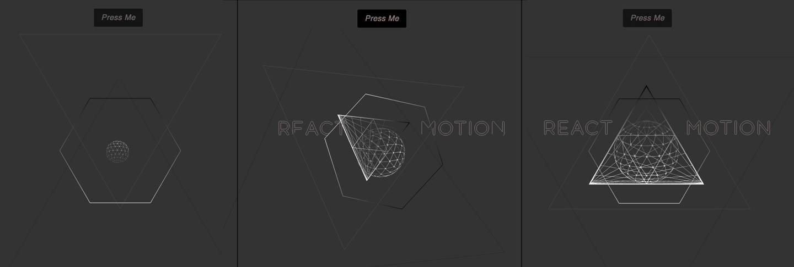

# 第14章： React-Motion

在 React 中，有很多的方法做 SVG 动画，并且我们已经介绍过的任一一种技术都需要更改才能用在 React 环境中。但是 [React-Motion](https://github.com/chenglou/react-motion)有很多漂亮的特性，让它如此出色，值得我们花一章的时间来研究这些特性。

在第七章提到过，React-Motion 和基于序列的技术比如 CSS 或者 GreenSock 的 timeline 有所不同。在序列技术中，我们并没有真正的使用时间来控制我们的插值。

想基于游戏的物理运动中，我们通过 React-Motion 给元素 `mass` 和 `spring` 参数，然后让他们运动。这样，我们可以得到一个类似现实的阻碍运动（我一会会解释一下），并且可以在 UI 里面，创建非常美的动画。

React-Motion 暴露 3 个主要的组件：`<Motion />`，`<StaggeredMotion/>`，`<TransitionMotion/>`。

但是，完整的暴露列表如下：

- spring
- Motion
- StaggeredMotion
- TransitionMotion 
- presets

我们在本章中主要研究下 `<Motion />` 和 `<StaggeredMotion />`，不过，在[该项目](https://github.com/chenglou/react-motion)的 `README` 中有更详细的信息。

> #### 加快速度
> 
> 如果你不熟悉 React 或者 ES6 的话，本章可能对你来说有点吃力。我的建议是，先去了解一下他们本身的工作原理（这超出了本书的范围），然后在回到这来学习一下 React-Motion 动画库。你不能脱离 React 去使用 React-Motion，所以，先理解基本内容比往下继续更重要。

## `< Motion />`

我们将以 React-Motion 提供的 `<Motino />` 组件开始讲解。

在这些例子中，我们将随着时间，使用通过 `styles` 传入的整数去改变某些事物的外观。事实上，你可以改变任何两个值，路径中的参数或者颜色值。只是最常见的是使用 `style` 模式。当然，浏览器也擅长于在不触发很多重绘的情况，改变一些 `style` 的属性值，就像我们在第二章说过的。所以，我们将利用该特点。

在直接看 Demo 代码之前，让我们一步一步的分解具体实施的过程。在该[例子](https://codepen.io/sdras/pen/9a1a04eb12c3423e713d41fd071df75e)中，我们将更新一下整数，接着你可以看到哪些发生变化（图 14-1）。

Figure 14-1. Interpolating a number as well as a transform

*图14-1： 插入一个数字和一个变化。*

首先，我们初始状态是一个简单的布尔值：

    getInitialState() {
        return {open: false};
    },

然后，通过按钮上触发 `click` 或者 `touch` 来更改状态：

    handleMouseDown() {
        this.setState({open: !this.state.open});
    },
    handleTouchStart(e) {
        e.preventDefault();
        this.handleMouseDown();
    },

在 `render` 函数中，我们定义了一个 `button`，它会调用我们刚刚定义的方法去改变状态：

    <button
        onMouseDown={this.handleMouseDown}
        onTouchStart={this.handleTouchStart}>
        Toggle
    </button>

然后，我们将通过 React-Motion 使用 `<Motion />` 组件，同时更新 div 上的整数和变形样式。注意，任何时候你使用一个库比如 `GSAP`，你其实通过 JavaScript 来设置内联样式。这并不难，即使他们以另外一种方式写：

    <Motion style={{x: spring(this.state.open ? 600 : 0)}}>
        {
            ({x}) =>
                
{x}

        } 
    </Motion>

我已经将语法代码放在不同的行中，这样你可以更清楚的了解。我们将创建一个样式对象，它以 `x` 作为键（你可以使用任何内容）并且通过状态的 `open` 属性为 `true` 或者 `false` 的三元操作符来进行赋值。

接着，我们向下传递 `x` 的值，并且能够将它作为一个变量去存储任何我们期望的插值。当在设置样式时，我们使用 ES 模板字面量来增加其可读性。注意，这不像 GreenSock，我们需要手动去处理前缀。你需要手动的将你需要的前缀写进去，比如对于变形属性的 `WebKit` 前缀。

我也已经将 `x` 变量防止在 `div {x}` 中，所以在 `div` 通过样式移动过程中，你可以看到该数字的更新。

> #### 颜色和 React-Motion 插值
> 
> 与一些基本样式，比如位置属性，SVG 路径数值，透明度等不同的是，某些属性不能接受纯数字作为值。颜色属性就是典型的例子。你需要使用十六进制或者 `RGBA` 的值。（比如，这并没有与 `rbga(33.2428797, 47, 52, 1)` 对应的颜色。）不过，这有很多解决办法。你既可以在数字后面加上 `%`，也可以通过 `Math.floor()/Math.round()` 来实现。你同样可以使用 `hsla()`，它代表了一个完整的色相旋转，而且当你超过 `360°`或者 `s`，`l` 的百分数的范围时，它不会失败。十进制在将来也会用在颜色组件中，因为 Web 页面的颜色范围已经超出 `sRGB` 到 DCI-P3 和其他更宽泛的色域中。

现在，基础内容已经讲完了，我们开始正式做一下 [SVG 动画](http://codepen.io/sdras/pen/ZWeJem)！

*图14-2：当你切换的时候，SVG 向里旋转，文字显现。*

这里有实际运行例子的精简版代码，这样，你可以更清楚的看到它实际的运行：

    <Motion style={{
        // 通过三元操作符，给定所有插值中不同的值
        ...
        dash: spring(this.state.compact ? 0 : 200),
        rotate: spring(this.state.compact ? 0 : 180),
        ...
        }}>   
        {/* 保证值能够向下传递 */} {({dash, rotate, ...}) =>
            <svg viewBox="0 0 803.9 738.1" aria-labelledby="title">
                <title>React-Motion</title>
                <g>
                    <path style={{ WebkitTransform: `scale(${scale}) rotate(${rotate}deg)`, transform: `scale(${scale}) rotate(${rotate}deg)` }} className="polygon cls-2" d="M529.8,359.7l-25.1-43.5-25.4-43.9-25.7-44.4L428,183.3..." />
                </g>
                ...
                <g style={{ strokeDashoffset: `${dash}` }}
                    className="react-letters"
                    data-name="react motion letters">
                    <path className="cls-5" d="M178.4,247a2.2,2.2,0,1,1-3.5,
                        2.6l-6.5-8.7h-8.6v7.4a2.2,2.2,0,0,1-4.4,0V220.1a2.2,2.2,
                        0,0,1,2.2-2.2h10.8a11.5,11.5,0,0,1,4.8,22Zm-18.6-10.3h8.6a7.3,
                        7.3,0,0,0,0-14.7h-8.6v14.7Z" transform="translate(3.1 1.5)" />
                    ...
                </g> 
            </svg>
        } 
    </Motion>

在这里，我们使用完全一样漏记，通过一个切换事件来改变状态值（该时间主要参考键 `compact` 或者 `this.state.compact`）。你可以看见我们如何在 `<Motion />` 组件中更改不同样式的属性值，实际通过传入一系列不同的值。比如，我们在第 6 章和第 12 章中介绍的手段一样，对于 `stroke-dashoffset`，我们将使 `dashoffset` 和图形的长度值一样，在该例中，就是 `200`：

    dash: spring(this.state.compact ? 0 : 200)

`rotate` 将会在 `180°`之间交替：

    rotate: spring(this.state.compact ? 0 : 180)

现在我们可以利用 `spring` 的方式去设计状态样式的改变。我们可以，像之间例子描述的，将它用于任意路径，甚至是分组。我们通过 JSX 直接将 SVG 内联在代码中。在 15 版本里面，所有的 SVG 属性都已经被支持，主要参考 [zpao 的 PR（Pull Request）](https://github.com/facebook/react/pull/6243)，我非常感谢他做的工作。不过，唯一的例外是我们已经将该部分多次重复使用的 `gradient` 直接嵌套在 HTML 中，因为这样可以直接提高渲染速度和性能（因为我们没有使用 `React-createElement()` 来包裹每一个独立的标签）：

    <svg width="0" height="0" xmlns="http://www.w3.org/2000/svg"
            xmlns:xlink="http://www.w3.org/1999/xlink" viewBox="0 0
                            803.9 738.1">
        <defs>
            <linearGradient id="linear-gradient" x1="399.74" y1="370.41"
            x2="399.74" y2="134.33" gradientUnits="userSpaceOnUse">
            <stop offset="0" stop-color="#fff"/>
            <stop offset="1"/>
            </linearGradient>
            <linearGradient id="linear-gradient-2" x1="406.42"
            y1="415.63" x2="406.42" y2="166.91" xlink:href="#linear-gradient"/>
        </defs>
    </svg>

你也注意到了，我将包裹 `gradient` 的 SVG 容器高度和宽度设为 `0`。这样 `gradient` 就不会对任何的 DOM 进行渲染，不过，某些浏览器可能会在该处留下一定的空间。所以为了安全起见，我们得额外做点保障措施。我通过在 JSX 中的 SVG 元素的 `#linear-gradient`  ID来进行调用，以确保当我想调用的时候可以调用。

> #### 性能问题
> 
> 通过 JavaScript 来渲染 SVG 有点耗费性能。我推荐的是，如果 SVG 只有几 KB，那么这看起来问题不大。我推荐的是，如果体积很大的话，你应该在 JSX 中使用 `<use>` 标签进行复用。但是，`<use>` 标签会存在一些奇奇怪怪的动画问题，所以，最好的是使用 `<use>` 去复用一些静态的 Icons 或者图片。我个人的喜好是通过状态的改变来移动内联的 SVG，但是我也很高兴其它人也喜欢这样做。无论你想做什么，要记得实际测试，比如通过 JS 开发者工具中的 timeline 面板和实际效果。

**可中断动画**

在上面的例子中，你需要注意到一件事，可以在动画运行的过程中间，使其往回运动：这是可中断的。你可以回想一下，我们介绍的其它技术里，都是依赖时间的。但是，React-Motion 则和时间变量没啥关系。

> 通过持续时间和曲线参数化的动画 API 与连续的流体交互性基本相反
> - [@Andy Matuschak](https://twitter.com/andy_matuschak/status/566736015188963328)
 
该库的机制和上面提到的以游戏为基础的物理运动，让我们可以进行中断操作。在一个简单地切换中，这看起来挺简单的。但是如果你准备实现一个菜单的打开和关闭呢？当用户在菜单打开时，决定关了它，并且不能不等待关闭完成，这是又点击了菜单一下，这可能会出错。这虽然有点少见，不过值得注意。

那这以为这可终端的运动更好吗？一方面，是的。另一方面，不是。基于时间和可中断的动画都有各自的用处。

在其它我们已经尝试过的例子（比如，11 章中的[文字拆分](https://codepen.io/sdras/pen/RNWaMX)例子，“扭转它”）或者我的 [Pen](https://codepen.io/sdras/pen/dPqRmP) "当你是个内向的人"，这类流体动画并没有多大意义。在写一个基于时间和序列动画时，没有使用相关工具去调整具体的序列，这对你来说有点蠢，除了你不能在 React-Motion 中编写一个循环，而不写一个无限循环的事实（请不要这么做，除非你在写一个伤害小孩和小狗的网站--那么你一定得这么做）。其实，也不算蠢，就像将威士忌淋在冰淇淋上。

## `< StaggeredMotion />`

像我之前描述的步进动画而言，那效果可以总结为：“这有一组元素。我想通过更新一个属性，让他们在一定时间内发生变化。但是，我们想让他们一个接一个开始。” React-Motion 中`<StaggeredMotion />` 组件并不是完全按照这个方式运行。

我们已经学习了如果不去使用基于时间的序列。那应该怎样让这些事件连续触发呢？特别当运动是可中断的？具体的就是我们发送一些东西，然后根据第一个元素的位置，更新下一个兄弟节点的位置。本质上说，这在做无偿运动。

像这样，当你拖拽元素并且更新它的位置，其它元素并不是直接跟着它，而是以一种十分漂亮的方式陆续完成。如果你再结合弹跳特性（我们可以做），这效果可能会更好。具体例子可以参考图 14-3 和对应的[实际例子](https://codepen.io/sdras/pen/pyedJE)。

*图14-3：当你拖拽步进组件时，你可以感觉到这是一个可中断的运动，和它错位方式的差异。*

如果你只能了解本书中唯一一个例子，那么你应该看看这个例子。因为，它非常难以描述，除非你亲自看见它。接下来，我们看一下具体的代码。

在 `getInitialState()`，我们有一个圆形对象，在 `250` 的 `X` 轴（`pageX`），`300` 的 `Y` 轴上。这样做的一部分原因是为了让观看者能够直接看到级联的现象，当他们第一次浏览页面并且圆的位置不会再页面的左上角。我们还可以将 `rotate` 设为 `0`。

当组件加载完成，我们开始监听鼠标和触摸时间（对于桌面和手机端）。当触发时，调用不同的函数将圆的 `x`，`y` 坐标状态变为触发位置的中心：

    getInitialState() {
        return {x: 250, y: 300, rotate:0};
    },
        componentDidMount() {
        window.addEventListener('mousemove', this.handleMouseMove);
        window.addEventListener('touchmove', this.handleTouchMove);
    },
        // 我们将 state 和具体的位置绑定在一起
        handleMouseMove({pageX: x, pageY: y}) {
        this.setState({x, y});
        },
        handleTouchMove({touches}) {
        this.handleMouseMove(touches[0]);
    },

在下一个方法 `getStyles()` 中，我们根据前一个样式的位置来设置新的样式。注意，这并不是在 `render()` 方法里面做的，我们需要将原来的样式作为参数传递进去。

我们还将做一些我们没能在 `<Motion />` 组件中做的事（如果你想做，也可以做）：我们还指定了硬度和湿度。这可以改变 React-Motion 的弹性运动的效果，以及其兄弟节点逐个继承该运动。

    getStyles(prevStyles) {
        // 我们使用之前的样式去改变下一个元素的位置
        const endValue = prevStyles.map((_, i) => {
            let stiff = 200, damp = 15;
            return i === 0
                ? this.state :{
                    x: spring(prevStyles[i - 1].x, {stiffness: stiff, damping: damp}),
                    y: spring(prevStyles[i - 1].y, {stiffness: stiff, damping: damp}),
                    rotate: spring((i * 10), {stiffness: stiff, damping: damp})
                }; 
        });
        return endValue;
    },

React-Motion 提供了一个非常好的 [demo 页面](http://chenglou.github.io/react-motion/demos/demo5-spring-parameters-chooser/)，你可以用它来尝试所有的参数。

现在，在 `<StaggeredMotion />` 组件里，我们一开始使用的是我们在数组里面设置的默认值。它会在组件加载完成的时候（同时也会创建原始的级联），会更新指定的样式和状态值。然后，我们将 `x`，`y` 的值设为长宽的一般，这样可以保证触摸和鼠标点击事件能在屏幕内得到相应。我们也可以为了一些效果，通过在 `getStyles()` 方法里设置 `i*10`，来旋转整个圆：

    render() {
        let arr = [], amtHalf = 175;
        for (var i = 0; i < 50; i++) {
            arr.push({x: 0, y:0, rotate:0});
        }
        return (
            

                <StaggeredMotion
                    defaultStyles = {arr}
                    styles={this.getStyles}>
                    {lines =>
                    

                        {lines.map(({x, y, rotate}, i) =>
                        
 )}
                    
 }
                </StaggeredMotion>
            

        ); 
    },

该结果非常有趣，并且有非常灵活的交互动画。它可以根据用户的操作来改变方向。