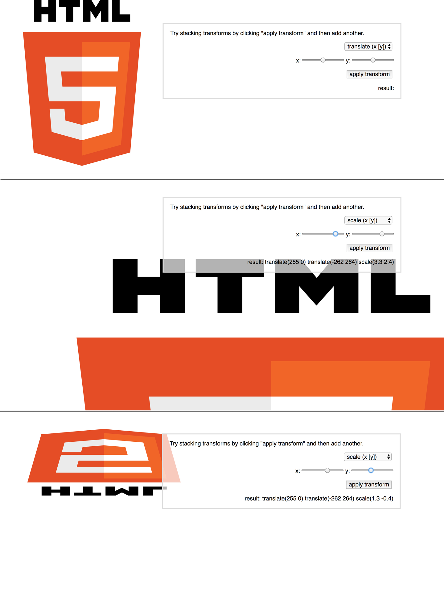
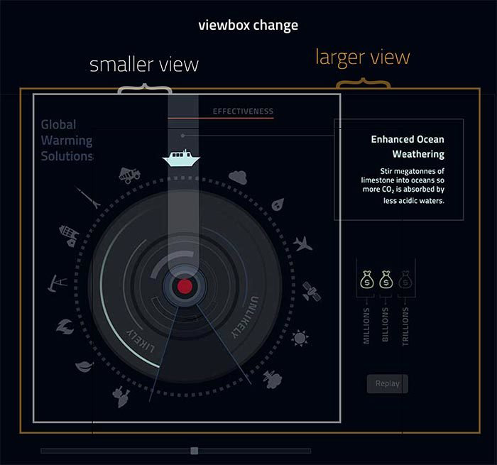
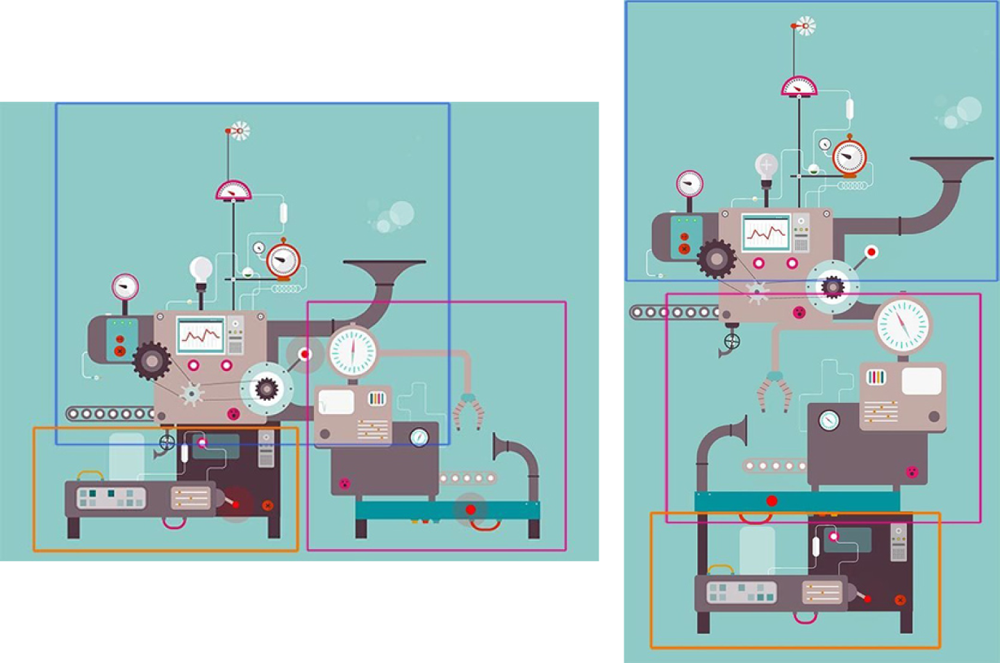

# 响应式动画

Web动画是非常微妙的，因为我们必须考虑带宽、代码兼容性和产品设计来调整我们的工作。本这一章中，将讨论如何创建响应式（可伸缩）动画的技术。我们还将介绍使用创建动画的不同方式来实现我们在众多设备中有一个较好的用户体验。

## 快速响应的Tips

至少我们应该在移动端上要确保创建的动画能发挥很好的作用，而且在移动设备上创建的互动能提供所有功有，这里可以使用像[ZingTouch](https://zingchart.github.io/zingtouch/)或[Hammer](http://hammerjs.github.io/)这样的库。使用滑动或手势检测来通过本机的交互检测。

Web响应式设计可以在`<meta>`标签上指定`initial-scale=1.0`，以便在调用操作之前，设备不需要等待默认的`300ms`。互动触摸事件必须从一个更大的触摸目标（`40x40`或更大）或者使用`@media(pointer:coarse)`。

## GreenSock和响应式SVG

使用GSAP的首要原因是对SVG Transform的跨浏览器支持。[SVG中的旋转非常麻烦](https://css-tricks.com/svg-animation-on-css-transforms/)。在几乎所有的浏览器中，`transform-origin`存在一定的问题，并且在IE中完全不受支持。当试图以一种响应式中使用Transform时，这个问题变得更为严重，那是因为任何`transform-origin`都会被异常的被夸大，而且难以覆盖。

GreenSock不仅纠正了这种行为，而且还支持IE9，它提供了很多的工具，使用响应式设计和开发变得特别的稳定。目前，使用原生的SVG元素渲染技术，SVG Transform不支持基于百分比的渲染。GSAP通过矩阵计算解决了这个问题。

首先应该先从SVG本身移除`width`和`height`的属性值，定义SVG的`viewBox`，然后使用CSS或JavaScript来控制SVG的`width`和`height`，这样一来可以轻松地使SVG适应任何终端设备的呈现。你还可以添加`preserveAspectRation="xMinYmin meet"`来确保所有`corre-sponding`维度都能适当地伸缩，因这是默认的，它不是必须的。如果你想获得更多的`viewBox`相关知识，可以阅读[Sara Soueidan整理的教程](http://www.sarasoueidan.com/demos/interactive-svg-coordinate-system/index.html)。

GSAp对于SVG还有另外三个优点，它们使Transform在SVG更好的使用。首先，除了`transform-origin`，GSAP现在已经内置了对`svgOrigin`的支持。这意味着你可以根据元素本身来选择是否要转换元素（在自己的轴上旋转）或在SVG的`viewBox`中使用坐标。使用`svgOrigin`，你将根据`viewBox`坐标声明值。换句话说，如果你的`viewBox`是`0 0 400 400`，并且你想围绕SVG的中心旋转，你将声明`svgOrigin: 200 200`。通常情况下你会发现`transition`和调整`transform-origin`已经足够了。在下图16-1，做了一个[月球旋转的动效](https://codepen.io/sdras/pen/doZReX)，它也是`viewBox`的一部分，因为我使用了一个`svgOrigin`来协调，让这个动画具备响应式效果。

    TweenMax.set(cow, {
        svgOrigin:"321.05, 323.3",
        rotation:50
    });

![images/svga_1601.png]

*图16-1：SVG动画是可以拖放的，并在SVG `viewBox`中或`svgOrigin`在一个点上进行旋转，因此在响应式设计中是完全是稳定的*

接下来继续讨论SVG中的另一个重要的特性，那就是关于SVG元素的`smoothOrigin`。通常情况下，`transform-origin`就可以改变元素的转换原点，那么这个动画就会变得复杂和违反直觉，如图16-2就是一个[响应式的案例](https://codepen.io/1Marc/full/DCvFm)。

*图16-2：这个案例学示了堆叠行为，解释了`transform`违反直觉的行为（此案例由@Marc Grabinski提供）*

正如@Carl Schooff录制的一个段[视频](https://www.youtube.com/watch?v=GsniGDilKtI)中解释的那样，GreenSock对`smoothOrigin`这个问题进行了修正。它确保了更改SVG元素的`transform-origin`，并随后再次移动它时，不会引起任何奇怪的跳动。

当处理一个更复杂的响应式动画时，这就解决了大量了反直觉以及一些令人不爽的行为。GSAP还让你在Edge中使用一行代码`CSSPlugin.defaultSmoothOrigin=false`就可以呈现原生的渲染效果。

在GSAP中，复杂的响应式动画的最后一个重要功能是让你能够在SVG元素基于百分比实现动画。CSS和SMIL对这种类型的行为还没有很好的支持。和BezierPlugin一样，GSAP为SVG的`transform`提供了向后兼容和跨浏览器的支持。图16-3就是一个GreenSock的动画效果：

    var playBtn = document.getElementById("play"),
            tl = new TimelineMax({repeat:1, yoyo:true, paused:true});
        tl.staggerTo(".box", 0.5, {x:"100%"}, 0.4)
        play.onclick = function() {
        tl.restart();
    }

![images/svga_1603.png]

*图16-3：GreenSock允许你对SVG元素进行基于百分比的变换，这是响应式动画开发的一个非常好的特性。*

## 不使用GreenSock实现响应式SVG

SVG元素基于百分比的变换令人印象深刻和非常有用。在响应式开发中，让我们允分利了Flexbox、百分比和允许我们扩展到`fit`容器。但是，当你移动到SVG时，更令人惊奇的是，你可能不需要它们。SVG的变换是在SVG画布上实现，但不是浏览器窗口定义的绝对像素整数。我们根据SVG DOM移动元素，而且元素并不是唯一可伸缩的东西。所以相应的变换和动画也是一样的。

不需要依赖任何媒体查询，就可以根据`x`轴和`y`轴移动元素，比如：

    tl.staggerFromTo($iPop, 0.3, {
        scale: 0,
        x: 0,
        y: 0
        }, 
    {
        scale: 1,
        x: 30,
        y: -30,
        ease: Back.easeOut
    }, 0.1, "start+=0.3")

图16-4就是对应[案例](https://codepen.io/sdras/full/jPLgQM)的演示效果。

![images/svga_1604.png]

*图16-4：当你点击按钮时，动画会改变大小，但动画效果会保持一致。*

请注意，我们这里没有使用基于百分比的变换。动画是建立在`viewBox`基础上的行为，因此，响应式开发变得像删除宽度和高度一样的简单。

仅仅“squish”一种动画以适应我们的视窗，而且效果很好，但是我们都知道真正的吶应式开发是一个更为复杂的过程。让我从开始到结束就使用工具来帮助我们进行一些响应式的开发。

有几种方法可以做到这一点。其中的一种方法就是使用大型SVG Sprite，并使用[媒体查询来处理`viewBox`](https://codepen.io/sdras/post/rethinking-information-presentation)。

## 通过更新viewBox实现响应式

还记得过去人们使用信息图片的时候吗？而信息图片因其受到转换的影响而变得越来越没有人喜欢用。在用户方面，可以快速易于理解信息。它们是五颜六色的，被创建时就能很清楚的向用户展示信息的比较。图形对公司知名度和品牌知名度的影响是[惊人](http://www.bitrebels.com/social/social-media-roi-infographics-2013/)的。Brain的[博客](http://blog.thewholebraingroup.com/return-on-infographics)有大量的这方面的数据：

- 网站流量增加了400%以上
- 增加了将近4500%可访问区
- 新网站访问者数量增加了近78%

但是所有这些帖子都有一个共同点，那就是它们至少都有两年以上。如果信息图表有这种潜在的性能，为什么它们看起来被认为是一个过时的潮流呢？

[手机可能是一个引爆点](https://www.lukew.com/ff/entry.asp?1939)。在桌面电脑上令人兴奋和无所不包的信息图表在移动端上成了一件费力不小的事情。随着移动端的增加，社交媒体的分享会带来挫折感，并降低这些图像的参与度。

另一个原因可能要简单一些。当一个概念不适应当前的文本，它就会消失。在Web上有更多的交互性和动态，静态图形与视觉上更令人兴奋的东西没有相同的可比性。动效胜过一切。

在设计和开发过程不应该考虑动画，因为这是一块硬骨头。如果我们把这个想法和传达大量信息的概念结合起来，就可以更新信息图表。在@David McCandless的书《Knowledge Is Beautiful (Harper Design)》中找到了一个信息图表的文本内容，并重新设计了外观，感觉和实现来创建一个带有动画的响应式信息图表。

图16-5就是对应的[示例效果](https://codepen.io/sdras/full/JdJgrB)。请记住，文本转换的进度是为了演示动画而不是内容。

*图16-5：使用`viewBox`实现用于移动端和桌面的信息图表。*

在设计方面，传统的信息图表通常使用的是一种沙龙（Salon）风格作为视觉上的加载方法。在这里，我们仍然填充了可用的图像区域，但是新的设计使其更干净。这里没有过多地使用元素，因为与传统的静态信息图表不同，在移动端有过多的元素会使用户迷失方向。而且也会令其加载更重，性能会受到一定的影响。

在响应式设计方面，整个演示过程都是流畅的，而是将信息图形一直放在一个断点，然后将元素移动到不同的位置。这样，SVG的主元素就可以在这个节点上流畅地响应了。尽管我们首先设计了PC桌面端，但是媒体查询的原则是移动端先行。我们使用SVG可以很容易的实现，通过JavaScript在移动端上调整`viewport`即可实现：

    var shape = document.getElementById("svg");
        // media query event handler
        if (matchMedia) {
            var mq = window.matchMedia("(min-width: 826px)");
            mq.addListener(WidthChange);
            WidthChange(mq);
        }
        // media query change
        function WidthChange(mq) {
            if (mq.matches) {
                shape.setAttribute("viewBox", "0 0 765 587");
            } else {
                shape.setAttribute("viewBox", "0 0 592 588");
        } 
    };

接下来使用GreenSock来对动画做处理，利用时间轴和擦除动画的能力来找到不同的时间点来与滑动条进行交互。下面是时间轴上图形显示中的一个信息示例。请注意，我们已经为所有这些动画添加了一个相对的时间来使用一个标签：

    tl.add("likely");
    tl.to($(".p1"), 0.3, {
        scale: 1.3,
        transformOrigin: "50% 100%",
        fill: $blue,
        ease: Bounce.easeOut
        },"likely")
        .to($effect, 0.3, {
            y: -10,
            ease: Circ.easeOut
        }, "likely")
        .to($eLine, 0.3, {
            stroke: $orange,
            ease: Sine.easeOut
            }, "likely")
        .fromTo($(".d1"), 0.3, {
            opacity: 0,
            scale: 0.7
        }, {
            opacity: 1,
            scale: 1,
            ease: Back.easeOut
        }, "likely")
        .to($m1, 0.3, {
            fill: $green,
            ease: Circ.easeOut
        }, "likely");

可以通过添加一个`<title>`元素来提高图形的可访问性。可以在`<svg>`元素中提供一个`aria-labelledby`属性，以加旨这两个元素之间的关系：

    <svg aria-labelledby="title" id="svg" xmlns="http://www.w3.org/2000/svg"
            viewBox="0 0 765 587">
        <title id="title" lang="en">Circle of icons that illustrate Global Warming
        Solutions</title>

如果需要，可以为SVG DOM中的任何元素提供`title`。你可以在[@Dudley Storey的文章](http://thenewcode.com/blog/1026/Making-SVG-Accessible)中可以了解到更多关于这方面的信息。在这个示例中，将文本分隔开，这样一来用户可以在屏幕上能更清晰的阅读想要的信息。这是对原始信息图形的改进。

这个演示仅仅是一个草图，用来思考的方法。通过它们可以给可共享的信息更多的信息和响应式的动画。同样的事情也可以通过PNGs、CSS、Canvas和其他各种方法来实现。现在在Web上支持的工具足以令人感到兴奋，它们可以为旧的概念注入新的生命。

## 具有多个SVG和媒体查询的响应式

我们在第3章中详细介绍了一个解决方案。另一种方法是使用联锁部件来设计我们的动画，就像俄罗期方块一样，并使用可以重新配置的多个SVG。让我们看看后者，如图16-6所示的[示例](https://codepen.io/sdras/full/waXKPw)。

*图16-6：一个富交互，允满活力的激光熊猫加工厂*

在激光熊猫加工厂（Huggy Laser Panda Factory）的这个示例中有三个不同的部件。为了保证我们的代码有组织，每个部分都可以接受一种类型的用户交互，然后触发它自己的时间线（图16-7）。

*图16-7：每一个SVG的联锁和重新配置，这取决于视窗尺寸的大小。*

保持内联的SVG不同于另一个，也使我们可以折叠它们，并根据可变的视窗的百分比或整数移动它们，使我们的动画在移动端和未来的迭代中变得更为灵活。我们已经为桌面设计了一个初始视图，以及如何为较的显示进行重新配置，包括`transform: scaleX(-1)`。线条的反映是移动的第二部分，因此这将优雅地配合移动端先行的实现：

    @media (max-width: 730px) {
        .second {
            width: 70%;
            top: -90px;
            margin-left: 70px;
            transform: scaleX(-1);
        }
    }
    @media (min-width: 731px) {
        .second {
            width: 350px;
            margin-left: 365px;
            top: 370px !important;
        }
    }

每个构建块都有自己的函数，命名为它所服务的动画的一部分。这避免了范围的问题，也使所有的事情变得有条理。用户只能触发与该动画相同的SVG或构建块的行为。我们先暂停时间线，但使用按钮或组来得新启动它：

    // create a timeline but initially pause it so that we can control it via click
    var triggerPaint = new TimelineMax({paused:true});
    triggerPaint.add(paintPanda());
    
    // this button kicks off the panda painting timeline
    $("#button").on("click", function(e){
        e.preventDefault();
        triggerPaint.restart();
    });

我们还有一个包含文档中许多元素的循环时间轴。我们为它的开头设置了一个相对的标签，这样就可以在多个对象上设置循环。这很重要，如果我们让循环在时间轴上彼此跟踪，只有第一个会被触发，因为它将永远运行，而第二个将会无限期地待下去：

    function revolve() {
        var tl = new TimelineMax();
        tl.add("begin");
        tl.to(gear, 4, {
        transformOrigin:"50% 50%",
        rotation:360,
        repeat:-1,
        ease: Linear.easeNone
    }, "begin");
    tl.to(wind, 2, {
        transformOrigin:"50% 50%",
        rotation:360,
        repeat:-1,
        ease: Linear.easeNone
        }, "begin");
    // ...
    return tl; }
    var repeat = new TimelineMax();
    repeat.add(revolve());

现在，我们总共有四个时间线：三个与每个部分相关的时间线以及全局循环时间线。我们的交互和动画缩放每一个SVG，所以我们可以自由移动和调整它们在不同视图中的配置，并且代码直接、干净和有组织。

### 花更少的精力在移动端

还是面对现实吧，移动端的网络（特别是在欠发达国家）可能相当的慢。不管是你的网站上只有几个关键的动画互动，还是一个强大的WebGL体验，有时候在桌面端看起来很漂亮的动画不需要扩展到移动端上的体验。

对于一个大型Canvas动画，或者是一个非常复杂的SVG动画，对于用户体验来说并不重要，有时候最好的办法是把它降级或者关掉，换成更小的一个动画。

Active Theory的网站做了一个很漂亮的工作（如图16-8），在桌面端上是一个完整的粒子动画，而在移动端上是一个简单的多边形。在移动领域的互动仍然很有意义，甚至超过了我们的预期。

*图16-8：Active Theory保持了视觉语言的一致性，同时在移动端上放弃了粒子动画。*

该团队仍然展示了它在网站上的互动能力，这一点在移动领域比动画更令人印象深刻。还节省了不少的流量。

### 有一个计划

无论你是在从设计从开始到结束就考虑响应式，还是简单地把动画从移动端删除，都要有一个具体的计划。设备到设备的用户的经验非常重要。这一点在移动领域是王者。内容、图像类型和用户带宽都应该有助于指导响应式设计的动画选择。